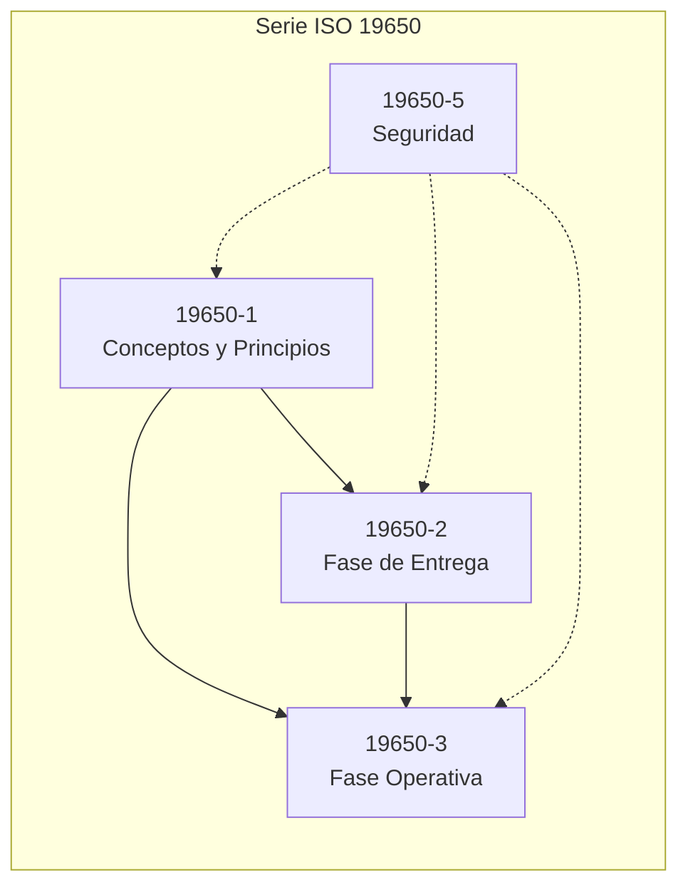
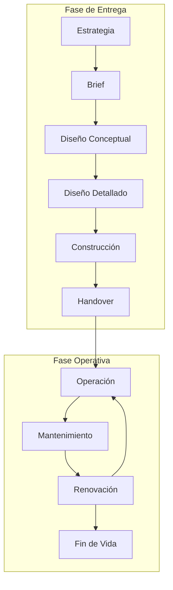
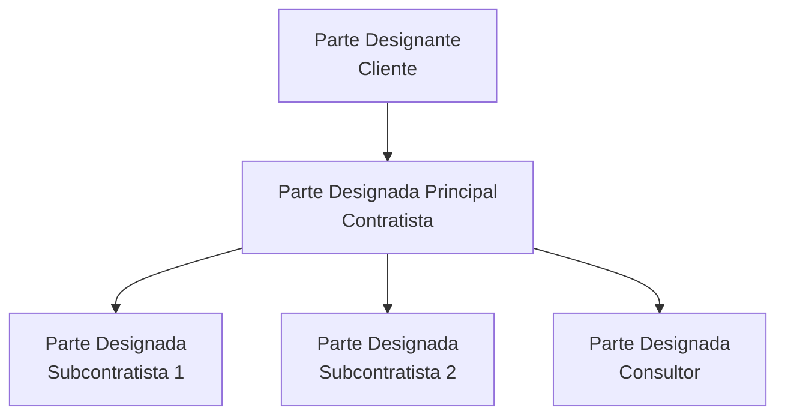
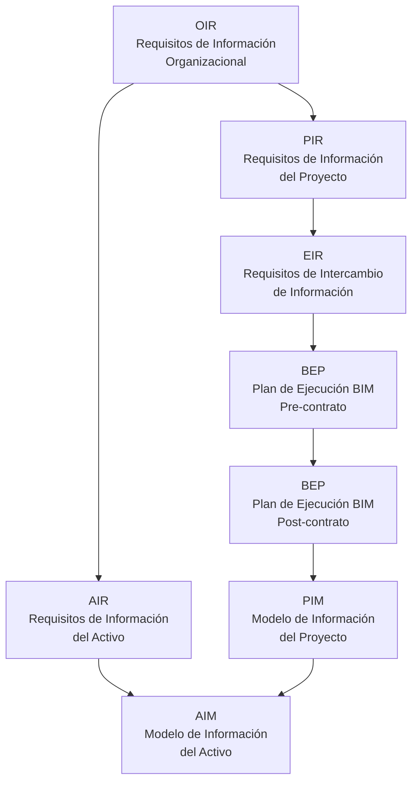
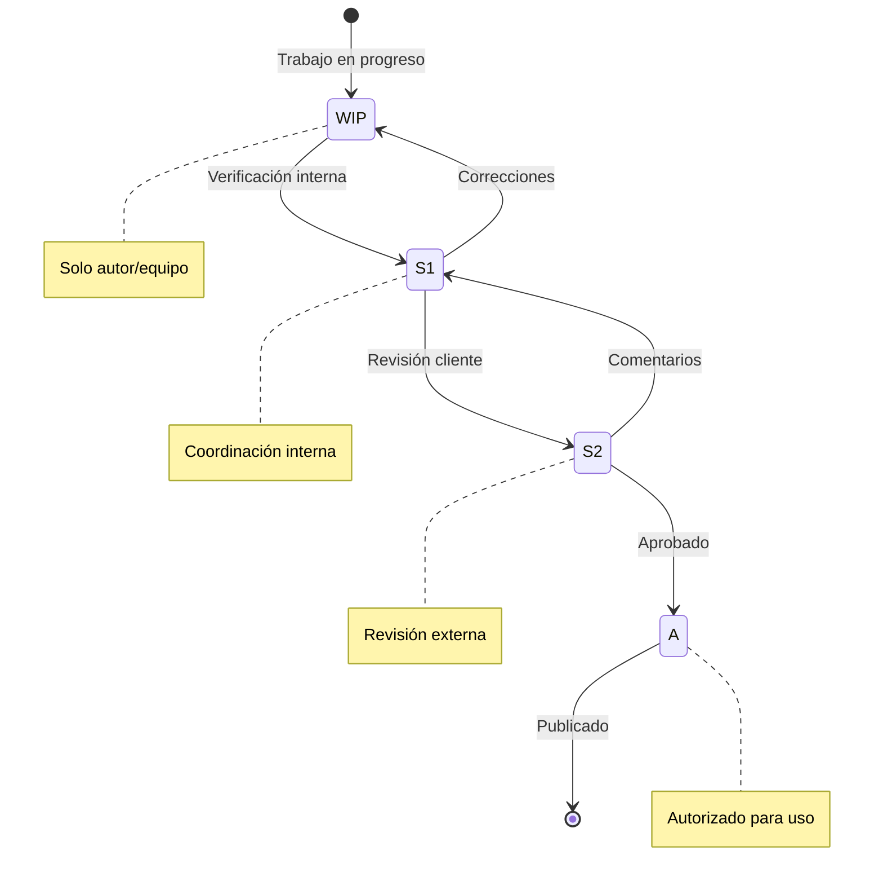
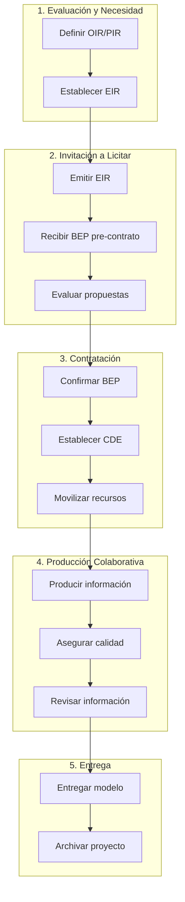

# Guía ISO 19650

**Gestión de la Información mediante BIM**

---

## Introducción

La serie ISO 19650 es el estándar internacional para la gestión de información a lo largo del ciclo de vida de un activo construido utilizando BIM (Building Information Modeling).



---

## Partes del Estándar

| Parte | Título | Alcance |
|-------|--------|---------|
| **ISO 19650-1** | Conceptos y principios | Marco general, terminología |
| **ISO 19650-2** | Fase de entrega de activos | Diseño y construcción |
| **ISO 19650-3** | Fase operativa de activos | Operación y mantenimiento |
| **ISO 19650-5** | Seguridad de la información | Gestión de riesgos de seguridad |

---

## Conceptos Fundamentales

### Ciclo de Vida del Activo



### Actores Principales

| Actor | Descripción | Responsabilidad |
|-------|-------------|-----------------|
| **Parte Designante** | Cliente/Propietario | Define requisitos de información |
| **Parte Designada Principal** | Contratista principal | Coordina entrega de información |
| **Parte Designada** | Subcontratistas/Consultores | Produce información según requisitos |



---

## Documentos de Información

### Jerarquía de Documentos



### Descripción de Documentos

| Documento | Nombre Completo | Propósito |
|-----------|-----------------|-----------|
| **OIR** | Organizational Information Requirements | Requisitos de información a nivel organizacional |
| **PIR** | Project Information Requirements | Requisitos específicos del proyecto |
| **AIR** | Asset Information Requirements | Requisitos para operación del activo |
| **EIR** | Exchange Information Requirements | Requisitos para el intercambio de información |
| **BEP** | BIM Execution Plan | Plan para cumplir con los EIR |
| **PIM** | Project Information Model | Modelo de información durante entrega |
| **AIM** | Asset Information Model | Modelo de información para operación |

---

## Exchange Information Requirements (EIR)

### Contenido del EIR

El EIR debe definir:

#### 1. Requisitos de Información

| Aspecto | Contenido |
|---------|-----------|
| **Estándar de información** | Normas y guías a seguir |
| **Métodos de producción** | Software, formatos, versiones |
| **Nivel de información** | LOD/LOI por elemento y fase |
| **Cronograma** | Hitos de entrega de información |

#### 2. Requisitos Comerciales

| Aspecto | Contenido |
|---------|-----------|
| **Seguridad** | Clasificación, controles de acceso |
| **Competencias** | Requisitos del equipo |
| **Evaluación** | Criterios de selección |

#### 3. Requisitos Técnicos

| Aspecto | Contenido |
|---------|-----------|
| **Plataforma CDE** | Sistema a utilizar |
| **Convenciones** | Nomenclatura, coordenadas |
| **Formatos** | Nativos, intercambio, entregables |

### Plantilla EIR Simplificada

```markdown
# Exchange Information Requirements (EIR)

## 1. Información del Proyecto
- Nombre:
- Ubicación:
- Tipo:
- Fases:

## 2. Objetivos de Información
- [ ] Coordinación de diseño
- [ ] Cuantificación
- [ ] Simulación 4D
- [ ] Operación y mantenimiento

## 3. Hitos de Entrega
| Hito | Fecha | Entregables | LOD |
|------|-------|-------------|-----|
| | | | |

## 4. Requisitos Técnicos
### Software
| Disciplina | Software | Versión |
|------------|----------|---------|
| | | |

### Formatos
- Nativo:
- Intercambio:
- Entrega:

### CDE
- Plataforma:
- Estructura:

## 5. Estándares
- Nomenclatura:
- Clasificación:
- Coordenadas:

## 6. Competencias Requeridas
| Rol | Certificación/Experiencia |
|-----|---------------------------|
| | |
```

---

## BIM Execution Plan (BEP)

### Fases del BEP

| Fase | Momento | Contenido |
|------|---------|-----------|
| **Pre-contrato** | Licitación | Propuesta de cómo cumplir EIR |
| **Post-contrato** | Inicio de proyecto | Plan detallado acordado |

### Contenido del BEP

Ver plantilla completa en: `templates/bep/bep-template-v1.md`

**Secciones principales:**
1. Información del proyecto
2. Objetivos y usos BIM
3. Roles y responsabilidades
4. Estándares y protocolos
5. CDE y flujo de trabajo
6. Software y formatos
7. Coordinación
8. Entregables
9. Control de calidad

---

## Common Data Environment (CDE)

### Concepto

El CDE es la fuente única de información del proyecto, donde se almacena, gestiona y comparte toda la información.

### Estados de Información



### Códigos de Estado

| Código | Estado | Descripción |
|--------|--------|-------------|
| **S0** | WIP | Work in Progress - Trabajo en desarrollo |
| **S1** | Shared | Compartido para coordinación interna |
| **S2** | Shared | Compartido para revisión del cliente |
| **S3** | Shared | Compartido para revisión de autoridades |
| **S4** | Shared | Compartido para fabricación |
| **A** | Published | Aprobado y publicado |
| **B** | Published | Aprobado parcialmente |

### Códigos de Aptitud (Suitability)

| Código | Significado |
|--------|-------------|
| **S0** | Solo para desarrollo |
| **S1** | Para coordinación |
| **S2** | Para información |
| **S3** | Para revisión y comentarios |
| **S4** | Para aprobación |
| **A** | Autorizado para construcción |
| **B** | Autorizado con comentarios |

### Estructura de Carpetas CDE

```
CDE/
├── WIP/                           # Trabajo en progreso
│   ├── [Disciplina]/
│   │   ├── [Zona]/
│   │   └── [Tipo de contenido]/
│
├── SHARED/                        # Compartido
│   ├── S1_Coordinacion/
│   ├── S2_Cliente/
│   └── S3_Autoridades/
│
├── PUBLISHED/                     # Publicado
│   ├── A_Construccion/
│   └── B_Referencia/
│
└── ARCHIVE/                       # Archivo
    └── [Versiones anteriores]/
```

---

## Nivel de Información (LOD/LOI)

### Definición

| Término | Significado |
|---------|-------------|
| **LOD** | Level of Development / Definition |
| **LOG** | Level of Geometry (detalle geométrico) |
| **LOI** | Level of Information (datos alfanuméricos) |

```
LOD = LOG + LOI
```

### Escala de LOD

| LOD | Geometría | Información | Uso Típico |
|-----|-----------|-------------|------------|
| **100** | Simbólico | Mínima | Concepto, estudios |
| **200** | Aproximada | Básica | Esquemático |
| **300** | Precisa | Detallada | Desarrollo de diseño |
| **350** | Detallada | Completa | Documentos construcción |
| **400** | Fabricación | Fabricante | Prefabricación |
| **500** | Verificada | As-built | Operación |

### Tabla LOD por Fase

| Elemento | Concepto | Esquemático | Desarrollo | Construcción | As-Built |
|----------|----------|-------------|------------|--------------|----------|
| Muros | 100 | 200 | 300 | 350 | 500 |
| Puertas | - | 200 | 300 | 350 | 500 |
| Estructura | 100 | 200 | 300 | 400 | 500 |
| HVAC | - | 200 | 300 | 350 | 500 |
| Equipos | - | 200 | 300 | 400 | 500 |

---

## Flujo de Trabajo ISO 19650-2

### Proceso de Entrega



### Actividades por Etapa

#### Etapa 1: Evaluación y Necesidad
- [ ] Definir propósitos de la información
- [ ] Establecer hitos de entrega
- [ ] Determinar recursos disponibles

#### Etapa 2: Invitación a Licitar
- [ ] Preparar documentos de licitación
- [ ] Incluir EIR completo
- [ ] Definir criterios de evaluación

#### Etapa 3: Contratación
- [ ] Revisar y aprobar BEP
- [ ] Establecer protocolos de CDE
- [ ] Confirmar equipo y competencias

#### Etapa 4: Producción Colaborativa
- [ ] Producir información según BEP
- [ ] Ejecutar verificaciones de calidad
- [ ] Coordinar entre disciplinas
- [ ] Resolver issues y conflictos

#### Etapa 5: Entrega
- [ ] Validar información final
- [ ] Entregar PIM completo
- [ ] Archivar para fase operativa

---

## ISO 19650-3: Fase Operativa

### Transición Entrega → Operación


### Asset Information Requirements (AIR)

El AIR define qué información se necesita para:
- Operación diaria
- Mantenimiento preventivo y correctivo
- Gestión de espacios
- Cumplimiento normativo
- Renovaciones futuras

### Información para FM

| Categoría | Ejemplos de Datos |
|-----------|-------------------|
| **Espacios** | Áreas, ocupación, uso |
| **Sistemas** | Capacidades, consumos, vida útil |
| **Equipos** | Marca, modelo, garantía, manuales |
| **Mantenimiento** | Frecuencias, procedimientos |
| **Contactos** | Proveedores, garantías |

### Formato COBie

Construction Operations Building Information Exchange:

| Hoja | Contenido |
|------|-----------|
| Contact | Empresas y contactos |
| Facility | Información del inmueble |
| Floor | Niveles |
| Space | Espacios |
| Zone | Zonas funcionales |
| Type | Tipos de equipos |
| Component | Instancias de equipos |
| System | Sistemas |
| Assembly | Ensambles |
| Spare | Refacciones |
| Resource | Recursos |
| Job | Tareas de mantenimiento |
| Document | Documentos vinculados |

---

## Glosario ISO 19650

| Término | Definición |
|---------|------------|
| **Activo** | Elemento, cosa o entidad que tiene valor para una organización |
| **AIM** | Asset Information Model - Modelo de información del activo |
| **AIR** | Asset Information Requirements - Requisitos de información del activo |
| **BEP** | BIM Execution Plan - Plan de ejecución BIM |
| **BIM** | Building Information Modeling - Modelado de información de construcción |
| **CDE** | Common Data Environment - Entorno común de datos |
| **Contenedor** | Conjunto de información recuperable de un sistema de archivos |
| **EIR** | Exchange Information Requirements - Requisitos de intercambio de información |
| **Federación** | Creación de un modelo compuesto a partir de contenedores separados |
| **LOIN** | Level of Information Need - Nivel de necesidad de información |
| **OIR** | Organizational Information Requirements - Requisitos organizacionales |
| **PIM** | Project Information Model - Modelo de información del proyecto |
| **PIR** | Project Information Requirements - Requisitos del proyecto |

---

## Referencias

| Documento | Descripción |
|-----------|-------------|
| ISO 19650-1:2018 | Conceptos y principios |
| ISO 19650-2:2018 | Fase de entrega |
| ISO 19650-3:2020 | Fase operativa |
| ISO 19650-5:2020 | Seguridad de información |
| UK BIM Framework | Guía de implementación UK |
| PAS 1192 Series | Predecesores de ISO 19650 |

---

*Guía ISO 19650 BIMAC - www.bimac.io*
