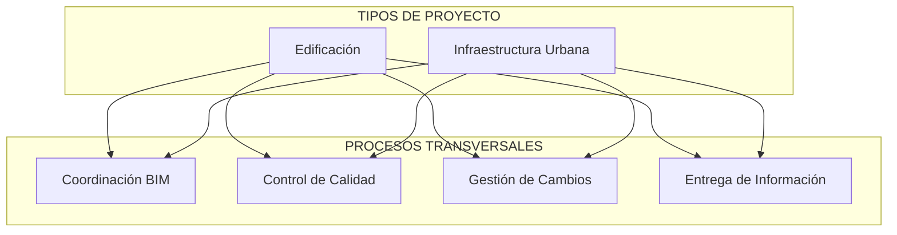
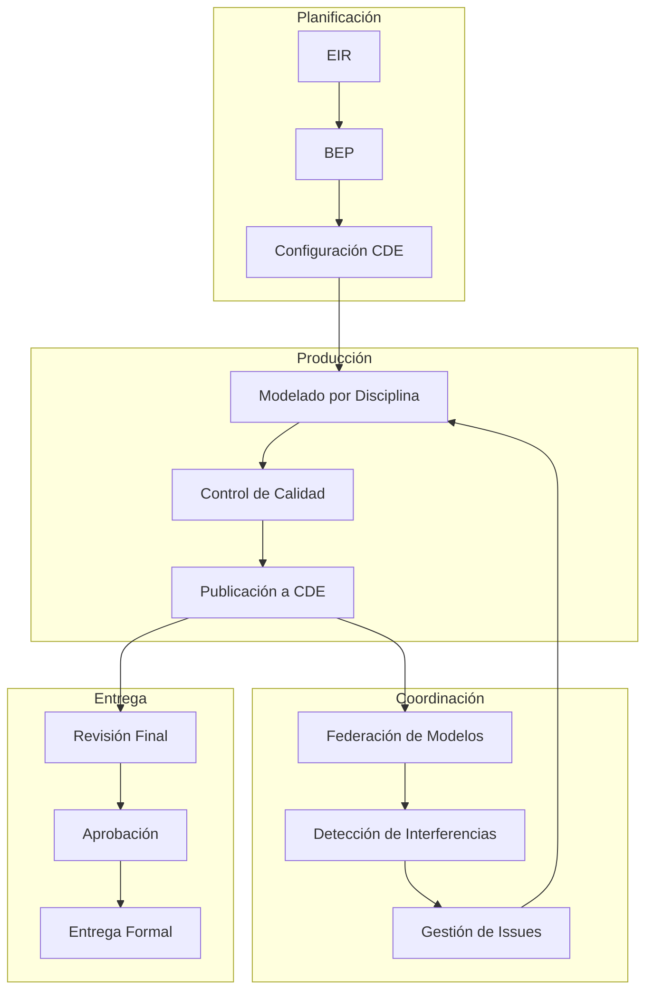
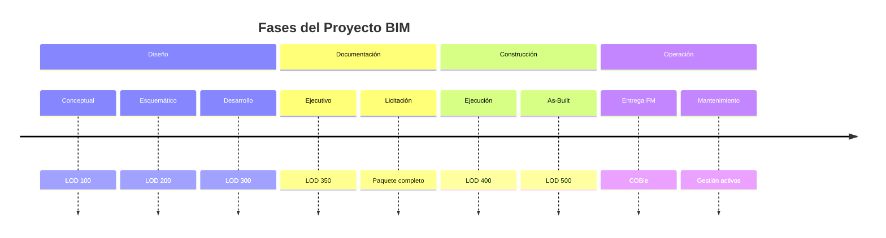
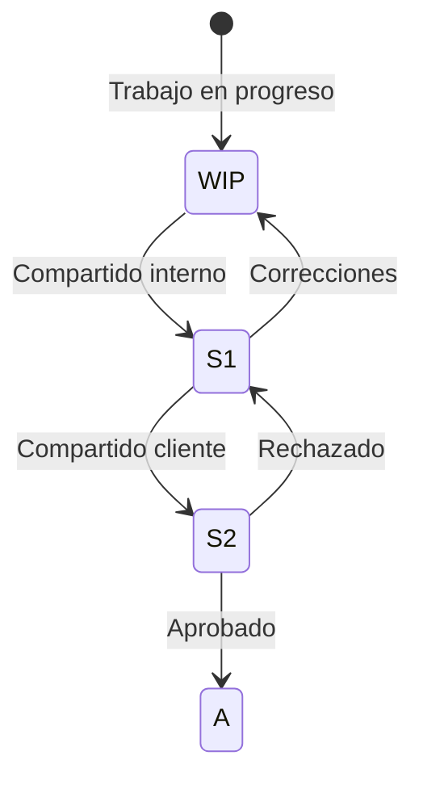

# Flujos de Trabajo BIM

**BIMAC Studio - www.bimacstudio.com**

---

## Índice de Flujos

### Por Tipo de Proyecto

| Documento | Descripción | Complejidad |
|-----------|-------------|-------------|
| [`edificacion-bim.md`](edificacion-bim.md) | Flujo integral para proyectos de edificación | ●●●● |
| [`infraestructura-urbana-bim.md`](infraestructura-urbana-bim.md) | Flujo para vialidades, redes y espacio público | ●●●● |

### Por Proceso

| Documento | Descripción | Frecuencia |
|-----------|-------------|------------|
| [`coordinacion-bim.md`](coordinacion-bim.md) | Proceso de coordinación multidisciplinaria | Semanal |
| [`entrega-informacion.md`](entrega-informacion.md) | Flujo de entrega según ISO 19650 | Por hito |
| [`control-calidad.md`](control-calidad.md) | QA/QC de modelos BIM | Continuo |
| [`gestion-cambios.md`](gestion-cambios.md) | Administración de cambios de diseño | Por evento |

---

## Mapa de Flujos de Trabajo

---

## Diagrama General de Procesos BIM

---

## Ciclo de Vida del Proyecto

---

## Roles Clave

| Rol | Responsabilidad Principal | Flujos Relacionados |
|-----|--------------------------|---------------------|
| **BIM Manager** | Estándares, CDE, coordinación general | Todos |
| **Coordinador de Disciplina** | Supervisión de modeladores, calidad | Coordinación, QC |
| **Modelador BIM** | Creación y mantenimiento de modelos | Producción |
| **Director de Proyecto** | Aprobaciones, decisiones de diseño | Cambios, Entrega |
| **Especialista 4D** | Simulación de construcción | Edificación, Infraestructura |
| **Especialista QC** | Validación de modelos | Control de Calidad |

---

## Estados de Información (ISO 19650)

| Estado | Código | Descripción | Acceso |
|--------|--------|-------------|--------|
| Work in Progress | WIP | Solo para el autor/equipo | Restringido |
| Shared (interno) | S1 | Para coordinación interna | Equipo de diseño |
| Shared (cliente) | S2 | Para revisión del cliente | Cliente + Equipo |
| Approved | A | Autorizado para uso | Todos |

---

## Frecuencia de Actividades

| Actividad | Frecuencia | Responsable | Flujo |
|-----------|------------|-------------|-------|
| Modelado | Continuo | Modeladores | Producción |
| Sincronización | Diaria | Modeladores | Producción |
| Publicación a CDE | Semanal | Coordinadores | Coordinación |
| Clash Detection | Semanal | BIM Manager | Coordinación |
| Reunión de Coordinación | Semanal | BIM Manager | Coordinación |
| Revisión de Calidad | Por entregable | Coordinadores | QC |
| Entrega al Cliente | Por hito | BIM Manager | Entrega |

---

## Herramientas por Proceso

### Edificación

| Proceso | Herramientas |
|---------|--------------|
| Modelado | Revit, Rhino, Grasshopper |
| Coordinación | Navisworks, BIMcollab ZOOM |
| 4D | Synchro 4D |
| Visualización | Twinmotion |
| Documentación | Revit, AutoCAD |

### Infraestructura

| Proceso | Herramientas |
|---------|--------------|
| Diseño vial | Civil 3D, Infraworks |
| Redes | Civil 3D |
| Estructuras | Revit, CSiBridge |
| Coordinación | Navisworks |
| GIS | QGIS, ArcGIS |

### Transversales

| Proceso | Herramientas |
|---------|--------------|
| Gestión de issues | BCF, BIMcollab |
| Documentación | Notion, Templates BIMAC |
| Automatización | n8n, Python |
| Comunicación | Slack, Email |

---

## Matriz de Selección de Flujo

| Si el proyecto es... | Usar flujo... |
|---------------------|---------------|
| Edificio nuevo (cualquier uso) | `edificacion-bim.md` |
| Remodelación/ampliación | `edificacion-bim.md` (adaptado) |
| Vialidad/calle/avenida | `infraestructura-urbana-bim.md` |
| Parque o espacio público | `infraestructura-urbana-bim.md` |
| Red hidráulica/sanitaria | `infraestructura-urbana-bim.md` |
| Puente o estructura vial | `infraestructura-urbana-bim.md` + `edificacion-bim.md` (estructuras) |
| Proyecto mixto | Combinar ambos flujos |

---

## KPIs Generales

| Categoría | KPI | Meta | Medición |
|-----------|-----|------|----------|
| **Calidad** | Clashes críticos | <5 por ciclo | Navisworks |
| **Calidad** | Warnings por modelo | <50 | Revit |
| **Coordinación** | Resolución de issues | >80% semanal | BCF/BIMcollab |
| **Entrega** | Cumplimiento de fechas | >95% | Log de entregas |
| **Información** | Completitud de datos | >95% | Scripts de validación |
| **Eficiencia** | Retrabajos | <10% | Análisis de cambios |

---

## Documentos Relacionados

| Categoría | Documento | Ubicación |
|-----------|-----------|-----------|
| **Templates** | BEP | `templates/bep/bep-template-v1.md` |
| **ISO 19650** | Guía completa | `docs/bim/iso-19650-guia.md` |
| **ISO 19650** | Templates | `templates/iso19650/` |
| **Sustentabilidad** | Checklist LEED | `templates/checklists/leed-checklist.md` |
| **Sustentabilidad** | Checklist EDGE | `templates/checklists/edge-checklist.md` |
| **IA** | Prompts BIM | `research/ai-prompts/` |

---

## Automatización con n8n

Los flujos de trabajo pueden automatizarse mediante n8n (hospedado en Hostinger):

| Evento | Automatización |
|--------|---------------|
| Nuevo archivo en CDE | Notificación a equipo |
| Issue BCF creado | Crear tarea en Notion |
| Publicación de modelo | Trigger de clash detection |
| Entrega próxima | Recordatorio automático |
| Cambio aprobado | Actualizar log y notificar |

---

## Versionado de Flujos

| Versión | Fecha | Cambios |
|---------|-------|---------|
| 2.0 | 2025-12 | Agregados flujos de edificación e infraestructura |
| 1.0 | 2025-11 | Versión inicial con procesos base |

---

*Flujos de trabajo BIMAC Studio basados en ISO 19650 - www.bimacstudio.com*
