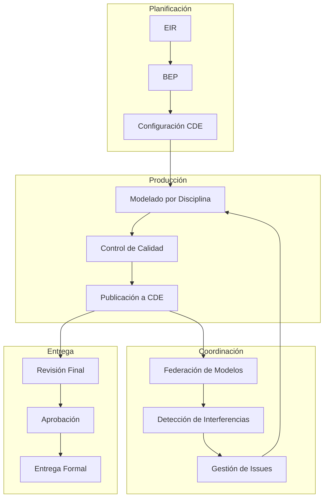
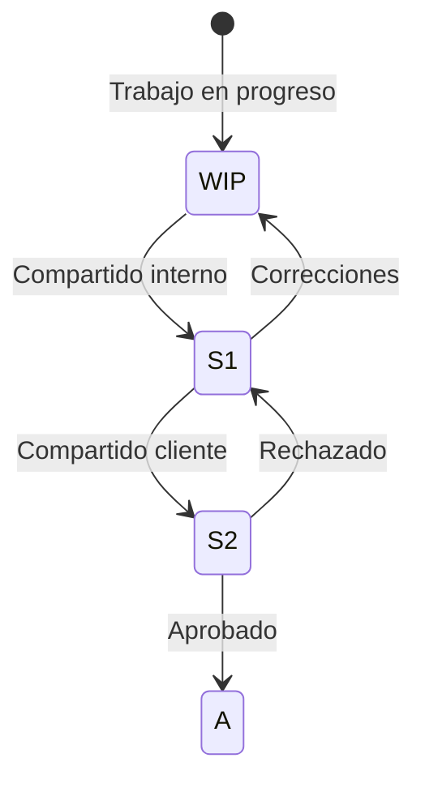

# Flujos de Trabajo BIM

**BIMAC - Documentación de procesos BIM**

---

## Índice de Flujos

| Documento | Descripción |
|-----------|-------------|
| `coordinacion-bim.md` | Proceso de coordinación multidisciplinaria |
| `entrega-informacion.md` | Flujo de entrega según ISO 19650 |
| `control-calidad.md` | QA/QC de modelos BIM |
| `gestion-cambios.md` | Administración de cambios de diseño |

---

## Diagrama General de Procesos BIM

---

## Roles Clave

| Rol | Responsabilidad Principal |
|-----|--------------------------|
| **BIM Manager** | Estándares, CDE, coordinación general |
| **Coordinador de Disciplina** | Supervisión de modeladores, calidad |
| **Modelador BIM** | Creación y mantenimiento de modelos |
| **Director de Proyecto** | Aprobaciones, decisiones de diseño |

---

## Estados de Información (ISO 19650)

| Estado | Código | Descripción |
|--------|--------|-------------|
| Work in Progress | WIP | Solo para el autor/equipo |
| Shared (interno) | S1 | Para coordinación interna |
| Shared (cliente) | S2 | Para revisión del cliente |
| Approved | A | Autorizado para uso |

---

## Frecuencia de Actividades

| Actividad | Frecuencia | Responsable |
|-----------|------------|-------------|
| Modelado | Continuo | Modeladores |
| Publicación a CDE | Semanal | Coordinadores |
| Clash Detection | Semanal | BIM Manager |
| Reunión de Coordinación | Semanal | BIM Manager |
| Revisión de Calidad | Por entregable | Coordinadores |
| Entrega al Cliente | Por hito | BIM Manager |

---

## Herramientas por Proceso

| Proceso | Herramientas |
|---------|--------------|
| Modelado | Revit, Civil 3D, Rhino |
| Coordinación | Navisworks, BIMcollab ZOOM |
| 4D | Synchro 4D |
| Comunicación | BCF, Plataforma CDE |
| Documentación | Notion, Templates BIMAC |

---

*Flujos de trabajo BIMAC basados en ISO 19650*
