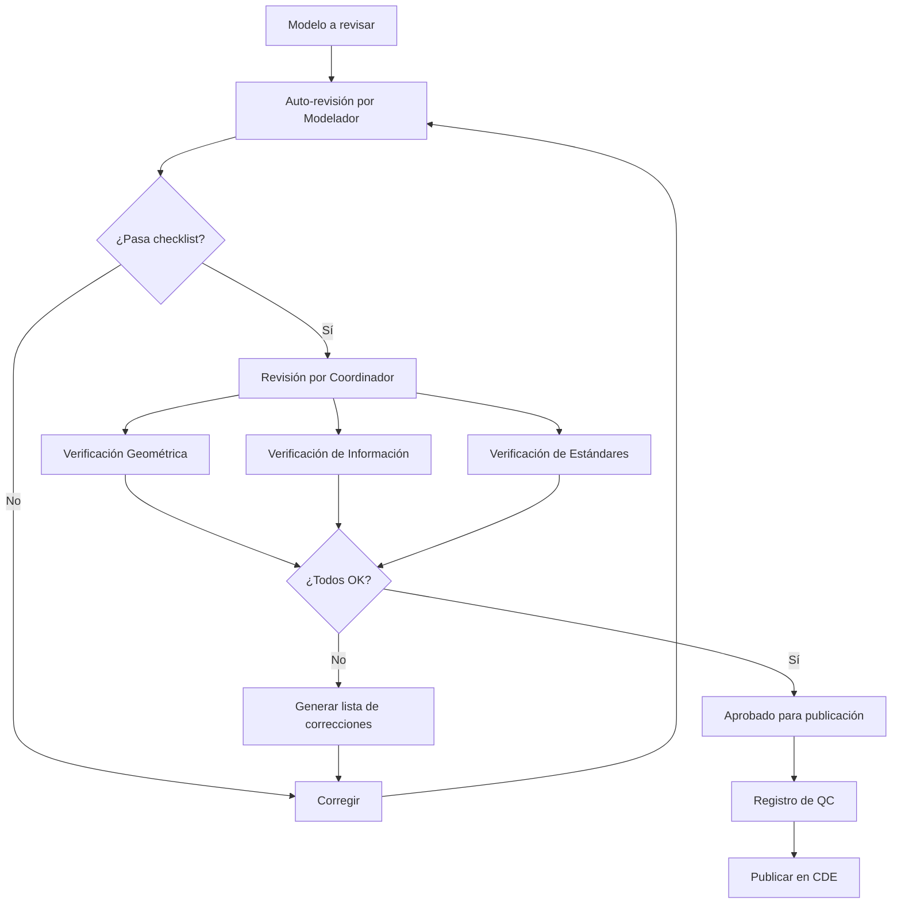
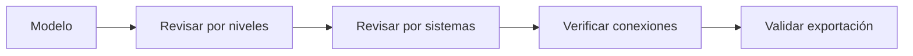
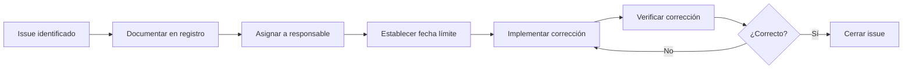

# Flujo de Control de Calidad BIM

---

## Objetivo

Establecer el proceso sistemático para verificar la calidad de modelos BIM, asegurando cumplimiento con estándares, precisión geométrica e integridad de información.

---

## Diagrama del Proceso



---

## Niveles de Revisión

| Nivel | Responsable | Frecuencia | Alcance |
|-------|-------------|------------|---------|
| **Nivel 1** | Modelador | Diario | Auto-revisión básica |
| **Nivel 2** | Coordinador | Semanal | Revisión técnica completa |
| **Nivel 3** | BIM Manager | Por entregable | Validación final |
| **Nivel 4** | Externo | Por fase | Auditoría independiente |

---

## Nivel 1: Auto-Revisión (Modelador)

### Checklist Diario

#### Antes de Guardar
- [ ] No hay elementos seleccionados flotando
- [ ] Warnings nuevos revisados
- [ ] Elementos creados en workset correcto
- [ ] Vistas de trabajo limpiadas

#### Antes de Sincronizar
- [ ] Todos los cambios intencionados
- [ ] Sin elementos prestados innecesarios
- [ ] Comentario de sincronización descriptivo

### Warnings Críticos a Resolver Inmediatamente

| Warning | Impacto | Acción |
|---------|---------|--------|
| Elementos duplicados | Cuantificación incorrecta | Eliminar duplicado |
| Room not enclosed | Áreas incorrectas | Cerrar perímetro |
| Walls overlap | Geometría corrupta | Unir o separar muros |
| Highlighted elements overlap | Exportación IFC fallida | Corregir geometría |

---

## Nivel 2: Revisión Técnica (Coordinador)

### A. Verificación Geométrica



#### Checklist Geométrico

**General:**
- [ ] Todos los elementos visibles en vistas 3D
- [ ] Sin elementos fuera del límite del proyecto
- [ ] Niveles correctamente definidos
- [ ] Rejillas alineadas entre disciplinas

**Por Disciplina - Arquitectura:**
- [ ] Muros conectados a niveles correctos
- [ ] Puertas y ventanas hospedadas correctamente
- [ ] Pisos sin huecos involuntarios
- [ ] Plafones a altura correcta

**Por Disciplina - Estructura:**
- [ ] Columnas alineadas a rejillas
- [ ] Vigas conectadas a columnas
- [ ] Losas con espesor correcto
- [ ] Cimentación visible y completa

**Por Disciplina - MEP:**
- [ ] Sistemas conectados correctamente
- [ ] Tuberías con pendiente (si aplica)
- [ ] Equipos en ubicación final
- [ ] Espacios para mantenimiento considerados

---

### B. Verificación de Información

#### Parámetros Obligatorios por Categoría

| Categoría | Parámetros Requeridos |
|-----------|----------------------|
| Muros | Tipo, Material, Función, Resistencia al fuego |
| Puertas | Tipo, Dimensiones, Material, Herraje |
| Ventanas | Tipo, Dimensiones, U-Value, SHGC |
| Equipos MEP | Marca, Modelo, Capacidad, Voltaje |
| Espacios | Nombre, Número, Área, Ocupación |

#### Script de Validación de Parámetros

```python
# Pseudocódigo para validación
elementos_sin_info = []

for elemento in modelo.elementos:
    parametros_requeridos = obtener_requeridos(elemento.categoria)
    for param in parametros_requeridos:
        if elemento.get_param(param) is None:
            elementos_sin_info.append({
                'id': elemento.id,
                'categoria': elemento.categoria,
                'parametro_faltante': param
            })

generar_reporte(elementos_sin_info)
```

#### Checklist de Información
- [ ] >95% de elementos con parámetros obligatorios
- [ ] Materiales asignados correctamente
- [ ] Clasificación (Uniformat/Omniclass) aplicada
- [ ] Fases correctamente asignadas

---

### C. Verificación de Estándares

#### Nomenclatura de Vistas

| Tipo | Patrón | Ejemplo |
|------|--------|---------|
| Planta | [Nivel]-[Tipo]-[Descripción] | N01-ARQ-Planta General |
| Sección | SEC-[Número]-[Descripción] | SEC-01-Longitudinal |
| Detalle | DET-[Área]-[Número] | DET-BAÑO-01 |
| 3D | 3D-[Disciplina]-[Vista] | 3D-MEP-Cuarto Máquinas |

#### Nomenclatura de Familias

```
[Empresa]_[Categoría]_[Tipo]_[Variante]
```

Ejemplo: `BIMAC_Puerta_Abatible_90x210`

#### Checklist de Estándares
- [ ] Nombres de vistas según estándar
- [ ] Familias con nomenclatura correcta
- [ ] Browser organizado según plantilla
- [ ] Archivo nombrado correctamente
- [ ] Ubicado en carpeta correcta del CDE

---

## Nivel 3: Validación Final (BIM Manager)

### Revisión de Coordinación

- [ ] Modelo federado actualizado
- [ ] Clash detection ejecutado
- [ ] Sin interferencias críticas pendientes
- [ ] Alineación de coordenadas verificada

### Revisión de Exportación

| Formato | Verificación |
|---------|--------------|
| IFC | Abrir en visor, verificar geometría y propiedades |
| NWC | Verificar en modelo federado |
| DWG | Verificar capas y escala |
| PDF | Verificar resolución y legibilidad |

### Revisión de Cumplimiento EIR

- [ ] LOD alcanzado según fase
- [ ] Información requerida completa
- [ ] Formatos de entrega correctos
- [ ] Nomenclatura según contrato

---

## Nivel 4: Auditoría Externa

### Alcance de Auditoría

| Área | Verificaciones |
|------|----------------|
| Proceso | Cumplimiento de BEP, uso de CDE |
| Producto | Calidad de modelos, información |
| Personas | Competencias, capacitación |

### Criterios de Auditoría

Basados en:
- ISO 19650
- BEP del proyecto
- Requisitos contractuales
- Mejores prácticas de la industria

---

## Herramientas de QC

| Herramienta | Uso | Automatización |
|-------------|-----|----------------|
| Revit Warnings | Errores internos | Automático |
| Revit Model Review | Validación de reglas | Semi-automático |
| Navisworks Clash | Interferencias | Automático |
| Solibri | Validación avanzada | Configurable |
| BIMcollab ZOOM | Revisión visual | Manual |
| Scripts Python | Validación de parámetros | Automático |

---

## Registro de Control de Calidad

### Formato de Registro

```markdown
# Registro de Control de Calidad

**Proyecto:** ________________
**Modelo:** ________________
**Versión:** ________________
**Fecha de Revisión:** ________________

## Revisor
**Nombre:** ________________
**Rol:** ________________

## Resultados

### Verificación Geométrica
| Ítem | Estado | Observaciones |
|------|--------|---------------|
| Elementos duplicados | ✓/✗ | |
| Conexiones correctas | ✓/✗ | |
| Límites del proyecto | ✓/✗ | |

### Verificación de Información
| Ítem | Estado | % Cumplimiento |
|------|--------|----------------|
| Parámetros obligatorios | ✓/✗ | ___% |
| Materiales asignados | ✓/✗ | ___% |
| Clasificación | ✓/✗ | ___% |

### Verificación de Estándares
| Ítem | Estado | Observaciones |
|------|--------|---------------|
| Nomenclatura vistas | ✓/✗ | |
| Nomenclatura familias | ✓/✗ | |
| Organización browser | ✓/✗ | |

## Resultado Final
[ ] APROBADO - Listo para publicación
[ ] APROBADO CON OBSERVACIONES - Corregir antes de entrega
[ ] RECHAZADO - Requiere correcciones mayores

## Observaciones Generales
________________

## Firmas
**Revisor:** ________________ Fecha: ________________
**Modelador:** ________________ Fecha: ________________
```

---

## Métricas de Calidad

| Métrica | Fórmula | Meta |
|---------|---------|------|
| Tasa de aprobación primera vez | Aprobados / Total revisados | >70% |
| Warnings por modelo | Warnings / Elementos | <0.5% |
| Parámetros poblados | Params llenos / Params requeridos | >95% |
| Clashes por 1000 m² | Clashes / (Superficie/1000) | <10 |

---

## Acciones Correctivas

### Proceso de Corrección



### Categorización de Issues

| Categoría | Tiempo de Resolución | Ejemplo |
|-----------|---------------------|---------|
| Crítico | Antes de sincronizar | Geometría corrupta |
| Mayor | 24 horas | Información faltante masiva |
| Menor | Próxima revisión | Nomenclatura incorrecta |
| Mejora | Cuando sea posible | Optimización de modelo |

---

*Flujo de Control de Calidad BIMAC - www.bimac.io*
