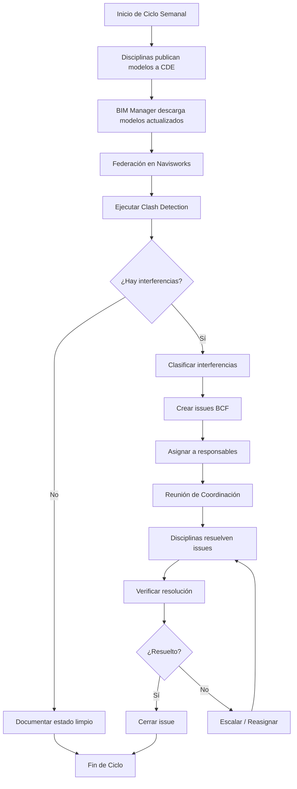
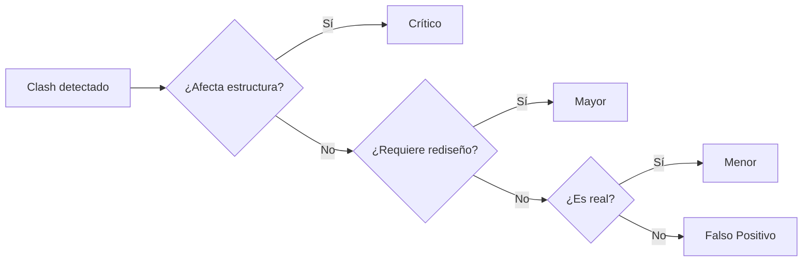
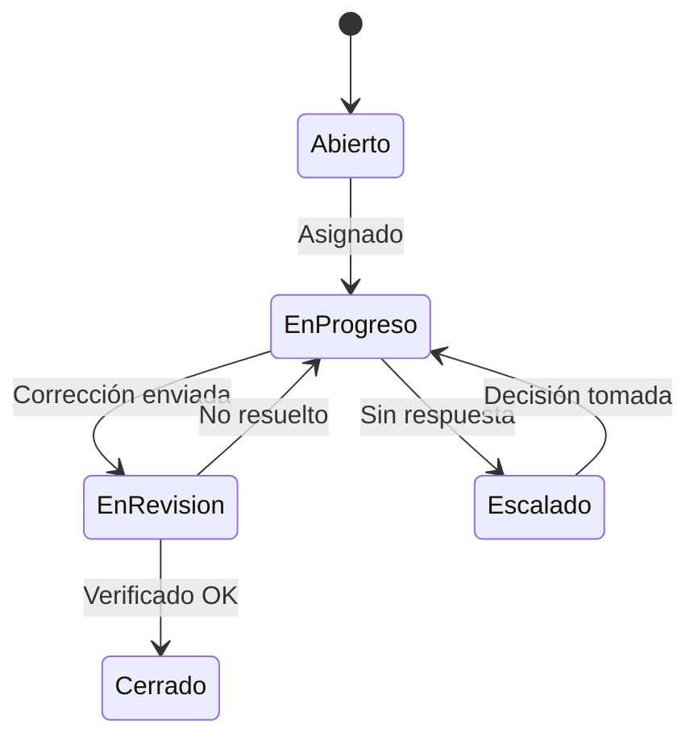

# Flujo de Coordinación BIM

---

## Objetivo

Establecer el proceso sistemático para coordinar modelos BIM de múltiples disciplinas, detectar interferencias y gestionar su resolución.

---

## Diagrama del Proceso



---

## Fases del Proceso

### 1. Publicación de Modelos

**Responsable:** Coordinadores de Disciplina

**Frecuencia:** Semanal (día acordado, ej. Lunes)

**Actividades:**
1. Verificar modelo con checklist de calidad
2. Exportar a formato de intercambio (NWC)
3. Subir a carpeta SHARED del CDE
4. Notificar al BIM Manager

**Entregable:** Modelo actualizado en CDE

```
CDE/
└── 02_SHARED/
    └── Modelos/
        ├── PRY-ARQ-MOD-001.nwc
        ├── PRY-EST-MOD-001.nwc
        └── PRY-MEP-MOD-001.nwc
```

---

### 2. Federación de Modelos

**Responsable:** BIM Manager

**Frecuencia:** Semanal (día siguiente a publicación)

**Actividades:**
1. Descargar modelos actualizados del CDE
2. Actualizar modelo federado en Navisworks
3. Verificar alineación de coordenadas
4. Guardar versión con fecha

**Archivo de Federación:**
```
PRY-COO-FED-001_AAAA-MM-DD.nwd
```

---

### 3. Detección de Interferencias

**Responsable:** BIM Manager

**Herramienta:** Navisworks Clash Detective

**Matrices de Clash:**

| Test | Selección A | Selección B | Tolerancia |
|------|-------------|-------------|------------|
| ARQ vs EST | Arquitectura | Estructura | 0 mm |
| ARQ vs MEP | Arquitectura | MEP | 25 mm |
| EST vs MEP | Estructura | MEP | 0 mm |
| MEC vs ELE | Mecánico | Eléctrico | 25 mm |
| MEC vs HID | Mecánico | Hidráulico | 25 mm |
| ELE vs HID | Eléctrico | Hidráulico | 25 mm |

**Configuración Recomendada:**
- Tipo: Hard (intersección sólida)
- Tolerancia: Según matriz
- Ignorar: Elementos del mismo archivo

---

### 4. Clasificación de Interferencias

**Criterios de Clasificación:**

| Nivel | Criterio | Tiempo de Resolución | Ejemplo |
|-------|----------|---------------------|---------|
| **Crítico** | Afecta estructura o seguridad | 24-48 horas | Ducto atraviesa viga |
| **Mayor** | Requiere cambio de diseño | 3-5 días | Tubería en espacio insuficiente |
| **Menor** | Ajuste de instalación | 1 semana | Clash por tolerancia |
| **Falso Positivo** | No es conflicto real | Ignorar | Secuencia de construcción |

**Proceso de Clasificación:**



---

### 5. Gestión de Issues BCF

**Creación de Issue:**

| Campo | Contenido |
|-------|-----------|
| Título | [Nivel]-[Disc A] vs [Disc B]-[Descripción breve] |
| Prioridad | Crítico / Mayor / Menor |
| Asignado a | Disciplina responsable |
| Fecha límite | Según nivel de prioridad |
| Viewpoint | Captura desde Navisworks |
| Descripción | Detalle del conflicto y sugerencia |

**Ejemplo:**
```
Título: N3-MEC vs EST-Ducto atraviesa viga eje C-5
Prioridad: Crítico
Asignado a: MEP-Mecánico
Fecha límite: [fecha + 2 días]
Descripción: Ducto de suministro 600x400mm penetra viga
IPR 400x200. Redirigir ducto por debajo verificando
altura libre mínima de 2.40m.
```

---

### 6. Reunión de Coordinación

**Frecuencia:** Semanal

**Duración:** 1-2 horas

**Participantes:**
- BIM Manager (modera)
- Coordinadores de cada disciplina
- Director de Proyecto (si hay escalamientos)

**Agenda Tipo:**

| Tiempo | Tema |
|--------|------|
| 10 min | Revisión de issues cerrados |
| 30 min | Discusión de issues críticos |
| 30 min | Revisión de issues mayores |
| 10 min | Asignación de nuevos issues |
| 10 min | Próximos pasos y compromisos |

**Entregables:**
- Acta de reunión
- Lista de compromisos actualizada
- Issues reasignados si aplica

---

### 7. Resolución y Verificación

**Proceso de Resolución:**

1. Disciplina asignada modifica modelo
2. Publica modelo corregido a CDE
3. BIM Manager re-ejecuta clash específico
4. Si resuelto → Cerrar issue
5. Si persiste → Reasignar o escalar

**Estados de Issue:**



---

## Métricas de Coordinación

| Métrica | Fórmula | Meta |
|---------|---------|------|
| Tasa de resolución | Issues cerrados / Issues abiertos | >80% semanal |
| Tiempo promedio de resolución | Σ(fecha cierre - fecha apertura) / n | <5 días |
| Issues escalados | Issues escalados / Total issues | <10% |
| Clashes recurrentes | Clashes reabiertos / Total cerrados | <5% |

---

## Escalamiento

| Nivel | Condición | Acción |
|-------|-----------|--------|
| 1 | Issue no resuelto en plazo | Notificar a Coordinador |
| 2 | 2+ ciclos sin resolución | Escalar a Director de Proyecto |
| 3 | Impacto en ruta crítica | Reunión extraordinaria |

---

## Checklist Semanal

### Para Coordinadores de Disciplina
- [ ] Modelo actualizado y verificado
- [ ] Exportación NWC correcta
- [ ] Publicación en CDE
- [ ] Issues asignados revisados
- [ ] Correcciones implementadas

### Para BIM Manager
- [ ] Modelos descargados de CDE
- [ ] Federación actualizada
- [ ] Clash detection ejecutado
- [ ] Issues clasificados y asignados
- [ ] Reunión de coordinación preparada
- [ ] Acta distribuida

---

*Flujo de Coordinación BIMAC - www.bimac.io*
