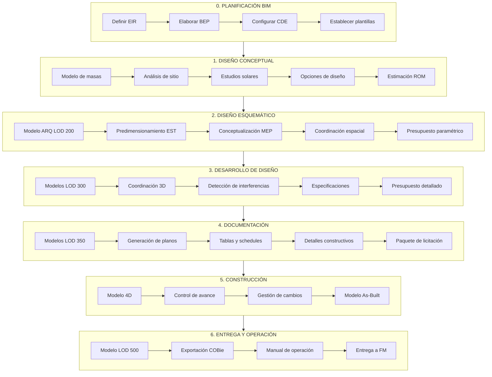
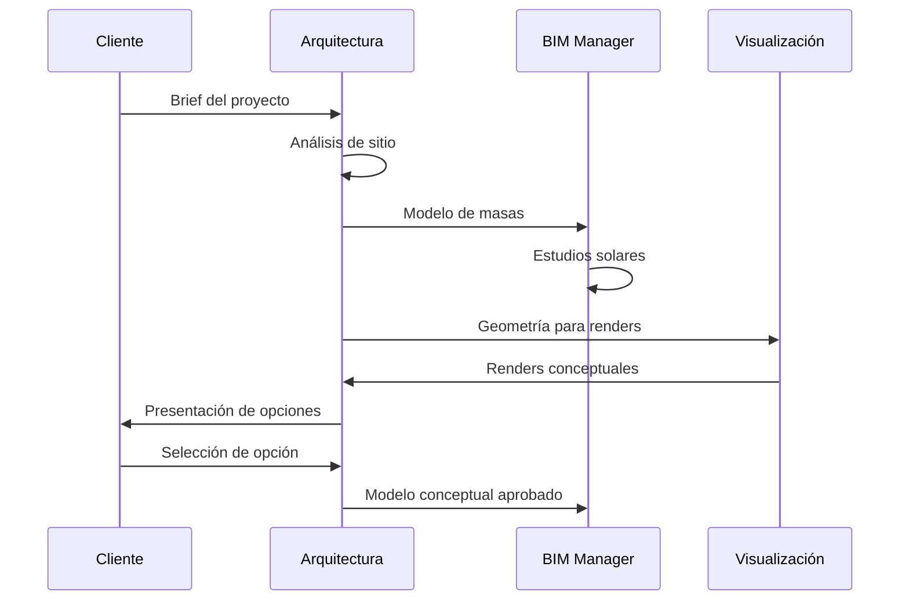
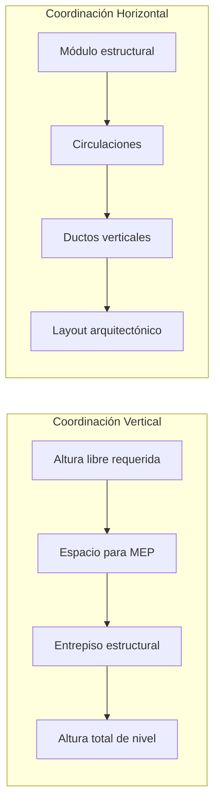
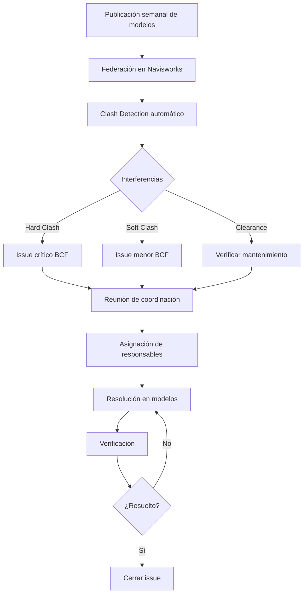
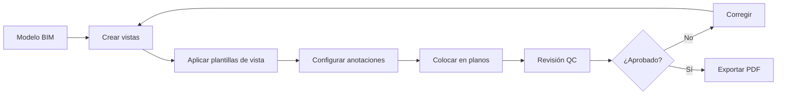
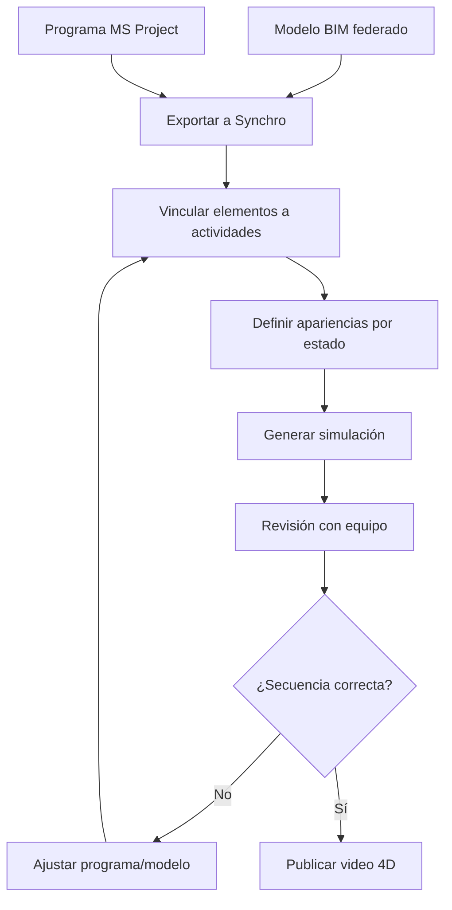
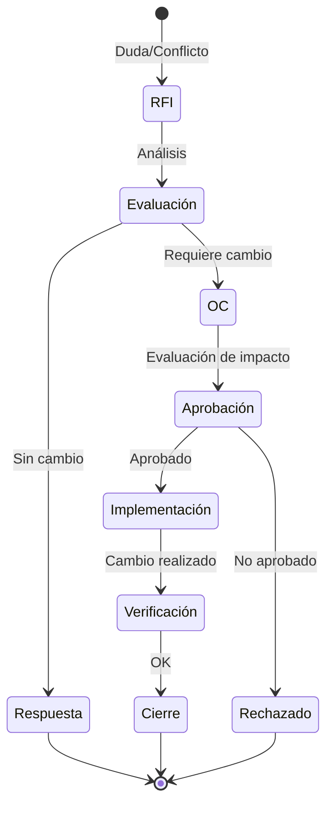
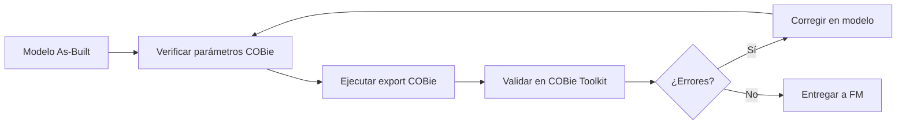
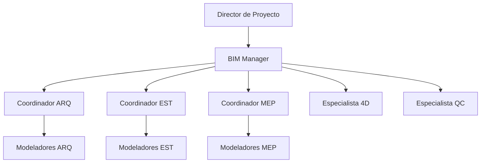

# Flujo BIM para Proyectos de Edificación

**BIMAC Studio - www.bimacstudio.com**

---

## Objetivo

Establecer el flujo de trabajo BIM integral para proyectos de edificación, desde la planificación inicial hasta la entrega para operación, integrando todas las disciplinas y fases del ciclo de vida.

---

## Alcance

### Tipologías de Edificación

| Categoría | Ejemplos | Complejidad BIM |
|-----------|----------|-----------------|
| **Residencial** | Vivienda unifamiliar, multifamiliar, torres | Media-Alta |
| **Comercial** | Oficinas, retail, centros comerciales | Alta |
| **Hospitalario** | Clínicas, hospitales, laboratorios | Muy Alta |
| **Educativo** | Escuelas, universidades, bibliotecas | Media-Alta |
| **Hotelero** | Hoteles, resorts, centros de convenciones | Alta |
| **Industrial** | Plantas, bodegas, centros de distribución | Media |
| **Mixto** | Usos combinados | Muy Alta |

---

## Diagrama Maestro del Proceso



---

## Fase 0: Planificación BIM

### Duración Típica: 2-4 semanas

### Entregables

| Documento | Responsable | Template |
|-----------|-------------|----------|
| EIR | Cliente/BIM Manager | `templates/iso19650/eir-template.md` |
| BEP | BIM Manager | `templates/bep/bep-template-v1.md` |
| Estructura CDE | BIM Manager | Configuración en plataforma |
| Plantillas Revit | BIM Manager | Archivo .rte |

### Configuración del CDE

```
CDE_[PROYECTO]/
├── 01_WIP/
│   ├── ARQ/
│   ├── EST/
│   ├── MEP-MEC/
│   ├── MEP-ELE/
│   ├── MEP-HID/
│   └── COORD/
├── 02_SHARED/
│   ├── Modelos/
│   ├── Planos/
│   └── Documentos/
├── 03_PUBLISHED/
│   └── [Por entrega]
└── 04_ARCHIVED/
    └── [Por versión]
```

### Matriz RACI - Planificación

| Actividad | Cliente | Dir. Proyecto | BIM Manager | Coordinadores |
|-----------|:-------:|:-------------:|:-----------:|:-------------:|
| Definir EIR | A | C | R | I |
| Aprobar EIR | A | R | C | I |
| Elaborar BEP | I | A | R | C |
| Configurar CDE | I | I | R | C |
| Crear plantillas | I | I | R | C |

*R=Responsable, A=Aprueba, C=Consulta, I=Informado*

---

## Fase 1: Diseño Conceptual

### LOD Objetivo: 100-200

### Entregables por Disciplina

#### Arquitectura
- [ ] Modelo de masas volumétrico
- [ ] Análisis de sitio y contexto
- [ ] Estudio de asoleamiento
- [ ] Alternativas de diseño (mín. 3)
- [ ] Renders conceptuales
- [ ] Programa arquitectónico validado

#### Consultoría (Opcional)
- [ ] Análisis energético preliminar
- [ ] Pre-evaluación LEED/EDGE
- [ ] Estudio de factibilidad

### Herramientas

| Tarea | Herramienta Principal | Alternativa |
|-------|----------------------|-------------|
| Modelo de masas | Revit | Rhino + Grasshopper |
| Análisis solar | Insight / Ladybug | Twinmotion |
| Opciones de diseño | Dynamo | Grasshopper |
| Visualización | Twinmotion | Lumion |
| Estimación | Excel + BD costos | - |

### Flujo de Trabajo



---

## Fase 2: Diseño Esquemático

### LOD Objetivo: 200

### Entregables por Disciplina

#### Arquitectura (LOD 200)
- [ ] Plantas arquitectónicas generales
- [ ] Cortes y elevaciones esquemáticos
- [ ] Modelo 3D con materialidad general
- [ ] Áreas calculadas por espacio
- [ ] Cuadro de áreas

#### Estructura (LOD 200)
- [ ] Sistema estructural definido
- [ ] Predimensionamiento de elementos
- [ ] Ubicación de juntas
- [ ] Modelo estructural esquemático

#### MEP (LOD 200)
- [ ] Cuartos técnicos ubicados
- [ ] Ductos principales dimensionados
- [ ] Rutas verticales definidas
- [ ] Cargas preliminares calculadas

### Coordinación Espacial



### Tabla de Alturas Típicas

| Uso | Altura Libre | Pleno MEP | Estructura | Entrepiso Total |
|-----|-------------|-----------|------------|-----------------|
| Oficinas | 2.70 m | 0.60 m | 0.50 m | 3.80 m |
| Comercio | 3.50 m | 0.80 m | 0.60 m | 4.90 m |
| Estacionamiento | 2.40 m | 0.30 m | 0.50 m | 3.20 m |
| Hospital | 2.70 m | 1.00 m | 0.60 m | 4.30 m |

---

## Fase 3: Desarrollo de Diseño

### LOD Objetivo: 300

### Entregables por Disciplina

#### Arquitectura (LOD 300)
- [ ] Modelo completo con todos los elementos
- [ ] Familias específicas del proyecto
- [ ] Materiales y acabados asignados
- [ ] Planos de acabados
- [ ] Planos de cancelería
- [ ] Planos de plafones

#### Estructura (LOD 300)
- [ ] Modelo estructural calculado
- [ ] Armados definidos
- [ ] Detalles de conexiones
- [ ] Cimentación modelada
- [ ] Memorias de cálculo

#### MEP Mecánico (LOD 300)
- [ ] Sistemas de HVAC completos
- [ ] Ductos y difusores
- [ ] Equipos seleccionados
- [ ] Cuartos de máquinas
- [ ] Cálculos de cargas

#### MEP Eléctrico (LOD 300)
- [ ] Alimentadores principales
- [ ] Tableros y subtableros
- [ ] Iluminación
- [ ] Sistemas especiales
- [ ] Diagrama unifilar

#### MEP Hidráulico (LOD 300)
- [ ] Red de agua fría y caliente
- [ ] Drenaje sanitario y pluvial
- [ ] Equipos de bombeo
- [ ] Cisternas y tinacos
- [ ] Isométricos

### Proceso de Coordinación 3D



### Matriz de Clash Detection

| Test ID | Selección A | Selección B | Tipo | Tolerancia |
|---------|-------------|-------------|------|------------|
| T01 | ARQ-Muros | EST-Columnas | Hard | 0 mm |
| T02 | ARQ-Muros | EST-Vigas | Hard | 0 mm |
| T03 | ARQ-Plafones | MEP-Ductos | Hard | 0 mm |
| T04 | EST-Vigas | MEP-Ductos | Hard | 0 mm |
| T05 | EST-Vigas | MEP-Tuberías | Hard | 0 mm |
| T06 | MEP-Ductos | MEP-Tuberías | Hard | 25 mm |
| T07 | MEP-Ductos | MEP-Charolas | Clearance | 50 mm |
| T08 | MEP-Equipos | Acceso mtto. | Clearance | 900 mm |

---

## Fase 4: Documentación para Construcción

### LOD Objetivo: 350

### Entregables

#### Paquete de Planos

| Disciplina | Series | Contenido |
|------------|--------|-----------|
| **Generales** | G-001+ | Carátula, índice, simbología, notas |
| **Arquitectura** | A-001+ | Plantas, cortes, elevaciones, detalles |
| **Interiores** | I-001+ | Acabados, detalles de carpintería |
| **Estructura** | S-001+ | Cimentación, plantas, detalles, armados |
| **Mecánico** | M-001+ | HVAC, cuartos de máquinas |
| **Eléctrico** | E-001+ | Alimentadores, iluminación, especiales |
| **Hidráulico** | P-001+ | AF, AC, drenajes, isométricos |
| **Coordinación** | C-001+ | Secciones combinadas, 3D |

#### Documentos Complementarios

- [ ] Especificaciones técnicas
- [ ] Catálogo de conceptos
- [ ] Presupuesto base
- [ ] Programa de obra preliminar
- [ ] Lista de equipos y proveedores

### Generación de Planos desde Modelo



---

## Fase 5: Construcción

### LOD Objetivo: 350 → 400 → 500

### Modelo 4D - Simulación de Construcción

#### Integración con Programa

| Elemento | Vinculación | Software |
|----------|-------------|----------|
| Cimentación | WBS 01.XX | Synchro 4D |
| Estructura | WBS 02.XX | Synchro 4D |
| Fachadas | WBS 03.XX | Synchro 4D |
| Acabados | WBS 04.XX | Synchro 4D |
| MEP | WBS 05.XX | Synchro 4D |

#### Flujo 4D



### Seguimiento de Avance

| Métrica | Fuente | Frecuencia |
|---------|--------|------------|
| % Avance físico | Modelo vs. Real | Semanal |
| Clashes nuevos | Navisworks | Semanal |
| RFIs pendientes | Log de proyecto | Diario |
| Órdenes de cambio | Log de cambios | Por evento |

### Gestión de Cambios en Construcción



---

## Fase 6: Entrega y Operación

### LOD Objetivo: 500 (As-Built)

### Modelo As-Built

#### Verificaciones Requeridas

| Categoría | Verificación | Método |
|-----------|--------------|--------|
| **Ubicación** | Elementos en posición real | Levantamiento topográfico |
| **Especificaciones** | Equipos instalados | Verificación de placas |
| **Sistemas** | Rutas reales de instalaciones | Recorrido de campo |
| **Acabados** | Materiales finales | Inspección visual |

### Exportación COBie



### Datos COBie Mínimos

| Hoja COBie | Datos Requeridos |
|------------|------------------|
| **Facility** | Nombre, categoría, área, dirección |
| **Floor** | Nombre, elevación, altura |
| **Space** | Nombre, categoría, área, ocupantes |
| **Type** | Categoría, fabricante, modelo, garantía |
| **Component** | Espacio, tipo, número de serie, instalación |
| **System** | Nombre, categoría, componentes |
| **Document** | Manuales, certificados, garantías |

### Paquete de Entrega FM

```
Entrega_FM_[Proyecto]/
├── 01_Modelos/
│   ├── [Proyecto]_AS-BUILT.rvt
│   ├── [Proyecto]_AS-BUILT.ifc
│   └── [Proyecto]_FEDERADO.nwd
├── 02_COBie/
│   └── [Proyecto]_COBie.xlsx
├── 03_Manuales/
│   ├── Manual_Operacion.pdf
│   ├── Manual_Mantenimiento.pdf
│   └── Fichas_Equipos/
├── 04_Planos_AsBuilt/
│   └── [PDFs por disciplina]
├── 05_Certificados/
│   ├── Garantias/
│   ├── Pruebas/
│   └── Comisionamiento/
└── 06_Capacitacion/
    └── Videos_Sistemas/
```

---

## Automatización con n8n

### Triggers Automatizados

| Evento | Trigger | Acción |
|--------|---------|--------|
| Nuevo archivo en CDE | Webhook | Notificar a equipo por Slack/Email |
| Issue BCF creado | API BIMcollab | Crear tarea en Notion |
| Cambio de estado modelo | Webhook CDE | Actualizar dashboard |
| Entrega programada | Cron | Recordatorio automático |
| Clash report generado | Webhook | Distribuir a responsables |

### Ejemplo de Workflow n8n


---

## KPIs del Proyecto BIM

### Dashboard de Métricas

| Categoría | KPI | Meta | Fórmula |
|-----------|-----|------|---------|
| **Calidad** | Clashes por 1000 m² | <5 | Clashes / (Área/1000) |
| **Calidad** | Warnings por modelo | <50 | Warnings activos |
| **Coordinación** | Resolución de issues | >80% | Cerrados/Abiertos semanal |
| **Entrega** | Cumplimiento de fechas | >95% | Entregas a tiempo/Total |
| **Información** | Completitud de datos | >95% | Params llenos/Requeridos |
| **Eficiencia** | Retrabajos | <10% | Elementos modificados 2+ veces |

---

## Roles y Responsabilidades

### Organigrama BIM



### Matriz RACI General

| Actividad | BIM Mgr | Coord ARQ | Coord EST | Coord MEP | Modeladores |
|-----------|:-------:|:---------:|:---------:|:---------:|:-----------:|
| Definir estándares | R | C | C | C | I |
| Modelado | I | A | A | A | R |
| Control de calidad | A | R | R | R | C |
| Coordinación 3D | R | C | C | C | I |
| Gestión de issues | R | C | C | C | I |
| Entrega de información | R | C | C | C | I |

---

## Documentos Relacionados

| Documento | Ubicación |
|-----------|-----------|
| BEP Template | `templates/bep/bep-template-v1.md` |
| EIR Template | `templates/iso19650/eir-template.md` |
| Checklist LEED | `templates/checklists/leed-checklist.md` |
| Guía ISO 19650 | `docs/bim/iso-19650-guia.md` |
| Prompts BIM | `research/ai-prompts/` |

---

*Flujo de Edificación BIMAC Studio - www.bimacstudio.com*
