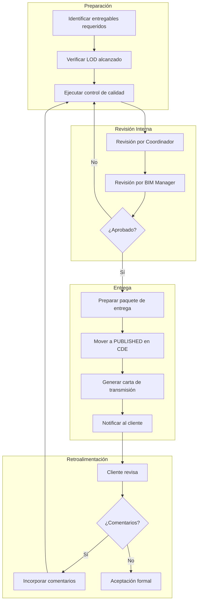
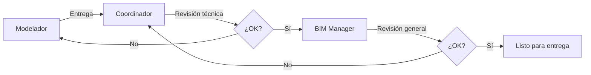
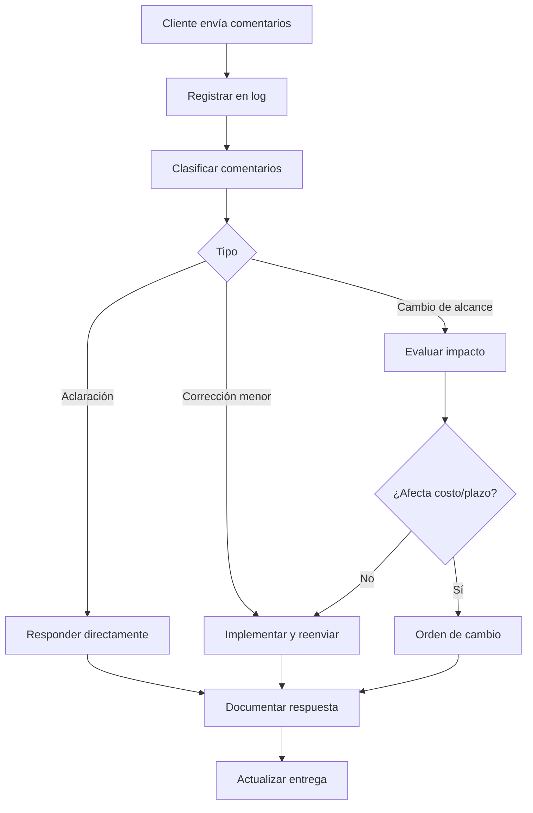

# Flujo de Entrega de Información

**Basado en ISO 19650-2**

---

## Objetivo

Establecer el proceso para la entrega formal de información BIM, asegurando cumplimiento con requisitos del cliente y estándares de calidad.

---

## Diagrama del Proceso



---

## Fases del Proceso

### 1. Identificación de Entregables

**Fuentes de Requisitos:**
- EIR (Exchange Information Requirements)
- Contrato / Alcance de trabajo
- BEP aprobado
- Solicitudes específicas del cliente

**Tabla de Entregables Tipo:**

| Hito | Entregables | Formato | LOD |
|------|-------------|---------|-----|
| Diseño Esquemático | Modelos 3D, Renders | RVT, IFC, PDF | 200 |
| Desarrollo de Diseño | Modelos coordinados, Plantas | RVT, IFC, DWG | 300 |
| Docs. Construcción | Modelos + Planos ejecutivos | RVT, IFC, PDF | 350 |
| As-Built | Modelos finales, COBie | RVT, IFC, XLSX | 500 |

---

### 2. Verificación de LOD

**Checklist por LOD:**

#### LOD 200 (Esquemático)
- [ ] Volúmenes generales definidos
- [ ] Ubicación aproximada de elementos
- [ ] Materiales genéricos asignados
- [ ] Áreas calculables

#### LOD 300 (Desarrollo)
- [ ] Geometría precisa y medible
- [ ] Elementos correctamente clasificados
- [ ] Parámetros básicos poblados
- [ ] Apto para cuantificación

#### LOD 350 (Documentación)
- [ ] Detalle suficiente para construcción
- [ ] Conexiones y interfaces definidas
- [ ] Información de fabricante (si aplica)
- [ ] Vistas de detalle generables

#### LOD 500 (As-Built)
- [ ] Condiciones reales verificadas
- [ ] Ubicación exacta en campo
- [ ] Información de operación
- [ ] Datos para mantenimiento

---

### 3. Control de Calidad Pre-Entrega

**Verificaciones Obligatorias:**

| Categoría | Verificación | Herramienta |
|-----------|--------------|-------------|
| Geometría | Sin elementos duplicados | Revit Warnings |
| Geometría | Sin interferencias críticas | Navisworks |
| Información | Parámetros requeridos poblados | Schedule/Filtros |
| Información | Clasificación correcta | Revisión manual |
| Estándares | Nomenclatura correcta | Script de validación |
| Estándares | Coordenadas verificadas | Revisión en federado |
| Exportación | IFC exporta correctamente | Visor IFC |
| Exportación | Planos legibles | Revisión PDF |

**Formulario de QC:**

```markdown
## Control de Calidad Pre-Entrega

**Proyecto:** ________________
**Entregable:** ________________
**Fecha:** ________________
**Revisor:** ________________

### Geometría
- [ ] Sin warnings críticos (actual: ___)
- [ ] Sin clashes pendientes (actual: ___)
- [ ] Elementos correctamente unidos

### Información
- [ ] Parámetros obligatorios: ___% poblados
- [ ] Materiales asignados: ___% elementos
- [ ] Clasificación verificada

### Estándares
- [ ] Nomenclatura de archivos: OK / Corregir
- [ ] Nomenclatura de vistas: OK / Corregir
- [ ] Coordenadas: X___ Y___ Z___

### Exportación
- [ ] IFC probado en visor
- [ ] PDFs revisados (resolución, capas)

**Resultado:** APROBADO / RECHAZADO
**Observaciones:** ________________
```

---

### 4. Revisión y Aprobación Interna

**Flujo de Aprobación:**



**Criterios de Aprobación:**

| Rol | Verifica |
|-----|----------|
| Coordinador | Contenido técnico, LOD, estándares de disciplina |
| BIM Manager | Coordinación, nomenclatura, exportaciones, cumplimiento EIR |

---

### 5. Preparación del Paquete de Entrega

**Estructura del Paquete:**

```
Entrega_[Proyecto]_[Hito]_[Fecha]/
├── 01_Modelos/
│   ├── Nativos/
│   │   ├── PRY-ARQ-MOD-001.rvt
│   │   ├── PRY-EST-MOD-001.rvt
│   │   └── PRY-MEP-MOD-001.rvt
│   ├── IFC/
│   │   ├── PRY-ARQ-MOD-001.ifc
│   │   ├── PRY-EST-MOD-001.ifc
│   │   └── PRY-MEP-MOD-001.ifc
│   └── Federado/
│       └── PRY-COO-FED-001.nwd
├── 02_Planos/
│   ├── Arquitectura/
│   ├── Estructura/
│   └── MEP/
├── 03_Cuantificacion/
│   └── PRY-CUA-001.xlsx
├── 04_Reportes/
│   ├── Reporte_Coordinacion.pdf
│   └── Reporte_QC.pdf
└── 00_Transmision/
    └── Carta_Transmision.pdf
```

---

### 6. Publicación en CDE

**Proceso:**

1. Mover archivos de SHARED a PUBLISHED
2. Cambiar estado de información a "A" (Aprobado)
3. Bloquear archivos contra edición
4. Registrar en log de entregas

**Estados en CDE:**

| Antes | Después | Significado |
|-------|---------|-------------|
| S1/S2 | A | Aprobado para entrega |
| WIP | - | No se entrega desde WIP |

---

### 7. Carta de Transmisión

**Contenido:**

```markdown
# Carta de Transmisión

**Proyecto:** [Nombre]
**Transmisión No.:** [Consecutivo]
**Fecha:** [DD/MM/AAAA]

**De:** [Empresa]
**Para:** [Cliente]

## Referencia
[Descripción del hito/entrega]

## Documentos Transmitidos

| No. | Descripción | Archivo | Versión | Copias |
|-----|-------------|---------|---------|--------|
| 1 | Modelo Arquitectónico | PRY-ARQ-MOD-001.rvt | 1.0 | Digital |
| 2 | ... | ... | ... | ... |

## Propósito
[ ] Para información
[ ] Para revisión y comentarios
[ ] Para aprobación
[x] Para construcción

## Acciones Requeridas
- Revisar documentos antes de [fecha]
- Enviar comentarios en formato BCF
- Confirmar recepción

## Notas
[Observaciones relevantes]

---
**Preparado por:** _____________ **Fecha:** _____________
**Recibido por:** _____________ **Fecha:** _____________
```

---

### 8. Gestión de Comentarios del Cliente

**Proceso de Retroalimentación:**



**Registro de Comentarios:**

| # | Fecha | Comentario | Tipo | Respuesta | Estado |
|---|-------|------------|------|-----------|--------|
| 1 | | | | | |

---

### 9. Aceptación Formal

**Documento de Aceptación:**

```markdown
# Acta de Aceptación de Entregables

**Proyecto:** [Nombre]
**Entrega:** [Descripción del hito]
**Fecha de Entrega:** [DD/MM/AAAA]

## Entregables Aceptados

| No. | Descripción | Versión | Aceptado |
|-----|-------------|---------|----------|
| 1 | | | [x] |
| 2 | | | [x] |

## Observaciones
[Comentarios finales si los hay]

## Firmas

**Por el Contratista:**
Nombre: _____________
Cargo: _____________
Firma: _____________
Fecha: _____________

**Por el Cliente:**
Nombre: _____________
Cargo: _____________
Firma: _____________
Fecha: _____________
```

---

## Registro de Entregas

| Entrega | Fecha | Contenido | Estado | Aceptación |
|---------|-------|-----------|--------|------------|
| E-001 | | | | |
| E-002 | | | | |

---

## Métricas de Entrega

| Métrica | Fórmula | Meta |
|---------|---------|------|
| Entregas a tiempo | Entregas en fecha / Total | >95% |
| Entregas sin rechazos | Aprobadas primera vez / Total | >80% |
| Tiempo de revisión | Días desde entrega hasta aceptación | <10 días |

---

*Flujo de Entrega BIMAC basado en ISO 19650-2 - www.bimac.io*
