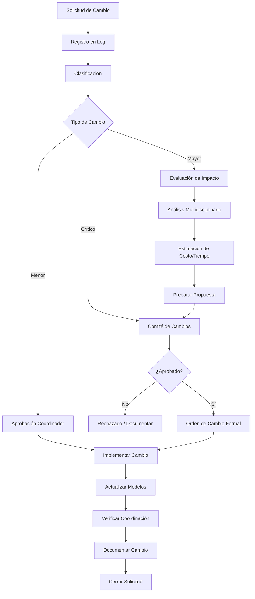
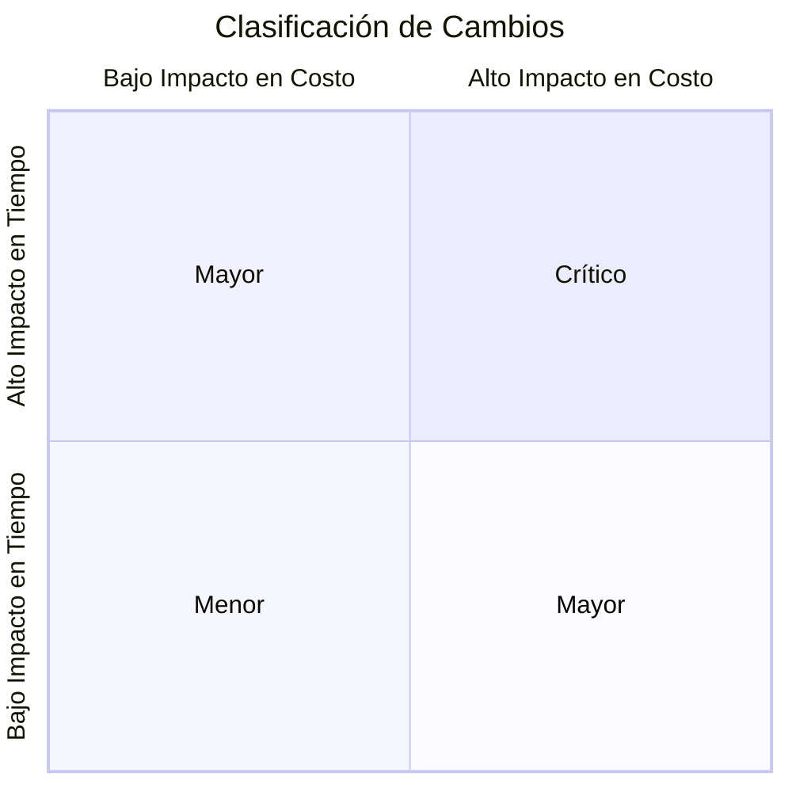
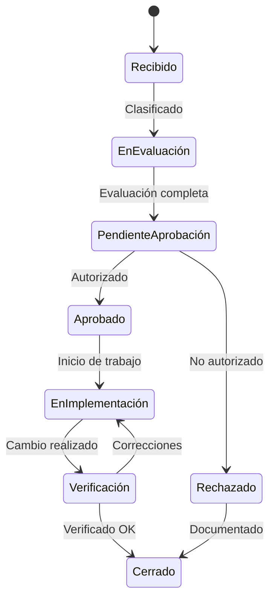
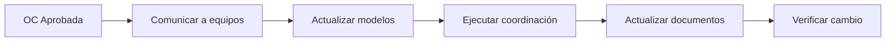

# Flujo de Gestión de Cambios

---

## Objetivo

Establecer el proceso para administrar cambios de diseño de manera controlada, evaluando impactos y asegurando trazabilidad.

---

## Diagrama del Proceso



---

## Clasificación de Cambios

| Tipo | Criterio | Aprobador | Ejemplo |
|------|----------|-----------|---------|
| **Menor** | No afecta otras disciplinas, sin costo adicional | Coordinador | Ajuste de ubicación de contacto |
| **Mayor** | Afecta 1+ disciplinas, impacto moderado en costo/tiempo | Director de Proyecto | Cambio de ruta de ductos |
| **Crítico** | Afecta múltiples disciplinas, impacto significativo | Comité de Cambios | Cambio de sistema estructural |

### Matriz de Clasificación



---

## Fases del Proceso

### 1. Solicitud de Cambio

**Canales de Entrada:**
- RFI del contratista
- Instrucción del cliente
- Resultado de coordinación
- Requisito normativo
- Optimización de diseño

**Formato de Solicitud:**

```markdown
# Solicitud de Cambio

**No. Solicitud:** SC-[AÑO]-[CONSECUTIVO]
**Fecha:** [DD/MM/AAAA]
**Solicitante:** [Nombre, Empresa, Rol]

## Descripción del Cambio
[Descripción clara de qué se quiere cambiar]

## Justificación
[Por qué es necesario el cambio]

## Ubicación
- Disciplina(s): [lista]
- Zona/Nivel: [ubicación]
- Referencia en modelo/plano: [referencia]

## Urgencia
[ ] Normal (10 días hábiles)
[ ] Urgente (5 días hábiles)
[ ] Crítica (48 horas)

## Documentos Adjuntos
- [ ] Croquis/Esquema
- [ ] Fotografía
- [ ] Referencia de plano
- [ ] Otro: ___________
```

---

### 2. Registro y Clasificación

**Log de Cambios:**

| No. | Fecha | Descripción | Solicitante | Tipo | Estado | Responsable |
|-----|-------|-------------|-------------|------|--------|-------------|
| SC-2025-001 | | | | | | |

**Estados del Cambio:**



---

### 3. Evaluación de Impacto

**Análisis Requerido:**

| Área | Preguntas Clave |
|------|-----------------|
| **Diseño** | ¿Qué disciplinas se afectan? ¿Requiere recálculo? |
| **Coordinación** | ¿Genera nuevas interferencias? ¿Afecta interfaces? |
| **Costo** | ¿Costo adicional de diseño? ¿Costo de construcción? |
| **Tiempo** | ¿Afecta ruta crítica? ¿Días adicionales? |
| **Calidad** | ¿Afecta especificaciones? ¿Cumplimiento normativo? |
| **Riesgo** | ¿Introduce nuevos riesgos? ¿Mitiga riesgos existentes? |

**Formato de Evaluación:**

```markdown
# Evaluación de Impacto

**Solicitud No.:** SC-XXXX-XXX
**Evaluador:** [Nombre]
**Fecha:** [DD/MM/AAAA]

## Resumen del Cambio
[Descripción breve]

## Análisis de Impacto

### Disciplinas Afectadas
| Disciplina | Impacto | Trabajo Requerido |
|------------|---------|-------------------|
| ARQ | Alto/Medio/Bajo/Ninguno | |
| EST | Alto/Medio/Bajo/Ninguno | |
| MEP | Alto/Medio/Bajo/Ninguno | |

### Impacto en Costo
| Concepto | Estimación |
|----------|------------|
| Diseño adicional | $ |
| Materiales | $ |
| Mano de obra | $ |
| **Total** | $ |

### Impacto en Tiempo
| Concepto | Días |
|----------|------|
| Rediseño | |
| Recoordinación | |
| Construcción adicional | |
| **Total** | |

### Impacto en Ruta Crítica
[ ] Sí - Afecta fecha de entrega
[ ] No - Puede absorberse

### Riesgos
| Riesgo | Probabilidad | Impacto | Mitigación |
|--------|--------------|---------|------------|
| | | | |

## Recomendación
[ ] Aprobar - Beneficios superan impactos
[ ] Aprobar con condiciones - Especificar:
[ ] Rechazar - Justificación:

## Alternativas Consideradas
1. [Alternativa 1]
2. [Alternativa 2]
```

---

### 4. Aprobación

#### Cambios Menores
- Aprueba: Coordinador de Disciplina
- Plazo: 2 días hábiles
- Documentación: Nota en log + email

#### Cambios Mayores
- Aprueba: Director de Proyecto
- Plazo: 5 días hábiles
- Documentación: Evaluación de impacto + autorización escrita

#### Cambios Críticos
- Aprueba: Comité de Cambios (Cliente + Diseñadores + Constructor)
- Plazo: Según urgencia
- Documentación: Minuta de comité + orden de cambio formal

**Orden de Cambio:**

```markdown
# Orden de Cambio

**No.:** OC-[AÑO]-[CONSECUTIVO]
**Fecha:** [DD/MM/AAAA]
**Proyecto:** [Nombre]

## Referencia
Solicitud de Cambio: SC-XXXX-XXX

## Descripción del Cambio Aprobado
[Descripción detallada]

## Alcance
[Trabajo específico a realizar]

## Impacto Autorizado
| Concepto | Valor |
|----------|-------|
| Costo adicional | $ |
| Días adicionales | |
| Nueva fecha de entrega | |

## Condiciones
[Condiciones específicas si las hay]

## Autorizaciones

**Por el Cliente:**
Nombre: _____________ Firma: _____________ Fecha: _____________

**Por el Diseñador:**
Nombre: _____________ Firma: _____________ Fecha: _____________

**Por el Constructor:**
Nombre: _____________ Firma: _____________ Fecha: _____________
```

---

### 5. Implementación

**Proceso de Implementación:**



**Checklist de Implementación:**

- [ ] Orden de cambio distribuida a todos los afectados
- [ ] Modelos BIM actualizados
- [ ] Clash detection re-ejecutado
- [ ] Planos actualizados (si aplica)
- [ ] Cuantificación actualizada
- [ ] Presupuesto ajustado
- [ ] Programa actualizado
- [ ] Documentación de proyecto actualizada

---

### 6. Verificación y Cierre

**Verificación:**

| Aspecto | Verificación | Estado |
|---------|--------------|--------|
| Modelo | Cambio implementado correctamente | ✓/✗ |
| Coordinación | Sin nuevas interferencias | ✓/✗ |
| Documentación | Planos/specs actualizados | ✓/✗ |
| Comunicación | Todos los involucrados notificados | ✓/✗ |

**Cierre:**

```markdown
# Cierre de Solicitud de Cambio

**Solicitud No.:** SC-XXXX-XXX
**Orden de Cambio:** OC-XXXX-XXX
**Fecha de Cierre:** [DD/MM/AAAA]

## Resumen de Implementación
[Descripción de lo realizado]

## Verificaciones
- [x] Cambio implementado en modelo
- [x] Coordinación verificada
- [x] Documentación actualizada
- [x] Partes interesadas notificadas

## Impacto Real vs Estimado
| Concepto | Estimado | Real | Variación |
|----------|----------|------|-----------|
| Costo | $ | $ | $ |
| Tiempo | días | días | días |

## Lecciones Aprendidas
[Si aplica]

**Cerrado por:** _____________ **Fecha:** _____________
```

---

## Métricas de Gestión de Cambios

| Métrica | Fórmula | Meta |
|---------|---------|------|
| Tiempo de respuesta | Días desde solicitud hasta decisión | <5 días (Mayor) |
| Precisión de estimación | \|Real - Estimado\| / Estimado | <20% |
| Cambios por fase | Cambios en fase / Total cambios | Minimizar en fases tardías |
| Cambios rechazados | Rechazados / Total | Documentar razones |

---

## Prevención de Cambios

### Estrategias Proactivas

| Fase | Estrategia |
|------|------------|
| Diseño temprano | Definir alcance claramente, involucrar stakeholders |
| Desarrollo | Coordinación frecuente, revisiones de diseño |
| Documentación | Verificación de constructabilidad |
| Construcción | Reuniones de preinicio, submittals oportunos |

### Análisis de Causa Raíz

Para cambios recurrentes, analizar:

```mermaid
fishbone
    title Causas de Cambios Frecuentes
    Diseño
        Información incompleta
        Falta de coordinación
        Cambios de alcance
    Construcción
        Condiciones de sitio
        Disponibilidad de materiales
        Métodos constructivos
    Cliente
        Cambios de requisitos
        Decisiones tardías
        Nuevos stakeholders
    Externo
        Normativa
        Mercado
        Clima
```

---

*Flujo de Gestión de Cambios BIMAC - www.bimac.io*
