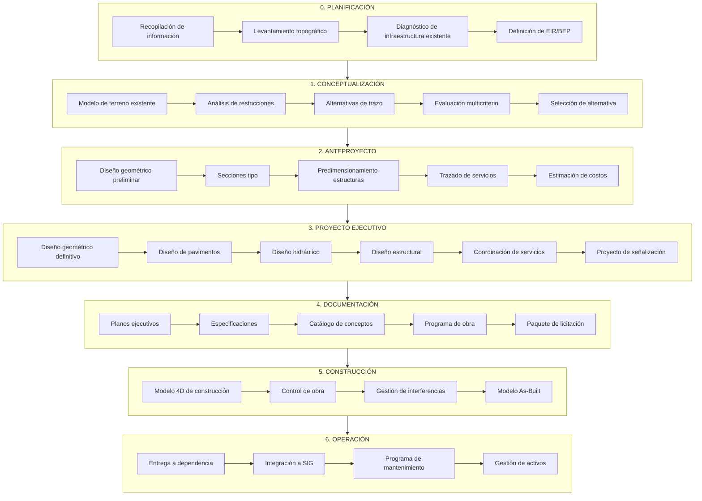
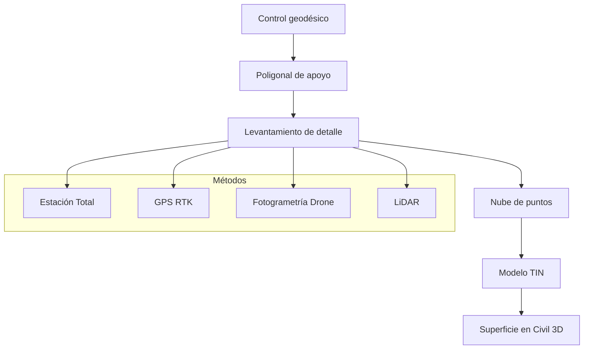
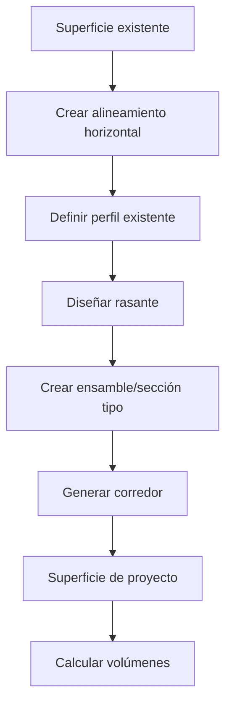
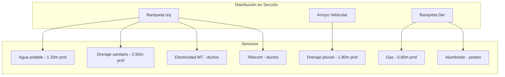
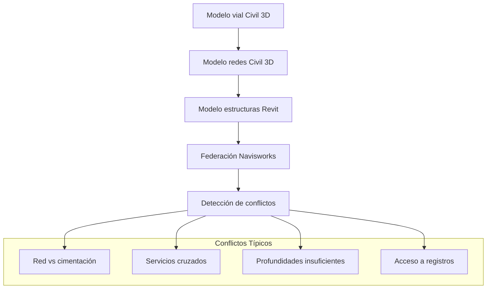
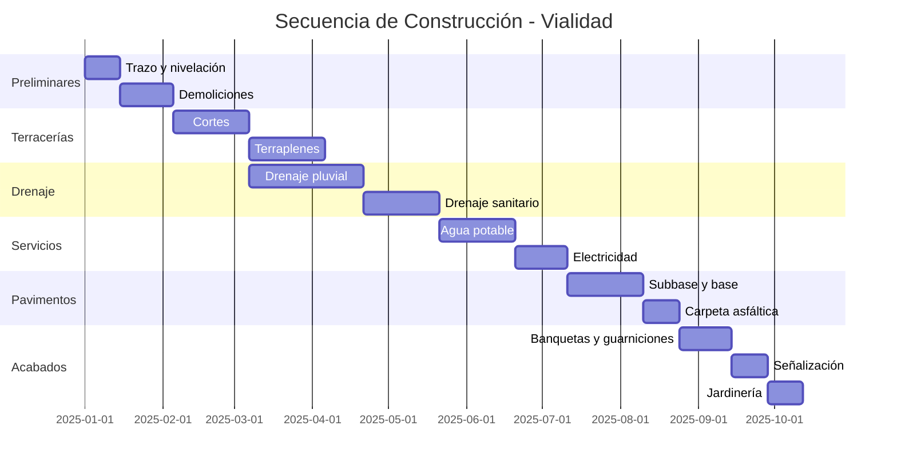
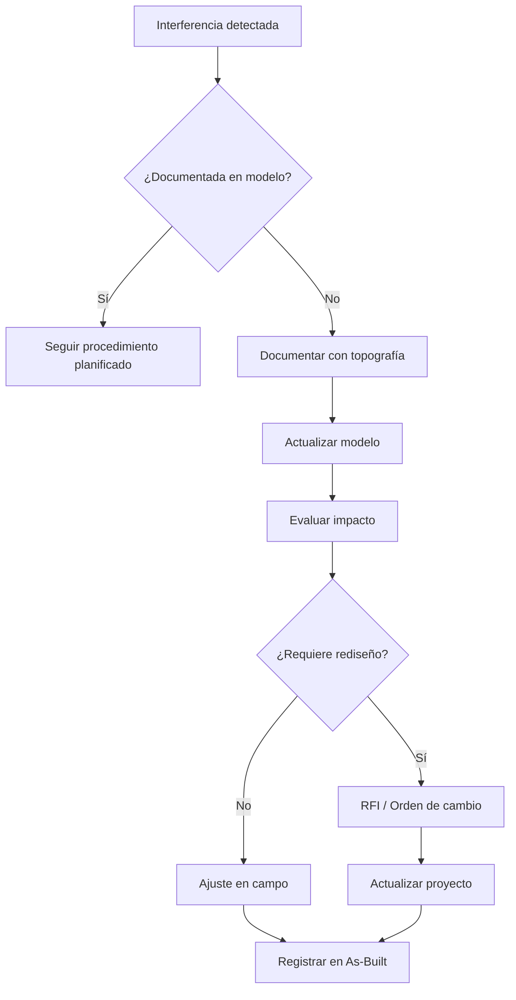
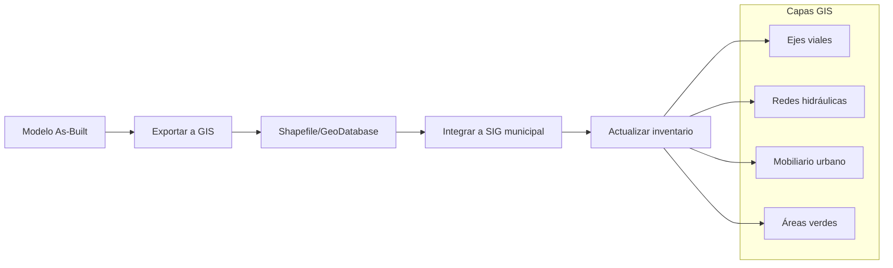
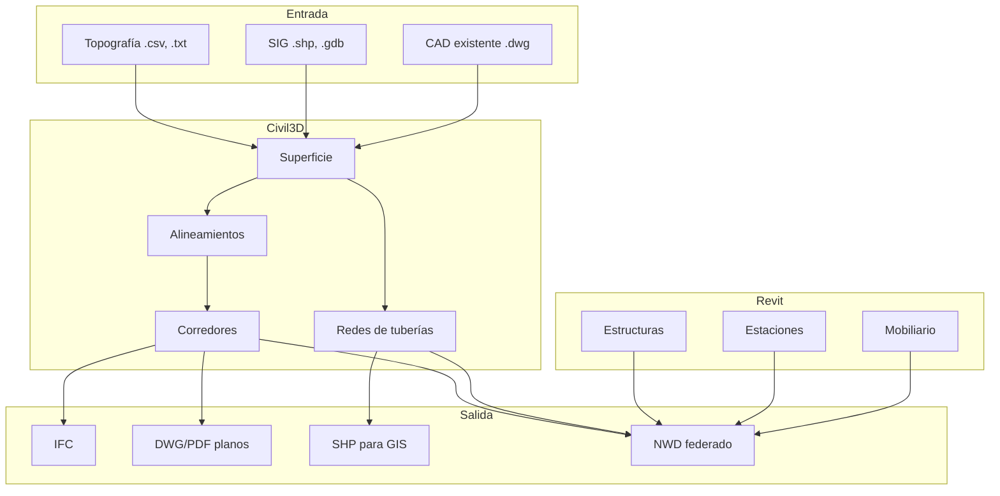

# Flujo BIM para Proyectos de Infraestructura Urbana

**BIMAC Studio - www.bimacstudio.com**

---

## Objetivo

Establecer el flujo de trabajo BIM especializado para proyectos de infraestructura urbana, integrando modelado geoespacial, diseño civil, coordinación de servicios públicos y gestión del ciclo de vida de activos lineales y puntuales.

---

## Alcance

### Tipologías de Infraestructura Urbana

| Categoría | Ejemplos | Software Principal |
|-----------|----------|-------------------|
| **Vialidades** | Calles, avenidas, intersecciones, puentes vehiculares | Civil 3D, Infraworks |
| **Transporte** | Líneas de metro, BRT, estaciones, paraderos | Revit, Civil 3D |
| **Hidráulica** | Redes de agua, drenaje, plantas de tratamiento | Civil 3D, Revit |
| **Espacio Público** | Parques, plazas, ciclovías, andadores | Civil 3D, Revit |
| **Servicios** | Alumbrado, cableado subterráneo, fibra óptica | Civil 3D, Revit |
| **Mobiliario Urbano** | Paradas, bancas, señalización, luminarias | Revit, Rhino |

---

## Características Especiales de Infraestructura

### Diferencias vs. Edificación

| Aspecto | Edificación | Infraestructura |
|---------|-------------|-----------------|
| **Geometría** | Vertical, contenida | Lineal, extensa |
| **Coordenadas** | Proyecto local | Georreferenciado UTM |
| **Escala** | Metros | Kilómetros |
| **Topografía** | Plana o definida | Variable, crítica |
| **Disciplinas** | ARQ, EST, MEP | Civil, GEO, HID, VIA |
| **Interacciones** | Entre edificio | Con ciudad existente |
| **Normativa** | Códigos edificación | Normativa vial, urbana |
| **Stakeholders** | Cliente privado | Múltiples dependencias |

### Sistema de Coordenadas


| Parámetro | Valor Típico (México) |
|-----------|----------------------|
| Zona UTM | 14N |
| Datum | WGS84 / ITRF2008 |
| Unidades | Metros |
| Precisión | ±2 cm horizontal |

---

## Diagrama Maestro del Proceso



---

## Fase 0: Planificación y Diagnóstico

### Duración Típica: 4-8 semanas

### Recopilación de Información

| Información | Fuente | Formato |
|-------------|--------|---------|
| Cartografía base | INEGI, municipio | DWG, SHP |
| Ortofotos | Drones, satélite | TIFF, JPG |
| Topografía | Levantamiento | Puntos, TIN |
| Catastro | Registro público | SHP, DWG |
| Redes existentes | Organismos operadores | DWG, SHP |
| Normativa | SCT, municipal | PDF |
| Estudios previos | Archivo | PDF, DWG |

### Levantamiento Topográfico



### Diagnóstico de Infraestructura Existente

| Sistema | Verificaciones |
|---------|---------------|
| **Vialidad** | Geometría, estado de pavimento, secciones |
| **Drenaje** | Ubicación de pozos, diámetros, pendientes, estado |
| **Agua potable** | Red, válvulas, tomas, presiones |
| **Electricidad** | Postes, transformadores, acometidas |
| **Gas** | Red, válvulas, acometidas |
| **Telecom** | Registros, ductos, fibra |
| **Mobiliario** | Postes, señales, bancas, jardineras |

---

## Fase 1: Conceptualización

### LOD Objetivo: 100

### Modelo de Terreno


### Análisis de Restricciones

| Tipo | Ejemplos | Representación |
|------|----------|----------------|
| **Físicas** | Cuerpos de agua, pendientes, predios | Polígonos |
| **Normativas** | Derechos de vía, zonas protegidas | Buffers |
| **Infraestructura** | Líneas de alta tensión, gasoductos | Líneas con buffer |
| **Ambientales** | Áreas verdes, especies protegidas | Polígonos |
| **Sociales** | Asentamientos, comercios | Polígonos |

### Matriz de Evaluación de Alternativas

| Criterio | Peso | Alternativa 1 | Alternativa 2 | Alternativa 3 |
|----------|------|---------------|---------------|---------------|
| Costo | 25% | | | |
| Impacto social | 20% | | | |
| Impacto ambiental | 15% | | | |
| Factibilidad técnica | 20% | | | |
| Tiempo de ejecución | 10% | | | |
| Mantenimiento | 10% | | | |
| **Total ponderado** | 100% | | | |

### Visualización en Infraworks

| Elemento | Nivel de Detalle |
|----------|-----------------|
| Terreno | Superficie real + ortofotos |
| Edificaciones | Masas 3D extruidas |
| Vegetación | Puntos + símbolos |
| Vialidades | Corredores esquemáticos |
| Agua | Superficies con textura |

---

## Fase 2: Anteproyecto

### LOD Objetivo: 200

### Diseño Geométrico Preliminar

#### Vialidades

| Elemento | Parámetros | Normativa |
|----------|------------|-----------|
| Velocidad de proyecto | km/h | SCT, Manual de calles |
| Radio mínimo de curva | m | Según velocidad |
| Pendiente máxima | % | Según clasificación |
| Bombeo | % | 2% típico |
| Sobreelevación máxima | % | 8-10% |
| Distancia de visibilidad | m | Según velocidad |

#### Secciones Tipo

```
SECCIÓN TIPO - AVENIDA PRINCIPAL
├── Banqueta izq. (2.00 m)
├── Ciclovía (1.50 m)
├── Camellón arbolado (2.00 m)
├── Carril izq. (3.50 m)
├── Carril central (3.50 m)
├── Carril derecho (3.50 m)
├── Camellón central (4.00 m)
├── Carril izq. (3.50 m)
├── Carril central (3.50 m)
├── Carril derecho (3.50 m)
├── Camellón arbolado (2.00 m)
├── Ciclovía (1.50 m)
└── Banqueta der. (2.00 m)
    TOTAL: 35.00 m
```

### Flujo en Civil 3D



### Predimensionamiento de Estructuras

| Estructura | Tipo | Método |
|------------|------|--------|
| Puentes vehiculares | Vigas AASHTO | Tablas preliminares |
| Puentes peatonales | Acero/concreto | Catálogos |
| Muros de contención | Concreto armado | Alturas típicas |
| Alcantarillas | Cajón/tubo | Hidráulico preliminar |
| Pasos a desnivel | Cajón | Gálibos vehiculares |

### Trazado de Servicios Preliminar



---

## Fase 3: Proyecto Ejecutivo

### LOD Objetivo: 300-350

### Diseño Geométrico Definitivo

#### Productos Civil 3D

| Entregable | Descripción |
|------------|-------------|
| Alineamientos | Horizontal y vertical |
| Perfiles | Existente y proyecto |
| Secciones transversales | Cada 20m o menos |
| Corredor 3D | Modelo de superficie |
| Volúmenes | Corte, terraplén, subrasante |
| Curvas masa | Diagrama de masas |

### Diseño de Pavimentos

| Capa | Espesor Típico | Material |
|------|---------------|----------|
| Carpeta asfáltica | 5-10 cm | Concreto asfáltico |
| Base hidráulica | 15-25 cm | Material pétreo |
| Sub-base | 15-30 cm | Material selecto |
| Subrasante | Variable | Terreno natural mejorado |

### Diseño Hidráulico

#### Drenaje Pluvial


| Parámetro | Método/Valor |
|-----------|--------------|
| Periodo de retorno | 5-10 años (colectores), 25-50 años (descargas) |
| Coeficiente de escurrimiento | 0.70-0.90 (urbano) |
| Fórmula de intensidad | Estación meteorológica local |
| Fórmula de diseño | Manning |
| Velocidad mínima | 0.60 m/s |
| Velocidad máxima | 5.00 m/s |

#### Red de Agua Potable

| Elemento | Consideraciones |
|----------|-----------------|
| Diámetro mínimo | 100 mm (red secundaria) |
| Presión mínima | 15 m.c.a. |
| Presión máxima | 50 m.c.a. |
| Velocidad | 0.5 - 2.0 m/s |
| Cobertura | 1.00 - 1.20 m |

### Diseño Estructural

| Estructura | Software | Entregables |
|------------|----------|-------------|
| Puentes | CSiBridge, Revit | Modelo 3D, planos, memorias |
| Muros | SAFE, Revit | Modelo 3D, armados |
| Alcantarillas | Civil 3D, Revit | Planos tipo, memorias |
| Pavimento rígido | PCA, Civil 3D | Diseño de losas, juntas |

### Coordinación de Servicios



#### Matriz de Separaciones Mínimas

| Servicio A | Servicio B | Separación Horizontal | Separación Vertical |
|------------|------------|----------------------|---------------------|
| Agua potable | Drenaje sanitario | 2.50 m | AP arriba de DS |
| Agua potable | Gas | 0.50 m | Indiferente |
| Electricidad MT | Gas | 0.50 m | - |
| Telecom | Electricidad | 0.30 m | - |
| Drenaje pluvial | Drenaje sanitario | 0.50 m | DP arriba de DS |

### Proyecto de Señalización

| Tipo | Elementos |
|------|-----------|
| **Horizontal** | Rayas, flechas, símbolos, letras |
| **Vertical** | Preventivas, restrictivas, informativas |
| **Semáforos** | Vehiculares, peatonales, ciclistas |
| **Dispositivos** | Boyas, topes, reductores |

---

## Fase 4: Documentación

### Paquete de Planos

| Serie | Contenido | Software |
|-------|-----------|----------|
| **IG** | Índice, generales, simbología | AutoCAD |
| **TO** | Topografía, poligonal, BMs | Civil 3D |
| **PL** | Planta general, lotificación | Civil 3D |
| **PP** | Planta-perfil vialidades | Civil 3D |
| **ST** | Secciones transversales | Civil 3D |
| **PV** | Pavimentos, detalles | Civil 3D, AutoCAD |
| **DP** | Drenaje pluvial | Civil 3D |
| **DS** | Drenaje sanitario | Civil 3D |
| **AP** | Agua potable | Civil 3D |
| **AL** | Alumbrado público | AutoCAD, Revit |
| **SE** | Señalización y dispositivos | AutoCAD |
| **ES** | Estructuras | Revit |
| **MU** | Mobiliario urbano | Revit |
| **JA** | Jardinería y áreas verdes | Civil 3D |

### Especificaciones Técnicas

| Capítulo | Contenido |
|----------|-----------|
| Preliminares | Trazo, nivelación, demoliciones |
| Terracerías | Corte, terraplén, compactación |
| Pavimentos | Capas, carpetas, concreto |
| Drenaje | Tuberías, pozos, descargas |
| Agua potable | Tuberías, válvulas, tomas |
| Estructuras | Concreto, acero, cimentaciones |
| Señalización | Marcas, señales, semáforos |
| Jardinería | Plantación, riego |

---

## Fase 5: Construcción

### Modelo 4D

#### Secuencia Típica de Construcción



### Control de Obra con Modelo BIM

| Actividad | Verificación | Herramienta |
|-----------|--------------|-------------|
| Trazo | Coordenadas GPS vs modelo | Estación total + Civil 3D |
| Niveles | Elevaciones vs rasante | Nivel, GPS |
| Espesores | Capas de pavimento | Medición directa |
| Compactación | Densidades | Laboratorio |
| Tuberías | Pendientes y ubicación | Nivel láser |
| Posición de estructuras | Coordenadas | Topografía |

### Gestión de Interferencias en Campo



---

## Fase 6: Operación y Mantenimiento

### Entrega a Dependencia

| Receptor | Activos |
|----------|---------|
| Municipio - Obras Públicas | Vialidades, banquetas, señalización |
| Municipio - Parques | Áreas verdes, mobiliario |
| Organismo de Agua | Redes AP, DS, DP |
| CFE / Empresa eléctrica | Red eléctrica, alumbrado |
| Empresas telecom | Ductos y registros |

### Integración con SIG Municipal



### Programa de Mantenimiento

| Sistema | Mantenimiento Preventivo | Frecuencia |
|---------|-------------------------|------------|
| Pavimento | Bacheo, sello de grietas | Anual |
| Señalización horizontal | Repintado | 2-3 años |
| Señalización vertical | Limpieza, reposición | Anual |
| Alumbrado | Cambio de luminarias | Por falla + programado |
| Áreas verdes | Poda, riego, reposición | Continuo |
| Drenaje | Desazolve de pozos | Semestral |
| Mobiliario | Pintura, reparaciones | Anual |

### Gestión de Activos

| Dato | Uso |
|------|-----|
| Ubicación georreferenciada | Localización para mantenimiento |
| Fecha de instalación | Cálculo de vida útil |
| Especificaciones | Reposición correcta |
| Historial de mantenimiento | Análisis de fallas |
| Costo de reposición | Presupuestación |
| Condición actual | Priorización de intervenciones |

---

## Herramientas por Fase

| Fase | Civil 3D | Revit | Infraworks | Navisworks | Otros |
|------|:--------:|:-----:|:----------:|:----------:|:-----:|
| Conceptual | ◐ | ○ | ● | ○ | QGIS |
| Anteproyecto | ● | ◐ | ● | ○ | - |
| Ejecutivo | ● | ● | ◐ | ● | SAP2000 |
| Documentación | ● | ● | ○ | ○ | AutoCAD |
| Construcción | ● | ◐ | ○ | ● | Synchro |
| Operación | ◐ | ○ | ○ | ○ | ArcGIS |

*● Principal | ◐ Secundario | ○ Opcional*

---

## Interoperabilidad

### Flujo de Datos



### Formatos de Intercambio

| Propósito | Formato | Software Origen | Software Destino |
|-----------|---------|-----------------|------------------|
| Terreno | .xml (LandXML) | Civil 3D | Infraworks, otros |
| Diseño vial | .xml (LandXML) | Civil 3D | Synchro, otros |
| Estructuras | .ifc | Revit | Navisworks, visores |
| Redes | .sqlite | Civil 3D | QGIS, ArcGIS |
| Coordinación | .nwc/.nwd | Civil 3D, Revit | Navisworks |
| GIS | .shp | Civil 3D | ArcGIS, QGIS |

---

## Automatización con n8n

### Workflows Específicos para Infraestructura

| Trigger | Proceso | Resultado |
|---------|---------|-----------|
| Actualización de superficie | Recalcular volúmenes | Notificar cambios significativos |
| Nuevo punto topográfico | Validar coordenadas | Alerta si fuera de tolerancia |
| Issue BCF creado | Clasificar por km/estación | Asignar a responsable de tramo |
| Avance de obra | Actualizar modelo 4D | Generar reporte semanal |
| Entrega de tramo | Generar paquete As-Built | Notificar a dependencia |

---

## KPIs para Infraestructura

| Categoría | KPI | Meta |
|-----------|-----|------|
| **Topografía** | Precisión de levantamiento | ±2 cm |
| **Diseño** | Cumplimiento de normativa SCT | 100% |
| **Coordinación** | Interferencias por km | <5 |
| **Volúmenes** | Variación vs. estimado | <10% |
| **Tiempo** | Cumplimiento de programa | >90% |
| **Entrega** | Observaciones de dependencia | <3 por entrega |

---

## Documentos Relacionados

| Documento | Ubicación |
|-----------|-----------|
| BEP Template | `templates/bep/bep-template-v1.md` |
| EIR Template | `templates/iso19650/eir-template.md` |
| Guía ISO 19650 | `docs/bim/iso-19650-guia.md` |
| Workflow Edificación | `docs/workflows/edificacion-bim.md` |
| Prompts BIM | `research/ai-prompts/` |

---

## Referencias Normativas

| Normativa | Aplicación |
|-----------|------------|
| SCT - Manual de Diseño Geométrico | Vialidades |
| CONAGUA - Manual de Agua Potable | Redes AP |
| CONAGUA - Manual de Alcantarillado | Drenaje |
| NOM-001-SEDE | Instalaciones eléctricas |
| Manual de Calles (SEDATU) | Diseño urbano |
| Reglamento de Tránsito local | Señalización |

---

*Flujo de Infraestructura Urbana BIMAC Studio - www.bimacstudio.com*
