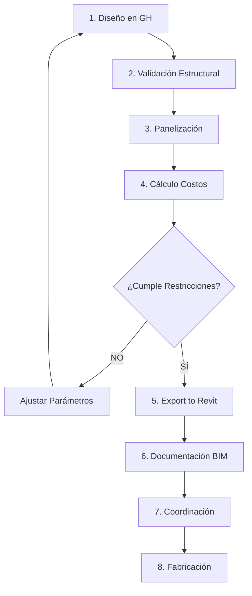

# Cubierta Orgánica de Museo

**Proyecto:** MUSEO-CUBIERTA-001
**Cliente:** [Nombre del Cliente]
**Fecha de Inicio:** 2025-12-27
**Estado:** En Desarrollo

---

## Descripción del Proyecto

Diseño paramétrico de una cubierta orgánica para museo con integración completa Grasshopper + Revit. El sistema permite iteraciones rápidas de diseño con validación automática de restricciones estructurales y optimización de costos.

### Objetivos

1. **Luz libre máxima:** 15 metros (restricción estructural)
2. **Optimización de costos:** Racionalización de paneles para minimizar fabricación
3. **Integración BIM:** Transferencia directa a Revit como Adaptive Components
4. **Automatización:** Generación automática de schedules y reportes de costos

---

## Parámetros del Proyecto

| Parámetro | Valor | Unidad | Notas |
|-----------|-------|--------|-------|
| Área de cubierta | ~400 | m² | Galería principal |
| Luz libre máxima | 15.0 | m | Restricción estructural |
| Altura cenit | 8.5 | m | Proporción áurea vs luz |
| Pendiente mínima | 2 | % | Drenaje pluvial |
| Módulo panel | 2.0 × 1.5 | m | Optimización fabricación |
| Material estructura | Acero | - | Perfiles tubulares |
| Material paneles | Policarbonato | - | Celular 16mm |
| Presupuesto cubierta | 280,000 | MXN | ~$700 MXN/m² |

---

## Stack Tecnológico

```
┌─────────────────────────────────────────────────────────┐
│                    DISEÑO PARAMÉTRICO                   │
├─────────────────────────────────────────────────────────┤
│  Rhino 8           │  Modelado base                    │
│  Grasshopper       │  Lógica paramétrica               │
│  Lunchbox          │  Panelización                     │
│  Pufferfish        │  Racionalización NURBS            │
│  Weaverbird        │  Subdivisión mesh                 │
└─────────────────────────────────────────────────────────┘

┌─────────────────────────────────────────────────────────┐
│                    INTEGRACIÓN BIM                      │
├─────────────────────────────────────────────────────────┤
│  Rhino.inside.Revit│  Bridge GH-Revit                  │
│  Revit 2024        │  Modelo BIM final                 │
│  Adaptive Family   │  Paneles paramétricos             │
└─────────────────────────────────────────────────────────┘

┌─────────────────────────────────────────────────────────┐
│                    AUTOMATIZACIÓN                       │
├─────────────────────────────────────────────────────────┤
│  n8n               │  Workflows notificación           │
│  Airtable          │  Tracking de costos               │
│  Python            │  Scripts de exportación           │
└─────────────────────────────────────────────────────────┘
```

---

## Estructura del Proyecto

```
cubierta-museo-organica/
├── README.md                    # Este archivo
├── PROJECT.md                   # Especificaciones técnicas detalladas
├── src/
│   ├── grasshopper/
│   │   ├── definitions/         # Archivos .gh
│   │   │   ├── 01_geometria_base.gh
│   │   │   ├── 02_validacion_estructural.gh
│   │   │   ├── 03_panelizacion.gh
│   │   │   ├── 04_costos.gh
│   │   │   └── main_cubierta.gh
│   │   ├── scripts/
│   │   │   └── python/          # Scripts Python para GH
│   │   │       ├── curvature_analyzer.py
│   │   │       ├── cost_calculator.py
│   │   │       └── revit_exporter.py
│   │   └── clusters/            # GH Clusters reutilizables
│   │       └── PanelOptimizer.ghcluster
│   ├── revit/
│   │   ├── families/            # Familias adaptativas
│   │   │   └── Cubierta_Panel_Adaptive.rfa
│   │   └── scripts/             # Scripts PyRevit
│   │       └── update_schedule.py
│   └── n8n/
│       └── workflows/           # Workflows de automatización
│           └── cost_update_notifier.json
├── docs/
│   ├── workflow.md              # Documentación del workflow
│   ├── parameters.md            # Guía de parámetros
│   └── troubleshooting.md       # Solución de problemas
├── resources/
│   ├── icons/                   # Iconos para UI
│   └── templates/               # Plantillas Excel, etc.
│       └── cost_report_template.xlsx
├── exports/                     # Archivos exportados
│   ├── ifc/
│   ├── excel/
│   └── images/
└── tests/                       # Definiciones de prueba
    └── test_surface.3dm
```

---

## Instalación y Setup

### Requisitos

- Rhino 7 o 8
- Grasshopper (incluido con Rhino)
- Revit 2024
- Rhino.inside.Revit

### Plugins de Grasshopper Requeridos

1. **Lunchbox** - [food4rhino.com/lunchbox](https://www.food4rhino.com/en/app/lunchbox)
2. **Pufferfish** - [food4rhino.com/pufferfish](https://www.food4rhino.com/en/app/pufferfish)
3. **Weaverbird** - [giuliopiacentino.com/weaverbird](https://www.giuliopiacentino.com/weaverbird/)

### Instalación de Plugins

```
1. Abrir Grasshopper en Rhino
2. File > Special Folders > Components Folder
3. Copiar archivos .gha descargados
4. Reiniciar Rhino
```

---

## Uso Rápido

### 1. Abrir Definición Principal

```
1. Abrir Rhino
2. Comando: Grasshopper
3. File > Open > src/grasshopper/definitions/main_cubierta.gh
```

### 2. Ajustar Parámetros

| Slider | Descripción | Rango | Default |
|--------|-------------|-------|---------|
| `Ancho_Museo` | Ancho del museo (luz libre) | 10-18 m | 15 m |
| `Largo_Museo` | Largo del museo | 20-30 m | 26 m |
| `Altura_Cenit` | Altura máxima de cubierta | 6-12 m | 8.5 m |
| `Tension_Curva` | Factor de curvatura | 0-1 | 0.65 |
| `U_Count` | Divisiones en U | 5-20 | 13 |
| `V_Count` | Divisiones en V | 5-15 | 10 |

### 3. Verificar Validaciones

El script validará automáticamente:
- Luz libre ≤ 15m
- Pendiente mínima ≥ 2%
- Costo total ≤ $280,000 MXN

### 4. Exportar a Revit

```
1. En Revit, activar Rhino.inside.Revit
2. Ribbon > Rhinoceros > Rhino
3. En Rhino, abrir Grasshopper
4. Ejecutar script de exportación
5. Verificar Adaptive Components en modelo
```

---

## Análisis de Costos

### Estructura de Costos por Tipo de Panel

| Tipo Panel | Costo/m² | Descripción |
|------------|----------|-------------|
| Plano | $450 MXN | Policarbonato estándar |
| Curvatura Simple | $680 MXN | Termoformado simple |
| Doble Curvatura | $1,250 MXN | Molde complejo |

### Distribución Óptima

```
Configuración Recomendada:
├── Paneles planos:        78% (101 uds) → $136,350 MXN
├── Curvatura simple:      18% (23 uds)  → $47,070 MXN
├── Doble curvatura:        4% (6 uds)   → $22,500 MXN
├── Subtotal paneles:                    → $205,920 MXN
├── Estructura metálica:   25%           → $51,480 MXN
└── TOTAL:                               → $257,400 MXN

Presupuesto: $280,000 MXN
Ahorro: $22,600 MXN (8.1%)
```

---

## Workflow de Desarrollo



---

## Archivos Clave

| Archivo | Descripción |
|---------|-------------|
| `main_cubierta.gh` | Definición principal de Grasshopper |
| `cost_calculator.py` | Calculadora de costos Python |
| `Cubierta_Panel_Adaptive.rfa` | Familia adaptativa para Revit |
| `cost_update_notifier.json` | Workflow n8n para notificaciones |

---

## Contacto

**BIMAC - BIM Advance Consulting**
- Web: [bimac.io](https://www.bimac.io)
- Email: contacto@bimac.io

---

## Changelog

| Versión | Fecha | Cambios |
|---------|-------|---------|
| 1.0.0 | 2025-12-27 | Estructura inicial del proyecto |
