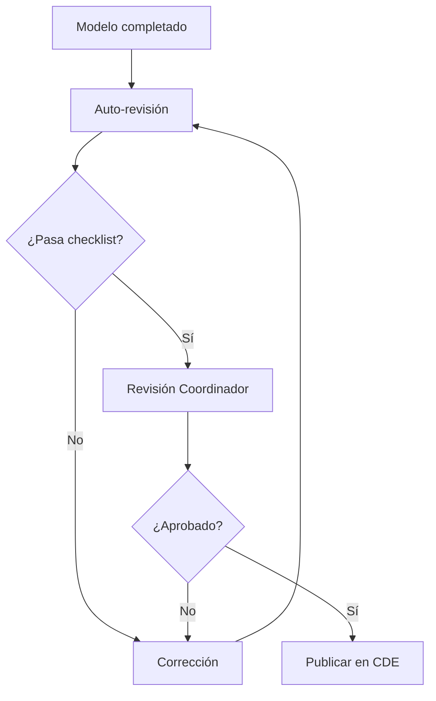

# BIM Execution Plan (BEP)

**Plantilla BIMAC v1.0**

---

## Información del Documento

| Campo | Valor |
|-------|-------|
| **Proyecto** | [Nombre del Proyecto] |
| **Código** | [PRY-000] |
| **Cliente** | [Nombre del Cliente] |
| **Versión** | 1.0 |
| **Fecha** | [DD/MM/AAAA] |
| **Estado** | Borrador / En Revisión / Aprobado |

### Control de Versiones

| Versión | Fecha | Autor | Cambios |
|---------|-------|-------|---------|
| 1.0 | [Fecha] | [Nombre] | Versión inicial |

### Aprobaciones

| Rol | Nombre | Firma | Fecha |
|-----|--------|-------|-------|
| BIM Manager | | | |
| Director de Proyecto | | | |
| Cliente | | | |

---

## 1. Información General del Proyecto

### 1.1 Descripción del Proyecto

| Campo | Descripción |
|-------|-------------|
| **Nombre** | |
| **Ubicación** | |
| **Tipo** | Edificación / Infraestructura / Mixto |
| **Superficie** | m² |
| **Presupuesto estimado** | $ |
| **Fecha inicio** | |
| **Fecha entrega** | |

### 1.2 Alcance BIM

| Fase | Incluida | LOD Objetivo |
|------|----------|--------------|
| Conceptual | [ ] | LOD 100 |
| Esquemático | [ ] | LOD 200 |
| Desarrollo de Diseño | [ ] | LOD 300 |
| Documentos de Construcción | [ ] | LOD 350 |
| Construcción | [ ] | LOD 400 |
| As-Built | [ ] | LOD 500 |

### 1.3 Disciplinas Participantes

| Disciplina | Empresa | Contacto | Software |
|------------|---------|----------|----------|
| Arquitectura | | | |
| Estructura | | | |
| MEP - Mecánico | | | |
| MEP - Eléctrico | | | |
| MEP - Plomería | | | |
| Civil | | | |

---

## 2. Objetivos y Usos BIM

### 2.1 Objetivos del Proyecto

| # | Objetivo | Prioridad | Métrica de Éxito |
|---|----------|-----------|------------------|
| 1 | | Alta/Media/Baja | |
| 2 | | | |
| 3 | | | |

### 2.2 Usos BIM

| Uso BIM | Fase | Responsable | Entregable |
|---------|------|-------------|------------|
| **Diseño** | | | |
| Modelado 3D | | | Modelos .rvt/.ifc |
| Visualización | | | Renders, recorridos |
| Análisis de opciones | | | Comparativas |
| **Coordinación** | | | |
| Detección de interferencias | | | Reportes BCF |
| Revisión de diseño | | | Actas de sesión |
| **Simulación** | | | |
| 4D - Programación | | | Modelo vinculado |
| 5D - Estimación | | | Cuantificación |
| 6D - Sustentabilidad | | | Análisis energético |
| **Construcción** | | | |
| Prefabricación | | | Planos de taller |
| Logística de sitio | | | Layout 3D |
| **Operación** | | | |
| As-Built | | | Modelo final |
| FM Handover | | | COBie / datos |

---

## 3. Roles y Responsabilidades

### 3.1 Matriz RACI

| Actividad | BIM Manager | Coordinador | Modelador | Director |
|-----------|-------------|-------------|-----------|----------|
| Definir estándares | R | C | I | A |
| Crear modelos | I | C | R | I |
| Control de calidad | R | R | C | I |
| Coordinación | R | R | C | A |
| Entregables | A | R | R | I |
| Capacitación | R | C | I | A |

**Leyenda:** R = Responsable, A = Aprueba, C = Consultado, I = Informado

### 3.2 Descripción de Roles

#### BIM Manager
- Definir y mantener estándares BIM
- Configurar y administrar el CDE
- Coordinar reuniones de integración
- Validar calidad de modelos
- Gestionar issues y conflictos

#### Coordinador de Disciplina
- Supervisar modeladores de su disciplina
- Verificar cumplimiento de estándares
- Participar en sesiones de coordinación
- Resolver conflictos de su especialidad

#### Modelador BIM
- Crear y mantener modelos según estándares
- Documentar cambios y versiones
- Responder a issues asignados
- Participar en revisiones

### 3.3 Directorio del Equipo

| Rol | Nombre | Email | Teléfono |
|-----|--------|-------|----------|
| BIM Manager | | | |
| Coord. Arquitectura | | | |
| Coord. Estructura | | | |
| Coord. MEP | | | |

---

## 4. Estándares y Protocolos

### 4.1 Estándares de Referencia

| Estándar | Versión | Aplicación |
|----------|---------|------------|
| ISO 19650-1 | 2018 | Conceptos y principios |
| ISO 19650-2 | 2018 | Fase de entrega |
| ISO 19650-3 | 2020 | Fase operativa |
| NMX-C-527-ONNCCE | 2020 | Estándar mexicano BIM |

### 4.2 Nomenclatura de Archivos

**Patrón:**
```
[Proyecto]-[Disciplina]-[Zona]-[Tipo]-[Número].[ext]
```

**Códigos de Disciplina:**

| Código | Disciplina |
|--------|------------|
| ARQ | Arquitectura |
| EST | Estructura |
| MEC | Mecánico (HVAC) |
| ELE | Eléctrico |
| HID | Hidráulico/Sanitario |
| CIV | Civil |
| COO | Coordinación |

**Ejemplos:**
```
PRY001-ARQ-T1-MOD-001.rvt
PRY001-EST-T1-MOD-001.rvt
PRY001-COO-GEN-FED-001.nwd
```

### 4.3 Nomenclatura de Elementos

**Vistas:**
```
[Nivel/Sección]-[Tipo]-[Descripción]
```

**Planos:**
```
[Disciplina]-[Tipo]-[Número]
```

**Familias:**
```
[Empresa]_[Categoría]_[Tipo]_[Dimensión]
```

### 4.4 Niveles de Desarrollo (LOD)

| LOD | Descripción | Uso |
|-----|-------------|-----|
| **100** | Conceptual - Volúmenes masivos | Estudios de factibilidad |
| **200** | Esquemático - Geometría aproximada | Diseño preliminar |
| **300** | Desarrollo - Geometría precisa | Coordinación |
| **350** | Documentos - Detalle para construcción | Planos ejecutivos |
| **400** | Fabricación - Detalle para manufactura | Prefabricación |
| **500** | As-Built - Condiciones verificadas | Operación |

### 4.5 Sistema de Coordenadas

| Parámetro | Valor |
|-----------|-------|
| **Sistema** | UTM / Local |
| **Zona** | |
| **Punto base** | X: , Y: , Z: |
| **Norte de proyecto** | ° respecto a Norte real |
| **Unidades** | Metros |

---

## 5. Entorno de Datos Común (CDE)

### 5.1 Plataforma

| Aspecto | Especificación |
|---------|----------------|
| **Plataforma** | [BIM 360 / Trimble Connect / Otro] |
| **URL** | |
| **Administrador** | |

### 5.2 Estructura de Carpetas

```
CDE/
├── 01_WIP/                    # Trabajo en progreso
│   ├── ARQ/
│   ├── EST/
│   └── MEP/
├── 02_SHARED/                 # Compartido para coordinación
│   ├── Modelos/
│   └── Documentos/
├── 03_PUBLISHED/              # Aprobado para uso
│   ├── Entregables/
│   └── Planos/
├── 04_ARCHIVE/                # Versiones históricas
└── 05_REFERENCE/              # Información de referencia
    ├── Topografía/
    ├── Normativa/
    └── Catálogos/
```

### 5.3 Estados de Información

| Estado | Código | Descripción |
|--------|--------|-------------|
| Trabajo en progreso | WIP | Solo para el autor |
| Compartido | S1 | Para coordinación interna |
| Publicado cliente | S2 | Revisión del cliente |
| Aprobado | A | Autorizado para uso |
| Rechazado | - | Requiere corrección |

### 5.4 Control de Acceso

| Rol | WIP | SHARED | PUBLISHED | ARCHIVE |
|-----|-----|--------|-----------|---------|
| BIM Manager | RW | RW | RW | RW |
| Coordinador | RW (propio) | RW | R | R |
| Modelador | RW (propio) | R | R | - |
| Cliente | - | - | R | R |

**Leyenda:** R = Lectura, W = Escritura, - = Sin acceso

---

## 6. Software y Formatos

### 6.1 Software Autorizado

| Disciplina | Software | Versión | Formato Nativo |
|------------|----------|---------|----------------|
| Arquitectura | Revit | 2024 | .rvt |
| Estructura | Revit | 2024 | .rvt |
| MEP | Revit | 2024 | .rvt |
| Civil | Civil 3D | 2024 | .dwg |
| Coordinación | Navisworks | 2024 | .nwd/.nwf |
| Visualización | Twinmotion | 2024 | .tm |

### 6.2 Formatos de Intercambio

| Propósito | Formato | Notas |
|-----------|---------|-------|
| Intercambio abierto | IFC 4.0 | Exportar con MVD adecuado |
| Coordinación | NWC | Desde Revit |
| Documentación | PDF | Vectorial cuando sea posible |
| Datos tabulares | XLSX | Para cuantificaciones |
| Issues | BCF 2.1 | Compatible con BIMcollab |

### 6.3 Configuración de Exportación IFC

| Parámetro | Valor |
|-----------|-------|
| Versión | IFC 4 |
| MVD | Design Transfer View |
| Coordenadas | Compartidas |
| Incluir | Geometría + Propiedades |

---

## 7. Coordinación

### 7.1 Calendario de Reuniones

| Reunión | Frecuencia | Día | Hora | Participantes |
|---------|------------|-----|------|---------------|
| Coordinación BIM | Semanal | | | Coordinadores |
| Revisión de diseño | Quincenal | | | Equipo completo |
| Clash detection | Semanal | | | Técnicos |
| Avance cliente | Mensual | | | + Cliente |

### 7.2 Proceso de Detección de Interferencias


### 7.3 Clasificación de Conflictos

| Nivel | Descripción | Tiempo de Resolución |
|-------|-------------|---------------------|
| **Crítico** | Afecta seguridad o estructura | 24 horas |
| **Mayor** | Afecta funcionalidad | 3 días |
| **Menor** | Afecta estética o preferencia | 1 semana |
| **Advertencia** | Tolerancia mínima | Siguiente revisión |

### 7.4 Matrices de Clash

| vs | ARQ | EST | MEC | ELE | HID |
|----|-----|-----|-----|-----|-----|
| **ARQ** | - | X | X | X | X |
| **EST** | X | - | X | X | X |
| **MEC** | X | X | - | X | X |
| **ELE** | X | X | X | - | X |
| **HID** | X | X | X | X | - |

---

## 8. Entregables

### 8.1 Lista de Entregables

| # | Entregable | Formato | Responsable | Fecha |
|---|------------|---------|-------------|-------|
| 1 | Modelo Arquitectónico | RVT + IFC | | |
| 2 | Modelo Estructural | RVT + IFC | | |
| 3 | Modelo MEP | RVT + IFC | | |
| 4 | Modelo Federado | NWD | | |
| 5 | Planos Ejecutivos | PDF | | |
| 6 | Cuantificación | XLSX | | |
| 7 | Reporte de Coordinación | PDF + BCF | | |
| 8 | Modelo As-Built | RVT + IFC | | |
| 9 | Datos para FM | COBie | | |

### 8.2 Cronograma de Entregas

| Hito | Fecha | Entregables |
|------|-------|-------------|
| Diseño Esquemático | | 1, 2, 3 (LOD 200) |
| Desarrollo de Diseño | | 1-4 (LOD 300) |
| Documentos Construcción | | 1-7 (LOD 350) |
| Fin de Construcción | | 8, 9 (LOD 500) |

---

## 9. Control de Calidad

### 9.1 Checklist de Modelo

**Geometría:**
- [ ] Sin elementos duplicados
- [ ] Sin elementos flotantes
- [ ] Elementos correctamente unidos
- [ ] Niveles y rejillas consistentes

**Información:**
- [ ] Parámetros requeridos poblados
- [ ] Materiales asignados
- [ ] Clasificación correcta (Uniformat/Omniclass)
- [ ] Fases correctas

**Estándares:**
- [ ] Nomenclatura de vistas correcta
- [ ] Nomenclatura de archivos correcta
- [ ] Coordenadas verificadas
- [ ] Warnings resueltos

**Exportación:**
- [ ] IFC exporta correctamente
- [ ] Propiedades visibles en visor
- [ ] Geometría íntegra

### 9.2 Proceso de Validación



### 9.3 Herramientas de Validación

| Herramienta | Uso |
|-------------|-----|
| Revit Warnings | Errores internos del modelo |
| Navisworks Clash | Interferencias entre modelos |
| Solibri | Validación de reglas |
| BIMcollab ZOOM | Revisión BCF |

---

## 10. Gestión de Cambios

### 10.1 Proceso de Cambios


### 10.2 Registro de Cambios

| # | Fecha | Descripción | Solicitante | Impacto | Estado |
|---|-------|-------------|-------------|---------|--------|
| | | | | | |

---

## 11. Capacitación

### 11.1 Requisitos Mínimos

| Rol | Competencias Requeridas |
|-----|------------------------|
| BIM Manager | Certificación Autodesk, ISO 19650 |
| Coordinador | Revit Avanzado, Navisworks |
| Modelador | Revit Intermedio |

### 11.2 Plan de Capacitación

| Tema | Audiencia | Duración | Responsable |
|------|-----------|----------|-------------|
| Inducción BEP | Todo el equipo | 2 hrs | BIM Manager |
| Estándares de modelado | Modeladores | 4 hrs | BIM Manager |
| Uso del CDE | Todo el equipo | 2 hrs | BIM Manager |
| Coordinación | Coordinadores | 4 hrs | BIM Manager |

---

## 12. Anexos

### Anexo A: Plantilla de Acta de Reunión

```markdown
# Acta de Reunión de Coordinación BIM

**Fecha:**
**Proyecto:**
**Asistentes:**

## Agenda
1.
2.
3.

## Acuerdos
| # | Acuerdo | Responsable | Fecha límite |
|---|---------|-------------|--------------|

## Próxima reunión
**Fecha:**
**Temas pendientes:**
```

### Anexo B: Plantilla de Issue BCF

| Campo | Valor |
|-------|-------|
| Título | [Breve descripción] |
| Prioridad | Crítico / Mayor / Menor |
| Asignado a | [Nombre] |
| Fecha límite | [DD/MM/AAAA] |
| Descripción | [Detalle del problema] |
| Viewpoint | [Captura del modelo] |

### Anexo C: Glosario

| Término | Definición |
|---------|------------|
| **BEP** | BIM Execution Plan - Plan de ejecución BIM |
| **CDE** | Common Data Environment - Entorno de datos común |
| **LOD** | Level of Development - Nivel de desarrollo |
| **BCF** | BIM Collaboration Format - Formato de colaboración |
| **IFC** | Industry Foundation Classes - Clases de fundación industrial |
| **MEP** | Mechanical, Electrical, Plumbing |
| **WIP** | Work in Progress - Trabajo en progreso |
| **MVD** | Model View Definition |

---

## Firmas de Aceptación

| Rol | Nombre | Firma | Fecha |
|-----|--------|-------|-------|
| BIM Manager | | | |
| Director de Proyecto | | | |
| Representante Cliente | | | |

---

*Plantilla BEP desarrollada por BIMAC - www.bimac.io*
*Basada en ISO 19650 y mejores prácticas de la industria AEC*
