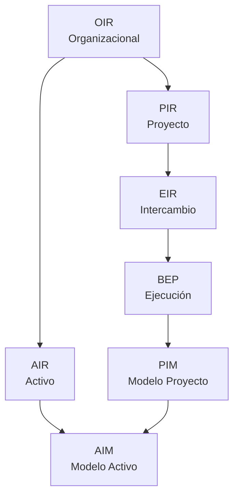

# Plantillas ISO 19650

**Manual BIM - BIMAC Studio**

---

## Índice de Plantillas

| Documento | Archivo | Descripción |
|-----------|---------|-------------|
| **OIR** | `oir-template.md` | Requisitos de Información Organizacional |
| **PIR** | `pir-template.md` | Requisitos de Información del Proyecto |
| **AIR** | `air-template.md` | Requisitos de Información del Activo |
| **EIR** | `eir-template.md` | Requisitos de Intercambio de Información |
| **PIM** | `pim-template.md` | Especificación del Modelo de Información del Proyecto |
| **AIM** | `aim-template.md` | Especificación del Modelo de Información del Activo |

---

## Jerarquía de Documentos



---

## Cuándo Usar Cada Documento

| Documento | Quién lo Crea | Cuándo | Para Qué |
|-----------|---------------|--------|----------|
| **OIR** | Organización | Una vez, actualizar anualmente | Definir estándares organizacionales |
| **PIR** | Cliente/PM | Inicio de proyecto | Definir requisitos específicos del proyecto |
| **AIR** | Propietario/FM | Antes de handover | Definir requisitos para operación |
| **EIR** | Cliente | Licitación | Comunicar requisitos a contratistas |
| **PIM** | Equipo de proyecto | Durante entrega | Estructurar la información del proyecto |
| **AIM** | FM | Post-handover | Estructurar la información del activo |

---

## Flujo de Uso

### Fase de Entrega (ISO 19650-2)

```
1. OIR (base) + PIR → EIR
2. EIR → Licitación
3. Contratista → BEP Pre-contrato
4. Adjudicación → BEP Post-contrato
5. Producción → PIM
6. Handover → Transición a AIM
```

### Fase Operativa (ISO 19650-3)

```
1. OIR (base) + AIR → Requisitos de operación
2. PIM (handover) → AIM (inicial)
3. AIM → Operación y mantenimiento
4. Actualizaciones → AIM versionado
```

---

## Documentos Relacionados

| Documento | Ubicación |
|-----------|-----------|
| BEP Template | `templates/bep/bep-template-v1.md` |
| Guía ISO 19650 | `docs/bim/iso-19650-guia.md` |
| Flujos de Trabajo | `docs/workflows/` |

---

## Personalización

Antes de usar las plantillas:

1. Reemplazar `[campos entre corchetes]` con información real
2. Eliminar secciones no aplicables
3. Agregar requisitos específicos del cliente/proyecto
4. Actualizar logotipos y datos de contacto
5. Revisar con el equipo legal si es necesario

---

**BIMAC Studio** | www.bimacstudio.com
