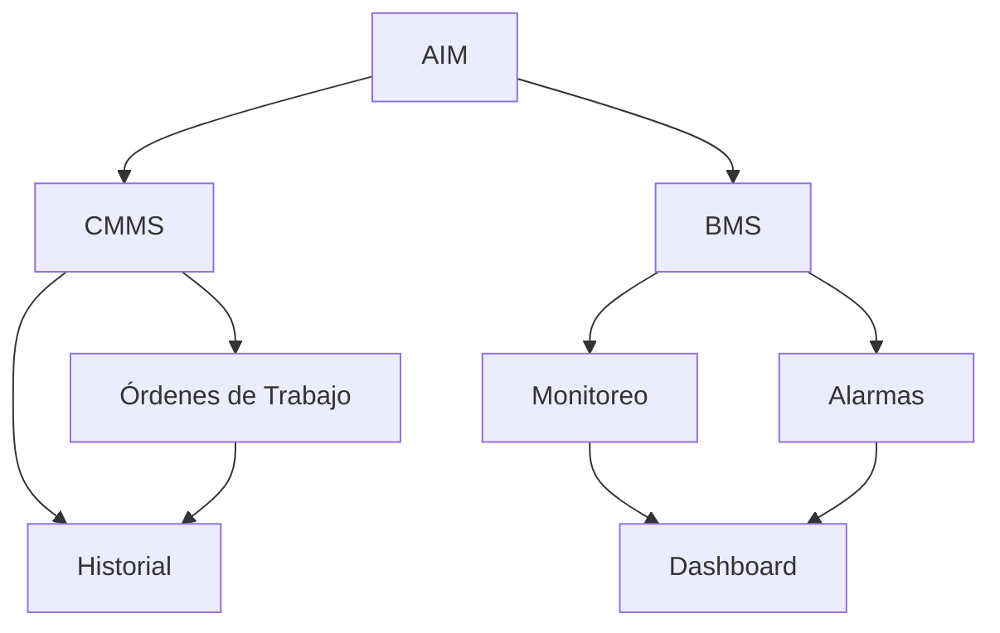
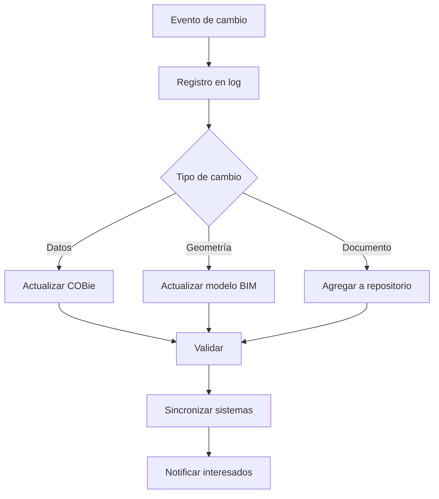

# AIM - Asset Information Model

**Especificación del Modelo de Información del Activo**

---

## Información del Documento

| Campo | Valor |
|-------|-------|
| **Organización** | BIMAC Studio |
| **Activo** | [Nombre del Activo] |
| **Código de Activo** | [ACT-000] |
| **Documento** | AIM-[Código]-001 |
| **Versión** | 1.0 |
| **Fecha** | [DD/MM/AAAA] |
| **Estado** | Inicial / Operativo / Actualizado |

### Control de Versiones

| Versión | Fecha | Autor | Cambios |
|---------|-------|-------|---------|
| 1.0 | | | Versión inicial (Handover) |

---

## 1. Descripción del AIM

### 1.1 ¿Qué es el AIM?

El **Asset Information Model (AIM)** es el conjunto completo de información necesaria para operar, mantener y gestionar un activo construido. Es la evolución del PIM para la fase operativa.

### 1.2 Propósito

| Propósito | Descripción |
|-----------|-------------|
| **Operación** | Información para operación diaria del activo |
| **Mantenimiento** | Datos para mantenimiento preventivo y correctivo |
| **Gestión de espacios** | Información de espacios y ocupación |
| **Cumplimiento** | Documentación para auditorías y certificaciones |
| **Renovaciones** | Base para futuros proyectos de modificación |
| **Gestión de activos** | Datos para decisiones de inversión |

---

## 2. Estructura del AIM

### 2.1 Organización de Contenedores

```
AIM/
├── 01_Modelos/
│   ├── BIM/
│   │   ├── ACT-ARQ-GEN-MOD-001.rvt
│   │   ├── ACT-EST-GEN-MOD-001.rvt
│   │   ├── ACT-MEP-GEN-MOD-001.rvt
│   │   └── ACT-COO-GEN-FED-001.nwd
│   ├── IFC/
│   │   └── [Archivos .ifc]
│   └── Visualizacion/
│       └── [Modelos ligeros para FM]
│
├── 02_Datos/
│   ├── COBie/
│   │   └── ACT-COBie-001.xlsx
│   ├── Inventarios/
│   │   ├── Equipos.xlsx
│   │   ├── Espacios.xlsx
│   │   └── Sistemas.xlsx
│   └── Consumos/
│       ├── Energia/
│       └── Agua/
│
├── 03_Documentos/
│   ├── Legales/
│   │   ├── Escrituras/
│   │   ├── Permisos/
│   │   └── Seguros/
│   ├── Tecnicos/
│   │   ├── Planos_AsBuilt/
│   │   ├── Memorias/
│   │   └── Diagramas/
│   ├── Manuales/
│   │   ├── Operacion/
│   │   └── Mantenimiento/
│   └── Certificados/
│       ├── Equipos/
│       └── Sistemas/
│
├── 04_Mantenimiento/
│   ├── Programas/
│   ├── Procedimientos/
│   └── Formatos/
│
└── 05_Historial/
    ├── Ordenes_Trabajo/
    ├── Inspecciones/
    ├── Incidentes/
    └── Modificaciones/
```

### 2.2 Modelos del Activo

| Modelo | Archivo | Propósito |
|--------|---------|-----------|
| **Arquitectura As-Built** | ACT-ARQ-GEN-MOD-001 | Condición actual de espacios y acabados |
| **Estructura As-Built** | ACT-EST-GEN-MOD-001 | Información estructural verificada |
| **MEP As-Built** | ACT-MEP-GEN-MOD-001 | Sistemas mecánicos, eléctricos, hidráulicos |
| **Modelo Federado** | ACT-COO-GEN-FED-001 | Visualización integrada |
| **Modelo FM Ligero** | ACT-FM-GEN-001 | Navegación para equipo de operación |

---

## 3. Datos COBie

### 3.1 Estructura COBie

El archivo COBie es el repositorio central de datos del activo:

| Hoja | Contenido | Registros |
|------|-----------|-----------|
| **Contact** | Proveedores, fabricantes, contratistas | |
| **Facility** | Información general del inmueble | 1 |
| **Floor** | Niveles del edificio | |
| **Space** | Espacios individuales | |
| **Zone** | Agrupaciones funcionales de espacios | |
| **Type** | Tipos de equipos y componentes | |
| **Component** | Instancias individuales de equipos | |
| **System** | Sistemas del edificio | |
| **Assembly** | Ensambles de componentes | |
| **Spare** | Refacciones recomendadas | |
| **Resource** | Recursos para mantenimiento | |
| **Job** | Tareas de mantenimiento programado | |
| **Document** | Documentos vinculados | |
| **Attribute** | Atributos adicionales | |
| **Coordinate** | Ubicación espacial | |
| **Issue** | Problemas identificados | |

### 3.2 Datos por Hoja COBie

#### Facility

| Campo | Valor |
|-------|-------|
| Name | [Nombre del activo] |
| Category | [Tipo de edificio] |
| ProjectName | [Proyecto original] |
| SiteName | [Nombre del sitio] |
| LinearUnits | meters |
| AreaUnits | square meters |
| VolumeUnits | cubic meters |
| CurrencyUnit | MXN |
| AreaMeasurement | [Método de medición] |
| Description | [Descripción del activo] |

#### Component (Ejemplo)

| Campo | Descripción | Ejemplo |
|-------|-------------|---------|
| Name | Nombre único | UMA-01 |
| TypeName | Referencia al tipo | Manejadora_50000CFM |
| Space | Espacio donde se ubica | Cuarto de Máquinas N1 |
| SerialNumber | Número de serie | SN123456789 |
| InstallationDate | Fecha de instalación | 2024-06-15 |
| WarrantyStartDate | Inicio de garantía | 2024-06-15 |
| WarrantyDurationParts | Duración garantía partes | 24 months |
| WarrantyDurationLabor | Duración garantía mano obra | 12 months |
| TagNumber | Etiqueta física | HVAC-UMA-01 |
| AssetIdentifier | ID en sistema FM | 10001 |

#### Job (Mantenimiento)

| Campo | Descripción | Ejemplo |
|-------|-------------|---------|
| Name | Nombre de la tarea | Cambio de filtros UMA |
| TypeName | Tipo de equipo | Manejadora_50000CFM |
| TaskNumber | Número de tarea | PM-HVAC-001 |
| Frequency | Frecuencia | 3 months |
| Duration | Duración estimada | 2 hours |
| Priors | Tareas previas requeridas | Ninguna |
| ResourceNames | Recursos necesarios | Filtros MERV 13, Técnico HVAC |

---

## 4. Información de Sistemas

### 4.1 Inventario de Sistemas

| Código | Sistema | Ubicación | Componentes | Criticidad |
|--------|---------|-----------|-------------|------------|
| HVAC-01 | Aire acondicionado central | Azotea | | Alta |
| ELEC-01 | Distribución eléctrica | Subestación | | Crítica |
| HIDR-01 | Agua potable | Cuarto bombas | | Alta |
| CONT-01 | Protección incendio | Distribuido | | Crítica |
| ELEV-01 | Elevadores | Cubo | | Alta |
| CTRL-01 | Automatización (BMS) | Site técnico | | Media |

### 4.2 Componentes Críticos

| Componente | Sistema | Ubicación | Marca | Modelo | Serie |
|------------|---------|-----------|-------|--------|-------|
| Chiller 1 | HVAC-01 | Azotea | | | |
| Transformador | ELEC-01 | Subestación | | | |
| Bomba contra incendio | CONT-01 | Cuarto bombas | | | |
| Generador | ELEC-01 | Azotea | | | |
| UPS | ELEC-01 | Site técnico | | | |

### 4.3 Diagramas de Sistemas

| Sistema | Diagrama | Ubicación en AIM |
|---------|----------|------------------|
| Eléctrico | Unifilar | 03_Documentos/Tecnicos/Diagramas/ |
| HVAC | Flujo de aire | 03_Documentos/Tecnicos/Diagramas/ |
| Hidráulico | Isométrico | 03_Documentos/Tecnicos/Diagramas/ |
| Control | Arquitectura BMS | 03_Documentos/Tecnicos/Diagramas/ |

---

## 5. Información de Espacios

### 5.1 Inventario de Espacios

| ID | Nombre | Nivel | Área (m²) | Uso | Ocupación | Departamento |
|----|--------|-------|-----------|-----|-----------|--------------|
| | | | | | | |
| | | | | | | |

### 5.2 Zonas Funcionales

| Zona | Espacios Incluidos | Uso | Horario | Control Ambiental |
|------|-------------------|-----|---------|-------------------|
| Oficinas | | Trabajo | L-V 8-18 | Zona HVAC 1 |
| Áreas comunes | | Circulación | 24/7 | Zona HVAC 2 |
| Servicios | | Apoyo | L-V 6-22 | Ventilación |
| Estacionamiento | | Vehículos | 24/7 | Extracción |

### 5.3 Acabados por Espacio

| Espacio | Piso | Muro | Plafón | Notas |
|---------|------|------|--------|-------|
| | | | | |
| | | | | |

---

## 6. Documentación Vinculada

### 6.1 Documentos por Tipo

| Tipo | Cantidad | Formatos | Vinculación |
|------|----------|----------|-------------|
| Planos As-Built | | PDF, DWG | Por espacio/sistema |
| Manuales de operación | | PDF | Por equipo |
| Manuales de mantenimiento | | PDF | Por equipo |
| Fichas técnicas | | PDF | Por tipo de equipo |
| Certificados | | PDF | Por equipo |
| Garantías | | PDF | Por equipo |
| Memorias de cálculo | | PDF | Por sistema |

### 6.2 Vinculación Documento-Equipo

| Documento | Tipo | Equipos Vinculados | Ubicación |
|-----------|------|-------------------|-----------|
| Manual_Chiller_Trane.pdf | Manual O&M | CH-01, CH-02 | 03_Documentos/Manuales/ |
| Cert_Elevador_TK.pdf | Certificado | EL-01, EL-02 | 03_Documentos/Certificados/ |

---

## 7. Mantenimiento

### 7.1 Programa de Mantenimiento Preventivo

| Sistema | Actividad | Frecuencia | Duración | Recursos |
|---------|-----------|------------|----------|----------|
| HVAC | Cambio de filtros | Trimestral | 4 hrs | Técnico HVAC |
| HVAC | Limpieza de serpentines | Semestral | 8 hrs | Técnico HVAC |
| ELEC | Termografía tableros | Anual | 4 hrs | Especialista |
| HIDR | Análisis de agua | Mensual | 1 hr | Laboratorio |
| ELEV | Mantenimiento general | Mensual | 4 hrs | Proveedor |

### 7.2 Procedimientos de Mantenimiento

| Procedimiento | Código | Equipos | Ubicación |
|---------------|--------|---------|-----------|
| Cambio de filtros UMA | PM-HVAC-001 | UMA-* | 04_Mantenimiento/Procedimientos/ |
| Inspección de tableros | PM-ELEC-001 | TAB-* | 04_Mantenimiento/Procedimientos/ |
| Purga de calderas | PM-HVAC-010 | CAL-* | 04_Mantenimiento/Procedimientos/ |

### 7.3 Refacciones Críticas

| Refacción | Equipos | Cantidad Mínima | Proveedor | Tiempo de Entrega |
|-----------|---------|-----------------|-----------|-------------------|
| Filtros MERV 13 | UMA-* | 50 | | 1 semana |
| Bandas de motor | UMA-*, VE-* | 10 | | 2 semanas |
| Fusibles 100A | TAB-* | 20 | | 3 días |

---

## 8. Integración con Sistemas

### 8.1 Sistema CMMS/CAFM

| Aspecto | Especificación |
|---------|----------------|
| Sistema | [Nombre del CMMS] |
| Integración | Sincronización bidireccional |
| Datos sincronizados | Equipos, ubicaciones, OT, historial |
| Frecuencia | Diaria / Tiempo real |
| Responsable | TI / FM |

### 8.2 Sistema BMS

| Aspecto | Especificación |
|---------|----------------|
| Sistema | [Nombre del BMS] |
| Protocolo | BACnet / Modbus |
| Puntos monitoreados | [Cantidad] |
| Dashboard | [URL] |

### 8.3 Flujo de Datos



---

## 9. Actualización del AIM

### 9.1 Eventos de Actualización

| Evento | Actualización Requerida | Responsable | Plazo |
|--------|------------------------|-------------|-------|
| Reemplazo de equipo | Datos del nuevo equipo en COBie | FM | 5 días |
| Modificación de espacio | Modelo BIM + datos de espacio | Proyectos | 15 días |
| Renovación mayor | Actualización completa de zona | Proyectos | Al cierre |
| Cambio de uso | Clasificación de espacios | Operaciones | 5 días |
| Recertificación | Documentos actualizados | Administración | Inmediato |

### 9.2 Proceso de Actualización



### 9.3 Control de Versiones

| Versión | Fecha | Tipo de Cambio | Descripción | Autor |
|---------|-------|----------------|-------------|-------|
| 1.0 | | Inicial | Handover de proyecto | |
| 1.1 | | Menor | | |
| 2.0 | | Mayor | Renovación de [zona] | |

---

## 10. Métricas y KPIs

### 10.1 KPIs del Activo

| KPI | Definición | Meta | Actual |
|-----|------------|------|--------|
| Disponibilidad | Uptime de sistemas críticos | >99% | |
| MTBF | Tiempo medio entre fallas | >1000 hrs | |
| MTTR | Tiempo medio de reparación | <4 hrs | |
| Cumplimiento PM | OT preventivas completadas | >95% | |
| Costo O&M / m² | Costo operativo por área | < $X | |
| EUI | Intensidad de uso energético | < X kWh/m² | |

### 10.2 Salud del AIM

| Métrica | Definición | Meta | Actual |
|---------|------------|------|--------|
| Completitud | Campos COBie llenos | >95% | |
| Actualidad | Registros actualizados a tiempo | >90% | |
| Vinculación | Documentos vinculados a equipos | >98% | |
| Precisión | Datos verificados correctos | >99% | |

---

## 11. Anexos

### Anexo A: Contactos de Proveedores

| Proveedor | Sistema | Contacto | Teléfono | Email | Contrato |
|-----------|---------|----------|----------|-------|----------|
| | | | | | Vigente hasta: |
| | | | | | Vigente hasta: |

### Anexo B: Calendario de Actividades Mayores

| Mes | Actividad | Sistema | Duración | Impacto |
|-----|-----------|---------|----------|---------|
| Enero | | | | |
| Febrero | | | | |
| ... | | | | |

### Anexo C: Procedimientos de Emergencia

| Emergencia | Procedimiento | Ubicación | Contacto |
|------------|---------------|-----------|----------|
| Falla eléctrica | EMER-ELEC-001 | 04_Mantenimiento/ | |
| Fuga de agua | EMER-HIDR-001 | 04_Mantenimiento/ | |
| Incendio | EMER-FIRE-001 | 04_Mantenimiento/ | |
| Sismo | EMER-SISM-001 | 04_Mantenimiento/ | |

---

**BIMAC Studio** | www.bimacstudio.com

*Este documento es propiedad de BIMAC Studio. Su reproducción o distribución requiere autorización.*
