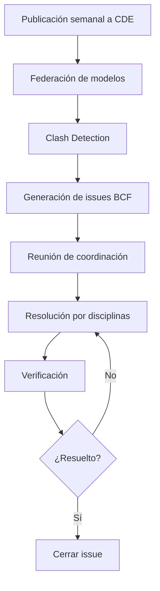
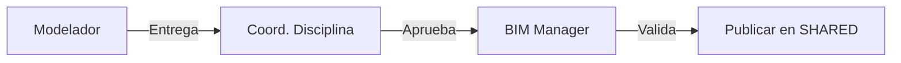

# EIR - Exchange Information Requirements

**Requisitos de Intercambio de Información**

---

## Información del Documento

| Campo | Valor |
|-------|-------|
| **Parte Designante** | BIMAC Studio (o Cliente) |
| **Proyecto** | [Nombre del Proyecto] |
| **Código de Proyecto** | [PRY-000] |
| **Documento** | EIR-[Código]-001 |
| **Versión** | 1.0 |
| **Fecha de Emisión** | [DD/MM/AAAA] |
| **Fecha Límite de Propuestas** | [DD/MM/AAAA] |
| **Estado** | Para Licitación / Contratado |

### Control de Versiones

| Versión | Fecha | Autor | Cambios |
|---------|-------|-------|---------|
| 1.0 | | | Versión inicial para licitación |

### Distribución

| Empresa | Contacto | Fecha de Envío |
|---------|----------|----------------|
| | | |
| | | |

---

## 1. Información del Proyecto

### 1.1 Datos Generales

| Campo | Descripción |
|-------|-------------|
| **Nombre del Proyecto** | |
| **Ubicación** | |
| **Cliente / Propietario** | |
| **Tipo de Proyecto** | Nueva construcción / Renovación / Ampliación |
| **Uso Principal** | |
| **Superficie Aproximada** | m² |
| **Niveles** | |
| **Presupuesto Estimado** | $ |

### 1.2 Descripción del Proyecto

[Descripción narrativa del proyecto, alcance, objetivos principales]

### 1.3 Alcance de la Contratación

| Disciplina | Incluida | Observaciones |
|------------|----------|---------------|
| Arquitectura | [ ] | |
| Diseño de Interiores | [ ] | |
| Estructura | [ ] | |
| Mecánico (HVAC) | [ ] | |
| Eléctrico | [ ] | |
| Hidráulico/Sanitario | [ ] | |
| Protección Contra Incendio | [ ] | |
| Civil/Sitio | [ ] | |
| Coordinación BIM | [ ] | |
| Otro: _________ | [ ] | |

---

## 2. Requisitos de Información

### 2.1 Propósitos de la Información

La información producida se utilizará para los siguientes propósitos:

| # | Propósito | Prioridad | Responsable |
|---|-----------|-----------|-------------|
| 1 | Visualización y presentación al cliente | Alta | ARQ |
| 2 | Coordinación multidisciplinaria | Alta | Todas |
| 3 | Detección de interferencias | Alta | COORD |
| 4 | Generación de documentación constructiva | Alta | Todas |
| 5 | Cuantificación y estimación de costos | Alta | Todas |
| 6 | Simulación de construcción (4D) | Media | COORD |
| 7 | Análisis energético | Media | MEP |
| 8 | Entrega para operación (FM) | Alta | Todas |

### 2.2 Hitos de Entrega

| Hito | Descripción | Fecha | Contenido |
|------|-------------|-------|-----------|
| E-01 | Diseño Esquemático | | Modelos LOD 200, renders |
| E-02 | Desarrollo de Diseño | | Modelos LOD 300, coordinados |
| E-03 | Documentos de Construcción | | Modelos LOD 350, planos |
| E-04 | Durante Construcción | | Actualizaciones, RFIs |
| E-05 | As-Built | | Modelos LOD 500, COBie |

---

## 3. Requisitos Técnicos

### 3.1 Software y Versiones

| Función | Software Requerido | Versión Mínima |
|---------|-------------------|----------------|
| BIM Authoring Arquitectura | Autodesk Revit | 2024 |
| BIM Authoring Estructura | Autodesk Revit | 2024 |
| BIM Authoring MEP | Autodesk Revit | 2024 |
| Diseño Civil | Autodesk Civil 3D | 2024 |
| Coordinación | Autodesk Navisworks | 2024 |
| Simulación 4D | Synchro Pro | |
| Gestión de Issues | BIMcollab | |

### 3.2 Formatos de Entrega

| Tipo | Formato | Especificación |
|------|---------|----------------|
| Modelos nativos | .rvt | Revit 2024, sin vínculos rotos |
| Modelos de intercambio | .ifc | IFC 4.0, MVD: Design Transfer |
| Modelos de coordinación | .nwc/.nwd | Navisworks 2024 |
| Planos | .pdf | PDF vectorial, escala correcta |
| Planos editables | .dwg | AutoCAD 2018+ compatible |
| Datos tabulares | .xlsx | Microsoft Excel |
| Issues | .bcf | BCF 2.1 |
| Imágenes | .jpg/.png | Mínimo 1920x1080 |

### 3.3 Sistema de Coordenadas

| Parámetro | Requisito |
|-----------|-----------|
| Sistema de referencia | [UTM / Local] |
| Datum | [WGS84 / NAD27] |
| Zona UTM | [Número] |
| Punto base compartido | X: _______ Y: _______ Z: _______ |
| Norte del proyecto | ___° respecto a norte verdadero |
| Unidades | Metros |
| Elevación 0.00 | [Referencia] NPT / NTN |

**Archivo de coordenadas compartidas será proporcionado por la Parte Designante.**

### 3.4 Configuración de Modelos

| Parámetro | Requisito |
|-----------|-----------|
| Unidades de proyecto | Metros |
| Precisión de longitud | 0.001 m |
| Precisión de área | 0.01 m² |
| Niveles | Según arquitectura, nombres estandarizados |
| Rejillas | Según estructura, nomenclatura alfanumérica |
| Worksets | Por sistema/zona según BEP |

---

## 4. Requisitos de Nivel de Información

### 4.1 LOD por Fase

| Fase | LOD General | LOD Estructura | LOD MEP |
|------|-------------|----------------|---------|
| Esquemático | 200 | 200 | 200 |
| Desarrollo | 300 | 300 | 300 |
| Construcción | 350 | 400 | 350 |
| As-Built | 500 | 500 | 500 |

### 4.2 Atributos Requeridos

#### Todos los Elementos (Mínimo)

| Atributo | Tipo | Obligatorio |
|----------|------|-------------|
| Clasificación Uniformat | Texto | Sí |
| Material | Material/Texto | Sí |
| Fase de construcción | Fase | Sí |

#### Elementos Arquitectónicos

| Elemento | Atributos Requeridos |
|----------|---------------------|
| Muros | Tipo, Material, Espesor, Resistencia al fuego, Acabados |
| Pisos | Tipo, Material, Espesor, Acabado, Pendiente (si aplica) |
| Techos | Tipo, Material, Aislamiento, Pendiente |
| Puertas | Tipo, Ancho, Alto, Material, Herraje, Resistencia al fuego |
| Ventanas | Tipo, Ancho, Alto, U-value, SHGC, Marco |
| Plafones | Tipo, Altura libre, Material, NRC |
| Espacios | Nombre, Número, Área, Ocupación, Acabados |

#### Elementos Estructurales

| Elemento | Atributos Requeridos |
|----------|---------------------|
| Columnas | Sección, Material, f'c/Fy, Refuerzo |
| Vigas | Sección, Material, f'c/Fy, Refuerzo |
| Losas | Espesor, Material, f'c, Sistema |
| Cimentación | Tipo, Dimensiones, f'c, Capacidad |
| Muros estructurales | Espesor, f'c, Refuerzo |

#### Elementos MEP

| Elemento | Atributos Requeridos |
|----------|---------------------|
| Ductos | Sistema, Tamaño, Material, Aislamiento |
| Tuberías | Sistema, Diámetro, Material, Presión |
| Equipos | Tipo, Marca, Modelo, Capacidad, Voltaje, Eficiencia |
| Luminarias | Tipo, Watts, Lúmenes, Temperatura de color |
| Accesorios | Tipo, Material, Conexiones |

### 4.3 Atributos para COBie (Fase As-Built)

| Atributo | Aplica a | Obligatorio |
|----------|----------|-------------|
| Número de serie | Equipos | Sí |
| Fecha de instalación | Equipos | Sí |
| Garantía | Equipos | Sí |
| Proveedor | Equipos | Sí |
| Contacto de servicio | Equipos | Sí |
| Manual de O&M | Equipos | Link/Referencia |

---

## 5. Estándares y Nomenclatura

### 5.1 Nomenclatura de Archivos

**Patrón:**
```
[Proyecto]-[Origen]-[Disciplina]-[Zona]-[Tipo]-[Número]_[Estado].[ext]
```

**Códigos de Origen:**
| Código | Significado |
|--------|-------------|
| BIMAC | Producido por BIMAC Studio |
| [EMP] | Producido por [Código de empresa] |

**Códigos de Disciplina:**
| Código | Disciplina |
|--------|------------|
| ARQ | Arquitectura |
| INT | Interiores |
| EST | Estructura |
| MEC | Mecánico/HVAC |
| ELE | Eléctrico |
| HID | Hidráulico/Sanitario |
| PCI | Protección contra incendio |
| CIV | Civil/Sitio |
| COO | Coordinación |

**Códigos de Zona:**
| Código | Zona |
|--------|------|
| GEN | General / Todo el proyecto |
| T01, T02... | Torre 1, Torre 2... |
| S01, S02... | Sótano 1, Sótano 2... |
| [Personalizar según proyecto] |

**Códigos de Tipo:**
| Código | Tipo de Contenido |
|--------|-------------------|
| MOD | Modelo BIM |
| PLN | Plano |
| CAL | Cálculo/Análisis |
| ESP | Especificación |
| REP | Reporte |
| IMG | Imagen/Render |

**Códigos de Estado:**
| Código | Estado |
|--------|--------|
| WIP | Work in Progress |
| S1 | Shared - Coordinación |
| S2 | Shared - Cliente |
| A | Aprobado |

**Ejemplo:**
```
PRY001-BIMAC-ARQ-T01-MOD-001_S1.rvt
PRY001-BIMAC-MEP-GEN-MOD-001_S1.rvt
PRY001-BIMAC-COO-GEN-REP-001_A.pdf
```

### 5.2 Nomenclatura de Vistas

| Tipo | Patrón | Ejemplo |
|------|--------|---------|
| Planta | [Nivel]-[Disciplina]-[Descripción] | N01-ARQ-Planta Amueblada |
| Sección | SEC-[Número]-[Descripción] | SEC-01-Longitudinal |
| Elevación | ELV-[Orientación]-[Descripción] | ELV-SUR-Fachada Principal |
| Detalle | DET-[Área]-[Número] | DET-BAÑO-01 |
| 3D | 3D-[Disciplina]-[Descripción] | 3D-MEP-Cuarto Máquinas |

### 5.3 Nomenclatura de Familias

**Patrón:**
```
[Empresa]_[Categoría]_[Tipo]_[Variante]
```

**Ejemplo:**
```
BIMAC_Puerta_Abatible_90x210
BIMAC_Ventana_Corrediza_150x120
GENERICO_Luminaria_Empotrada_60x60
```

---

## 6. Coordinación

### 6.1 Proceso de Coordinación



### 6.2 Frecuencia de Coordinación

| Actividad | Frecuencia | Día | Hora |
|-----------|------------|-----|------|
| Publicación de modelos | Semanal | Lunes | 12:00 |
| Clash detection | Semanal | Martes | AM |
| Reunión de coordinación | Semanal | Miércoles | 10:00 |
| Reporte al cliente | Quincenal | Viernes | 17:00 |

### 6.3 Matriz de Clash Detection

| Test | Selección A | Selección B | Tolerancia | Prioridad |
|------|-------------|-------------|------------|-----------|
| 1 | Estructura | HVAC | 0 mm | Crítico |
| 2 | Estructura | Eléctrico | 0 mm | Crítico |
| 3 | Estructura | Hidráulico | 0 mm | Crítico |
| 4 | Arquitectura | HVAC | 25 mm | Mayor |
| 5 | Arquitectura | Eléctrico | 25 mm | Mayor |
| 6 | HVAC | Eléctrico | 25 mm | Mayor |
| 7 | HVAC | Hidráulico | 25 mm | Mayor |
| 8 | Eléctrico | Hidráulico | 25 mm | Menor |

### 6.4 Gestión de Issues

| Campo BCF | Requisito |
|-----------|-----------|
| Título | Conciso, incluir ubicación |
| Prioridad | Crítico / Mayor / Menor |
| Asignado a | Disciplina responsable |
| Fecha límite | Según prioridad (1/3/7 días) |
| Viewpoint | Obligatorio, con anotaciones |
| Descripción | Clara, con sugerencia de solución |

---

## 7. Entorno Común de Datos (CDE)

### 7.1 Plataforma

| Aspecto | Especificación |
|---------|----------------|
| Plataforma | [BIM 360 / Trimble Connect / Otro] |
| Administrador | BIMAC Studio |
| URL de acceso | [Se proporcionará al adjudicar] |

### 7.2 Estructura de Carpetas

```
CDE/
└── [Código Proyecto]/
    ├── 00_REFERENCE/
    │   ├── Topografía/
    │   ├── Normativa/
    │   ├── Catálogos/
    │   └── Plantillas/
    │
    ├── 01_WIP/
    │   ├── ARQ/
    │   ├── EST/
    │   ├── MEC/
    │   ├── ELE/
    │   ├── HID/
    │   └── PCI/
    │
    ├── 02_SHARED/
    │   ├── S1_Coordinacion/
    │   │   ├── Modelos/
    │   │   ├── Issues/
    │   │   └── Reportes/
    │   └── S2_Cliente/
    │
    ├── 03_PUBLISHED/
    │   └── [Por entrega]/
    │
    └── 04_ARCHIVE/
```

### 7.3 Permisos de Acceso

| Carpeta | Parte Designada | Coordinador | Cliente |
|---------|-----------------|-------------|---------|
| REFERENCE | Lectura | Lectura/Escritura | Lectura |
| WIP (propio) | Lectura/Escritura | Lectura | - |
| WIP (otros) | - | Lectura | - |
| SHARED | Lectura | Lectura/Escritura | Lectura |
| PUBLISHED | Lectura | Lectura/Escritura | Lectura |
| ARCHIVE | Lectura | Lectura | Lectura |

---

## 8. Control de Calidad

### 8.1 Verificaciones Obligatorias

Antes de cada publicación, verificar:

| # | Verificación | Criterio | Método |
|---|--------------|----------|--------|
| 1 | Warnings de Revit | <50 warnings | Revisar warnings |
| 2 | Coordenadas | Punto base correcto | Verificar en federado |
| 3 | Nomenclatura | 100% cumplimiento | Script de validación |
| 4 | Parámetros | >95% poblados | Schedule de verificación |
| 5 | Interferencias | 0 críticas propias | Auto clash detection |
| 6 | Exportación IFC | Sin errores | Prueba en visor |

### 8.2 Proceso de Aprobación



---

## 9. Requisitos de Seguridad

### 9.1 Clasificación de Información

| Nivel | Descripción | Manejo |
|-------|-------------|--------|
| Público | Marketing, renders | Sin restricción |
| Interno | Modelos de trabajo | Solo equipo de proyecto |
| Confidencial | Información técnica completa | Controlado por CDE |
| Restringido | Sistemas de seguridad | Solo autorizados |

### 9.2 Obligaciones de la Parte Designada

- [ ] Mantener confidencialidad de la información
- [ ] No compartir accesos al CDE
- [ ] Reportar incidentes de seguridad
- [ ] Eliminar copias locales al cierre del proyecto
- [ ] Firmar acuerdo de confidencialidad

---

## 10. Entregables del BEP

### 10.1 BEP Pre-Contrato

La propuesta debe incluir un BEP pre-contrato que demuestre:

| Sección | Contenido Requerido |
|---------|---------------------|
| Equipo | Organigrama, roles BIM, competencias |
| Metodología | Proceso de trabajo, herramientas |
| Estándares | Compromiso con estándares del EIR |
| Experiencia | Proyectos similares con BIM |
| Riesgos | Identificación y mitigación |

### 10.2 BEP Post-Contrato

Dentro de los primeros 10 días hábiles de adjudicación:

| Sección | Contenido Requerido |
|---------|---------------------|
| Información del proyecto | Datos actualizados |
| Objetivos BIM | Confirmación de usos |
| Roles y responsabilidades | Nombres, contactos |
| Estándares detallados | Nomenclatura, LOD por elemento |
| CDE | Estructura confirmada |
| Coordinación | Calendario, participantes |
| Entregables | Lista detallada con fechas |
| Control de calidad | Procedimientos específicos |

---

## 11. Evaluación de Propuestas

### 11.1 Criterios de Evaluación BIM

| Criterio | Peso | Descripción |
|----------|------|-------------|
| Equipo BIM | 25% | Experiencia y competencias |
| Metodología | 25% | Claridad y alineación con EIR |
| Experiencia previa | 20% | Proyectos similares completados |
| Infraestructura | 15% | Software, hardware, CDE |
| Propuesta económica | 15% | Costo de servicios BIM |

### 11.2 Competencias Mínimas Requeridas

| Rol | Certificación/Experiencia |
|-----|---------------------------|
| BIM Manager | 5+ años experiencia, certificación Autodesk |
| Coordinador | 3+ años experiencia en coordinación BIM |
| Modelador | 2+ años experiencia en Revit |

---

## 12. Anexos

### Anexo A: Contactos del Proyecto

| Rol | Nombre | Email | Teléfono |
|-----|--------|-------|----------|
| Representante del Cliente | | | |
| BIM Manager (Parte Designante) | | | |
| Director de Proyecto | | | |

### Anexo B: Documentos de Referencia

| Documento | Descripción | Adjunto |
|-----------|-------------|---------|
| Programa arquitectónico | Áreas y espacios | [ ] |
| Topografía | Levantamiento del sitio | [ ] |
| Estudio de suelos | Mecánica de suelos | [ ] |
| Normativa aplicable | Reglamento local | [ ] |
| Plantilla Revit | Template BIMAC | [ ] |

### Anexo C: Plantilla de BEP Pre-Contrato

[Incluir o referenciar plantilla]

---

**BIMAC Studio** | www.bimacstudio.com

*Este documento es propiedad de BIMAC Studio. Su reproducción o distribución requiere autorización.*
