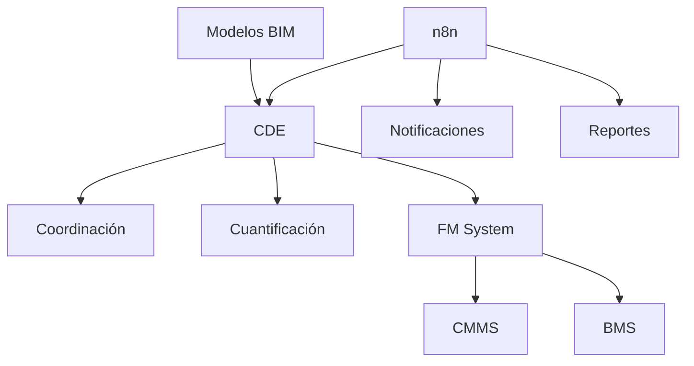

# OIR - Organizational Information Requirements

**Requisitos de Información Organizacional**

---

## Información del Documento

| Campo | Valor |
|-------|-------|
| **Organización** | BIMAC Studio |
| **Documento** | OIR-BIMAC-001 |
| **Versión** | 1.0 |
| **Fecha** | [DD/MM/AAAA] |
| **Estado** | Borrador / En Revisión / Aprobado |
| **Clasificación** | Interno / Confidencial |

### Control de Versiones

| Versión | Fecha | Autor | Cambios |
|---------|-------|-------|---------|
| 1.0 | | | Versión inicial |

### Aprobaciones

| Rol | Nombre | Firma | Fecha |
|-----|--------|-------|-------|
| Director General | | | |
| Director BIM | | | |

---

## 1. Introducción

### 1.1 Propósito

Este documento define los Requisitos de Información Organizacional (OIR) de **BIMAC Studio**, estableciendo las necesidades de información a nivel estratégico que deben cumplirse en todos los proyectos y activos de la organización.

### 1.2 Alcance

| Aplica a | Descripción |
|----------|-------------|
| Proyectos nuevos | Todos los proyectos de diseño y construcción |
| Proyectos existentes | Renovaciones y ampliaciones |
| Activos en operación | Edificios e infraestructura bajo gestión |
| Socios y proveedores | Partes designadas que producen información |

### 1.3 Referencias Normativas

| Documento | Descripción |
|-----------|-------------|
| ISO 19650-1:2018 | Conceptos y principios |
| ISO 19650-2:2018 | Fase de entrega de activos |
| ISO 19650-3:2020 | Fase operativa de activos |
| ISO 19650-5:2020 | Gestión de seguridad de información |

---

## 2. Contexto Organizacional

### 2.1 Sobre BIMAC Studio

| Aspecto | Descripción |
|---------|-------------|
| **Razón Social** | |
| **Giro** | Arquitectura, Ingeniería, Consultoría BIM |
| **Ubicación** | |
| **Sitio Web** | www.bimacstudio.com |
| **Tamaño** | [# empleados] |

### 2.2 Cartera de Activos

| Tipo de Activo | Cantidad | Descripción |
|----------------|----------|-------------|
| Edificios corporativos | | |
| Proyectos en diseño | | |
| Proyectos en construcción | | |
| Activos bajo gestión FM | | |

### 2.3 Roles Organizacionales Clave

| Rol | Responsabilidad | Nombre |
|-----|-----------------|--------|
| Director General | Estrategia organizacional | |
| Director de Proyectos | Gestión de portafolio | |
| Director BIM | Estándares y tecnología | |
| Gerente de Operaciones | Gestión de activos | |
| Gerente de TI | Infraestructura tecnológica | |

---

## 3. Objetivos Estratégicos de Información

### 3.1 Objetivos de Negocio

| # | Objetivo | Indicador | Meta |
|---|----------|-----------|------|
| 1 | Mejorar eficiencia en diseño | Reducción de RFIs | -30% |
| 2 | Reducir conflictos en obra | Clashes resueltos pre-construcción | >95% |
| 3 | Optimizar costos de operación | Ahorro en mantenimiento | 15% anual |
| 4 | Cumplimiento normativo | Auditorías aprobadas | 100% |
| 5 | Satisfacción del cliente | NPS | >80 |

### 3.2 Objetivos de Información

| Objetivo | Descripción | Prioridad |
|----------|-------------|-----------|
| **Toma de decisiones** | Información precisa y oportuna para decisiones estratégicas | Alta |
| **Trazabilidad** | Historial completo de cambios y decisiones | Alta |
| **Interoperabilidad** | Flujo de información sin pérdidas entre sistemas | Alta |
| **Seguridad** | Protección de información sensible | Alta |
| **Accesibilidad** | Información disponible para quienes la necesitan | Media |
| **Sostenibilidad** | Información para análisis de ciclo de vida | Media |

---

## 4. Requisitos de Información por Función

### 4.1 Alta Dirección

| Necesidad de Información | Frecuencia | Formato | Fuente |
|--------------------------|------------|---------|--------|
| Estado de portafolio de proyectos | Mensual | Dashboard | PIM |
| KPIs de desempeño BIM | Mensual | Reporte | Métricas |
| Riesgos y desviaciones | Semanal | Alertas | PM |
| Valor de activos | Anual | Informe | AIM |

### 4.2 Gestión de Proyectos

| Necesidad de Información | Frecuencia | Formato | Fuente |
|--------------------------|------------|---------|--------|
| Avance de diseño | Semanal | % completado | Modelos |
| Estado de coordinación | Semanal | Reporte BCF | Navisworks |
| Cuantificación | Por hito | Schedules | Revit |
| Programa 4D | Quincenal | Simulación | Synchro |
| Control de cambios | Continuo | Log | CDE |

### 4.3 Diseño y Producción

| Necesidad de Información | Frecuencia | Formato | Fuente |
|--------------------------|------------|---------|--------|
| Estándares de modelado | Permanente | Guías | BEP |
| Bibliotecas de contenido | Actualizado | Familias | CDE |
| Información de referencia | Por proyecto | Topografía, normas | CDE |
| Retroalimentación de obra | Continuo | Issues | BCF |

### 4.4 Operación y Mantenimiento

| Necesidad de Información | Frecuencia | Formato | Fuente |
|--------------------------|------------|---------|--------|
| Inventario de equipos | Actualizado | COBie | AIM |
| Manuales de O&M | Por sistema | PDF/Links | AIM |
| Historial de mantenimiento | Continuo | CMMS | FM System |
| Consumos energéticos | Mensual | Datos | BMS |
| Garantías y contactos | Actualizado | Base datos | AIM |

### 4.5 Finanzas y Administración

| Necesidad de Información | Frecuencia | Formato | Fuente |
|--------------------------|------------|---------|--------|
| Estimaciones de costo | Por fase | 5D | Modelos |
| Control presupuestal | Mensual | Comparativo | ERP |
| Valuación de activos | Anual | Reporte | AIM |
| Contratos y garantías | Actualizado | Documentos | CDE |

---

## 5. Estándares de Información

### 5.1 Clasificación

| Sistema | Aplicación |
|---------|------------|
| **Uniformat II** | Elementos de construcción (estimación) |
| **MasterFormat** | Especificaciones y licitación |
| **OmniClass** | Clasificación general |
| **COBie** | Entrega para operación |

### 5.2 Nomenclatura

#### Archivos
```
[Proyecto]-[Disciplina]-[Zona]-[Tipo]-[Consecutivo].[ext]
```

#### Elementos del Modelo
```
[Empresa]_[Categoría]_[Tipo]_[Variante]
```

### 5.3 Niveles de Información

| Fase | LOD Mínimo | LOI Mínimo |
|------|------------|------------|
| Concepto | 100 | Básico |
| Esquemático | 200 | General |
| Desarrollo | 300 | Detallado |
| Documentos | 350 | Completo |
| Construcción | 400 | Fabricación |
| As-Built | 500 | Verificado |

---

## 6. Infraestructura Tecnológica

### 6.1 Plataformas Autorizadas

| Función | Plataforma | Versión |
|---------|------------|---------|
| **CDE** | [Plataforma] | |
| **BIM Authoring** | Revit | 2024 |
| **Coordinación** | Navisworks | 2024 |
| **4D** | Synchro | |
| **FM** | [Sistema CMMS] | |
| **Automatización** | n8n (Hostinger) | |

### 6.2 Formatos de Intercambio

| Propósito | Formato | Especificación |
|-----------|---------|----------------|
| Open BIM | IFC | 4.0 / 4.3 |
| Issues | BCF | 2.1 |
| Datos FM | COBie | 2.4 |
| Documentos | PDF | PDF/A |
| Datos tabulares | XLSX | Office Open XML |

### 6.3 Integración de Sistemas



---

## 7. Seguridad de la Información

### 7.1 Clasificación de Información

| Nivel | Descripción | Acceso |
|-------|-------------|--------|
| **Público** | Información para difusión | Sin restricción |
| **Interno** | Uso dentro de la organización | Empleados |
| **Confidencial** | Información sensible de proyectos | Equipo de proyecto |
| **Restringido** | Información crítica de negocio | Solo autorizados |

### 7.2 Controles de Acceso

| Rol | Público | Interno | Confidencial | Restringido |
|-----|---------|---------|--------------|-------------|
| Director | ✓ | ✓ | ✓ | ✓ |
| Gerente | ✓ | ✓ | ✓ | Caso por caso |
| Coordinador | ✓ | ✓ | ✓ | ✗ |
| Modelador | ✓ | ✓ | Proyecto asignado | ✗ |
| Externo | ✓ | Caso por caso | Contrato | ✗ |

### 7.3 Retención de Información

| Tipo de Información | Período de Retención |
|---------------------|---------------------|
| Modelos As-Built | Vida útil del activo + 10 años |
| Documentos contractuales | 10 años post-cierre |
| Información de diseño | 5 años post-entrega |
| Comunicaciones de proyecto | 3 años post-cierre |
| Datos de operación | Vida útil del activo |

---

## 8. Gobernanza de Información

### 8.1 Responsabilidades

| Rol | Responsabilidad |
|-----|-----------------|
| **Director BIM** | Definir y mantener estándares OIR |
| **BIM Manager** | Implementar estándares en proyectos |
| **Coordinadores** | Asegurar cumplimiento por disciplina |
| **TI** | Mantener infraestructura tecnológica |
| **Legal** | Aspectos contractuales y de propiedad |

### 8.2 Revisión y Actualización

| Actividad | Frecuencia | Responsable |
|-----------|------------|-------------|
| Revisión de OIR | Anual | Director BIM |
| Actualización de estándares | Semestral | BIM Manager |
| Auditoría de cumplimiento | Anual | Externo |
| Capacitación | Continua | RRHH + BIM |

### 8.3 Métricas de Desempeño

| Métrica | Definición | Meta |
|---------|------------|------|
| Adopción BIM | % proyectos con BIM | 100% |
| Cumplimiento de estándares | Auditorías aprobadas | >90% |
| Calidad de modelos | Score de QC | >85% |
| Satisfacción de usuarios | Encuesta interna | >4/5 |

---

## 9. Anexos

### Anexo A: Glosario

| Término | Definición |
|---------|------------|
| AIM | Asset Information Model |
| BEP | BIM Execution Plan |
| CDE | Common Data Environment |
| COBie | Construction Operations Building Information Exchange |
| EIR | Exchange Information Requirements |
| LOD | Level of Development |
| LOI | Level of Information |
| OIR | Organizational Information Requirements |
| PIM | Project Information Model |
| PIR | Project Information Requirements |

### Anexo B: Documentos Relacionados

| Documento | Código | Ubicación |
|-----------|--------|-----------|
| Manual BIM BIMAC | | |
| Guía de Estándares | | |
| Plantilla BEP | BEP-BIMAC-001 | templates/bep/ |
| Plantilla EIR | EIR-BIMAC-001 | templates/iso19650/ |

---

**BIMAC Studio** | www.bimacstudio.com

*Este documento es propiedad de BIMAC Studio. Su reproducción o distribución requiere autorización.*
