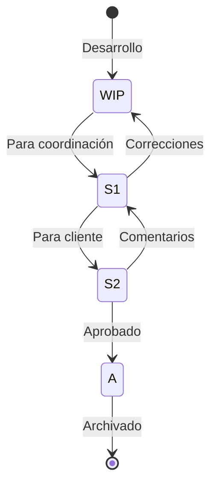

# PIM - Project Information Model

**Especificación del Modelo de Información del Proyecto**

---

## Información del Documento

| Campo | Valor |
|-------|-------|
| **Organización** | BIMAC Studio |
| **Proyecto** | [Nombre del Proyecto] |
| **Código de Proyecto** | [PRY-000] |
| **Documento** | PIM-[Código]-001 |
| **Versión** | 1.0 |
| **Fecha** | [DD/MM/AAAA] |
| **Fase Actual** | Diseño / Construcción / Entrega |

### Control de Versiones

| Versión | Fecha | Autor | Cambios |
|---------|-------|-------|---------|
| 1.0 | | | Versión inicial |

---

## 1. Descripción del PIM

### 1.1 ¿Qué es el PIM?

El **Project Information Model (PIM)** es el conjunto completo de información producida durante la fase de entrega del proyecto. Incluye:

- Modelos BIM geométricos e información asociada
- Documentación técnica
- Datos estructurados
- Documentos no gráficos

### 1.2 Propósito

| Propósito | Descripción |
|-----------|-------------|
| **Diseño** | Base para desarrollo y coordinación del diseño |
| **Construcción** | Información para ejecución de obra |
| **Cuantificación** | Extracción de cantidades para presupuesto |
| **Coordinación** | Detección y resolución de interferencias |
| **Documentación** | Generación de planos y especificaciones |
| **Handover** | Base para creación del AIM |

---

## 2. Estructura del PIM

### 2.1 Organización de Contenedores

```
PIM/
├── 01_Modelos/
│   ├── ARQ/
│   │   ├── PRY-ARQ-GEN-MOD-001.rvt
│   │   └── PRY-ARQ-GEN-MOD-001.ifc
│   ├── EST/
│   │   ├── PRY-EST-GEN-MOD-001.rvt
│   │   └── PRY-EST-GEN-MOD-001.ifc
│   ├── MEC/
│   │   ├── PRY-MEC-GEN-MOD-001.rvt
│   │   └── PRY-MEC-GEN-MOD-001.ifc
│   ├── ELE/
│   │   ├── PRY-ELE-GEN-MOD-001.rvt
│   │   └── PRY-ELE-GEN-MOD-001.ifc
│   ├── HID/
│   │   ├── PRY-HID-GEN-MOD-001.rvt
│   │   └── PRY-HID-GEN-MOD-001.ifc
│   └── COORD/
│       ├── PRY-COO-GEN-FED-001.nwf
│       └── PRY-COO-GEN-FED-001.nwd
│
├── 02_Documentos/
│   ├── Planos/
│   │   ├── ARQ/
│   │   ├── EST/
│   │   └── MEP/
│   ├── Especificaciones/
│   ├── Memorias/
│   └── Reportes/
│
├── 03_Datos/
│   ├── Cuantificacion/
│   ├── Programa/
│   └── Schedules/
│
├── 04_Coordinacion/
│   ├── Clash_Reports/
│   ├── BCF/
│   └── Actas/
│
└── 05_Visualizacion/
    ├── Renders/
    ├── Recorridos/
    └── Presentaciones/
```

### 2.2 Modelos por Disciplina

| Modelo | Archivo | Contenido |
|--------|---------|-----------|
| **Arquitectura** | PRY-ARQ-[Zona]-MOD-001 | Muros, pisos, techos, puertas, ventanas, plafones, mobiliario |
| **Estructura** | PRY-EST-[Zona]-MOD-001 | Cimentación, columnas, vigas, losas, muros estructurales |
| **Mecánico** | PRY-MEC-[Zona]-MOD-001 | Ductos, equipos HVAC, difusores, controles |
| **Eléctrico** | PRY-ELE-[Zona]-MOD-001 | Tableros, canalizaciones, luminarias, contactos |
| **Hidráulico** | PRY-HID-[Zona]-MOD-001 | Tuberías, equipos, muebles sanitarios |
| **Protección Incendio** | PRY-PCI-[Zona]-MOD-001 | Rociadores, gabinetes, detección |
| **Civil** | PRY-CIV-GEN-MOD-001 | Terreno, vialidades, drenaje pluvial |
| **Coordinación** | PRY-COO-[Zona]-FED-001 | Modelo federado de todas las disciplinas |

### 2.3 División de Modelos

Para proyectos grandes, dividir modelos por:

| Criterio | Ejemplo | Cuándo Aplicar |
|----------|---------|----------------|
| **Por torre/edificio** | T01, T02, T03 | Conjuntos de edificios |
| **Por nivel** | S01, N01-N10, N11-N20 | Edificios muy altos |
| **Por zona** | Z01, Z02 | Plantas muy extensas |
| **Por sistema** | HVAC, ELEC, PLOM | MEP muy complejos |

---

## 3. Información de los Modelos

### 3.1 Información Geométrica

| Aspecto | Requisito |
|---------|-----------|
| Precisión geométrica | Según LOD de la fase |
| Tolerancia de modelado | ±5 mm para elementos visibles |
| Representación | Apropiada para escala de dibujo |
| Conexiones | Elementos correctamente unidos |

### 3.2 Información No Geométrica

#### Parámetros de Proyecto

| Parámetro | Descripción | Obligatorio |
|-----------|-------------|-------------|
| Project Name | Nombre del proyecto | Sí |
| Project Number | Código del proyecto | Sí |
| Project Address | Ubicación | Sí |
| Client Name | Nombre del cliente | Sí |
| Project Status | Fase actual | Sí |

#### Parámetros de Elementos

Ver EIR para lista completa de atributos requeridos por elemento.

### 3.3 Clasificación de Elementos

| Sistema | Aplicación | Parámetro |
|---------|------------|-----------|
| Uniformat II | Clasificación primaria | Assembly Code |
| OmniClass | Clasificación secundaria | OmniClass Number |
| Código interno | Referencia de proyecto | Mark |

---

## 4. Federación del Modelo

### 4.1 Modelo Federado

| Aspecto | Especificación |
|---------|----------------|
| Software | Navisworks Manage 2024 |
| Formato de trabajo | .nwf (con vínculos a NWC) |
| Formato de publicación | .nwd (archivo único) |
| Frecuencia de actualización | Semanal o por hito |

### 4.2 Estructura del Modelo Federado

```
Modelo Federado (NWF)
├── Arquitectura (NWC)
├── Estructura (NWC)
├── Mecánico (NWC)
├── Eléctrico (NWC)
├── Hidráulico (NWC)
├── Protección Incendio (NWC)
├── Civil (NWC)
└── Topografía (NWC)
```

### 4.3 Configuración de Exportación NWC

| Parámetro | Valor |
|-----------|-------|
| Coordenadas | Compartidas |
| Convertir elementos | Links y Groups |
| Incluir | Room Geometry, MEP Insulation |
| Vista de exportación | {3D} o vista específica |

---

## 5. Documentación del PIM

### 5.1 Planos Generados

| Set | Contenido | Formato | Escala |
|-----|-----------|---------|--------|
| A - Arquitectura | Plantas, cortes, fachadas, detalles | PDF + DWG | 1:100, 1:50, 1:20 |
| E - Estructura | Plantas, detalles, armados | PDF + DWG | 1:50, 1:25 |
| M - Mecánico | Plantas, isométricos, detalles | PDF + DWG | 1:100, 1:50 |
| L - Eléctrico | Plantas, diagramas, detalles | PDF + DWG | 1:100, 1:50 |
| P - Plomería | Plantas, isométricos, detalles | PDF + DWG | 1:100, 1:50 |

### 5.2 Schedules y Tablas

| Schedule | Contenido | Formato |
|----------|-----------|---------|
| Programa de puertas | Todas las puertas con especificaciones | XLSX |
| Programa de ventanas | Todas las ventanas con especificaciones | XLSX |
| Programa de acabados | Acabados por espacio | XLSX |
| Lista de equipos MEP | Todos los equipos con datos técnicos | XLSX |
| Cuantificación | Cantidades por sistema | XLSX |

### 5.3 Reportes

| Reporte | Contenido | Frecuencia |
|---------|-----------|------------|
| Coordinación | Clashes detectados y estado | Semanal |
| Avance de modelado | % completado por disciplina | Quincenal |
| Control de calidad | Resultados de verificaciones | Por entrega |
| Cambios | Modificaciones al diseño | Por evento |

---

## 6. Control de Versiones del PIM

### 6.1 Versionado de Modelos

| Versión | Cuándo | Nomenclatura |
|---------|--------|--------------|
| Mayor | Entrega formal / hito | v1.0, v2.0 |
| Menor | Correcciones significativas | v1.1, v1.2 |
| Revisión | Correcciones menores | v1.1.1, v1.1.2 |

### 6.2 Registro de Versiones

| Modelo | Versión | Fecha | Cambios | Estado |
|--------|---------|-------|---------|--------|
| PRY-ARQ-GEN-MOD-001 | | | | |
| PRY-EST-GEN-MOD-001 | | | | |
| PRY-MEC-GEN-MOD-001 | | | | |
| PRY-ELE-GEN-MOD-001 | | | | |
| PRY-HID-GEN-MOD-001 | | | | |

### 6.3 Estados del Modelo



---

## 7. Verificación del PIM

### 7.1 Checklist de Modelo

#### Geometría
- [ ] Sin elementos duplicados
- [ ] Sin elementos flotantes o desconectados
- [ ] Conexiones correctas entre elementos
- [ ] Niveles y rejillas consistentes entre modelos
- [ ] Coordenadas verificadas en modelo federado

#### Información
- [ ] Parámetros obligatorios poblados >95%
- [ ] Clasificación Uniformat aplicada
- [ ] Materiales asignados correctamente
- [ ] Fases de construcción correctas

#### Estándares
- [ ] Nomenclatura de archivo correcta
- [ ] Nomenclatura de vistas correcta
- [ ] Familias con nombres estándar
- [ ] Browser organizado

#### Coordinación
- [ ] Clash detection ejecutado
- [ ] 0 interferencias críticas
- [ ] Issues BCF actualizados
- [ ] Reuniones de coordinación documentadas

#### Exportación
- [ ] IFC exporta sin errores
- [ ] Propiedades visibles en visor IFC
- [ ] NWC exporta correctamente
- [ ] Planos PDF legibles

### 7.2 Métricas de Calidad

| Métrica | Fórmula | Meta | Actual |
|---------|---------|------|--------|
| Completitud de información | Params llenos / Params requeridos | >95% | |
| Warnings por modelo | Total warnings | <50 | |
| Clashes por 1000 m² | Clashes / (Área/1000) | <10 | |
| Cumplimiento de nomenclatura | Correctos / Total | 100% | |

---

## 8. Entrega del PIM

### 8.1 Contenido de Entrega por Fase

#### Diseño Esquemático (LOD 200)

| Contenido | Formato |
|-----------|---------|
| Modelos por disciplina | RVT + IFC |
| Renders conceptuales | JPG/PNG |
| Plantas esquemáticas | PDF |
| Programa de áreas | XLSX |
| Estimación paramétrica | XLSX |

#### Desarrollo de Diseño (LOD 300)

| Contenido | Formato |
|-----------|---------|
| Modelos coordinados | RVT + IFC |
| Modelo federado | NWD |
| Planos de desarrollo | PDF + DWG |
| Reporte de coordinación | PDF + BCF |
| Cuantificación | XLSX |
| Especificaciones preliminares | PDF |

#### Documentos de Construcción (LOD 350)

| Contenido | Formato |
|-----------|---------|
| Modelos ejecutivos | RVT + IFC |
| Modelo federado final | NWD |
| Planos ejecutivos completos | PDF + DWG |
| Especificaciones completas | PDF |
| Catálogo de conceptos | XLSX |
| Programa de obra vinculado (4D) | Synchro |

### 8.2 Formato de Entrega

```
Entrega_[Proyecto]_[Fase]_[Fecha]/
├── 00_Indice.pdf
├── 01_Modelos/
│   ├── Nativos/
│   │   └── [Archivos .rvt]
│   ├── IFC/
│   │   └── [Archivos .ifc]
│   └── Federado/
│       └── [Archivo .nwd]
├── 02_Planos/
│   ├── PDF/
│   └── DWG/
├── 03_Especificaciones/
├── 04_Cuantificacion/
├── 05_Coordinacion/
│   ├── Reporte_Coordinacion.pdf
│   └── Issues.bcfzip
└── 06_Visualizacion/
```

---

## 9. Transición PIM → AIM

### 9.1 Proceso de Handover


### 9.2 Información Adicional para AIM

| Información | Fuente | Responsable |
|-------------|--------|-------------|
| Números de serie | Instalación | Constructor |
| Fechas de instalación | Bitácora | Constructor |
| Certificados de garantía | Proveedores | Compras |
| Manuales de O&M | Fabricantes | MEP |
| Resultados de commissioning | Cx Agent | MEP |
| Fotografías de instalación | Campo | Supervisión |

### 9.3 Entregables para FM

| Entregable | Formato | Contenido |
|------------|---------|-----------|
| Modelos As-Built | RVT + IFC | Condición final verificada |
| Datos COBie | XLSX | Información estructurada para FM |
| Manuales | PDF | Vinculados a equipos en modelo |
| Planos As-Built | PDF | Condición final |

---

## 10. Anexos

### Anexo A: Registro de Modelos del PIM

| # | Modelo | Versión Actual | Última Actualización | Estado | Responsable |
|---|--------|----------------|---------------------|--------|-------------|
| 1 | | | | | |
| 2 | | | | | |
| 3 | | | | | |

### Anexo B: Registro de Entregas

| # | Fase | Fecha | Contenido | Receptor | Aceptación |
|---|------|-------|-----------|----------|------------|
| 1 | | | | | |
| 2 | | | | | |

---

**BIMAC Studio** | www.bimacstudio.com

*Este documento es propiedad de BIMAC Studio. Su reproducción o distribución requiere autorización.*
