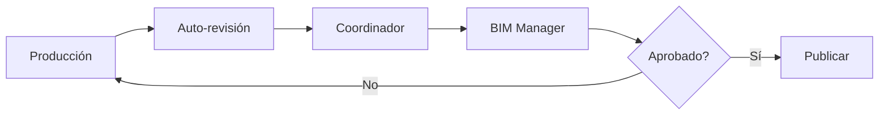

# PIR - Project Information Requirements

**Requisitos de Información del Proyecto**

---

## Información del Documento

| Campo | Valor |
|-------|-------|
| **Organización** | BIMAC Studio |
| **Proyecto** | [Nombre del Proyecto] |
| **Código de Proyecto** | [PRY-000] |
| **Documento** | PIR-[Código]-001 |
| **Versión** | 1.0 |
| **Fecha** | [DD/MM/AAAA] |
| **Estado** | Borrador / En Revisión / Aprobado |

### Control de Versiones

| Versión | Fecha | Autor | Cambios |
|---------|-------|-------|---------|
| 1.0 | | | Versión inicial |

### Aprobaciones

| Rol | Nombre | Firma | Fecha |
|-----|--------|-------|-------|
| Director de Proyecto | | | |
| BIM Manager | | | |
| Cliente | | | |

---

## 1. Información del Proyecto

### 1.1 Datos Generales

| Campo | Descripción |
|-------|-------------|
| **Nombre del Proyecto** | |
| **Ubicación** | |
| **Cliente** | |
| **Tipo de Proyecto** | Nueva construcción / Renovación / Ampliación |
| **Uso Principal** | Residencial / Comercial / Industrial / Mixto |
| **Superficie Aproximada** | m² |
| **Presupuesto Estimado** | $ |
| **Fecha de Inicio** | |
| **Fecha de Entrega** | |

### 1.2 Descripción del Proyecto

[Descripción narrativa del proyecto, alcance general, características principales]

### 1.3 Fases del Proyecto

| Fase | Descripción | Fecha Inicio | Fecha Fin |
|------|-------------|--------------|-----------|
| 1. Conceptual | | | |
| 2. Esquemático | | | |
| 3. Desarrollo de Diseño | | | |
| 4. Documentos de Construcción | | | |
| 5. Licitación | | | |
| 6. Construcción | | | |
| 7. Entrega / Handover | | | |

---

## 2. Propósitos de la Información

### 2.1 Usos BIM del Proyecto

Seleccionar los usos BIM aplicables a este proyecto:

#### Fase de Diseño

| Uso BIM | Aplica | Responsable | Entregable |
|---------|--------|-------------|------------|
| [ ] Modelado 3D | | | Modelos RVT/IFC |
| [ ] Visualización | | | Renders, recorridos |
| [ ] Análisis de opciones | | | Comparativas |
| [ ] Análisis de áreas | | | Schedules |
| [ ] Análisis estructural | | | Modelo analítico |
| [ ] Análisis energético | | | Simulación |
| [ ] Análisis de iluminación | | | Simulación |

#### Fase de Coordinación

| Uso BIM | Aplica | Responsable | Entregable |
|---------|--------|-------------|------------|
| [ ] Coordinación 3D | | | Modelo federado |
| [ ] Detección de interferencias | | | Reportes BCF |
| [ ] Revisión de diseño | | | Actas de sesión |

#### Fase de Construcción

| Uso BIM | Aplica | Responsable | Entregable |
|---------|--------|-------------|------------|
| [ ] Simulación 4D | | | Modelo vinculado |
| [ ] Cuantificación 5D | | | Schedules, reportes |
| [ ] Logística de sitio | | | Layout 3D |
| [ ] Prefabricación | | | Modelos de detalle |
| [ ] Control de avance | | | Comparativos |

#### Fase de Operación

| Uso BIM | Aplica | Responsable | Entregable |
|---------|--------|-------------|------------|
| [ ] Modelo As-Built | | | Modelo final verificado |
| [ ] Entrega FM (COBie) | | | Datos estructurados |
| [ ] Mantenimiento | | | Manuales vinculados |

### 2.2 Decisiones Clave por Fase

| Fase | Decisiones a Tomar | Información Requerida |
|------|--------------------|-----------------------|
| Conceptual | Viabilidad, programa | Áreas, costos paramétricos |
| Esquemático | Configuración general | Layouts, volumetría |
| Desarrollo | Sistemas y materiales | Especificaciones, coordinación |
| Construcción | Secuencia, logística | 4D, cuantificación |
| Operación | Estrategia de mantenimiento | Equipos, garantías |

---

## 3. Hitos de Entrega de Información

### 3.1 Cronograma de Entregas

| Hito | Fecha | Contenido | LOD | Responsable |
|------|-------|-----------|-----|-------------|
| E-01: Diseño Conceptual | | Modelos conceptuales, renders | 100 | |
| E-02: Diseño Esquemático | | Modelos esquemáticos, áreas | 200 | |
| E-03: Desarrollo de Diseño | | Modelos coordinados | 300 | |
| E-04: Docs. Construcción | | Modelos + planos ejecutivos | 350 | |
| E-05: As-Built | | Modelos finales + COBie | 500 | |

### 3.2 Entregables por Hito

#### E-01: Diseño Conceptual

| Entregable | Formato | Cantidad |
|------------|---------|----------|
| Modelo conceptual | RVT | 1 |
| Renders | JPG/PNG | |
| Memoria descriptiva | PDF | 1 |
| Estimación paramétrica | XLSX | 1 |

#### E-02: Diseño Esquemático

| Entregable | Formato | Cantidad |
|------------|---------|----------|
| Modelos por disciplina | RVT + IFC | Por disciplina |
| Planos esquemáticos | PDF | Set completo |
| Programa arquitectónico | XLSX | 1 |
| Estimación por sistemas | XLSX | 1 |

#### E-03: Desarrollo de Diseño

| Entregable | Formato | Cantidad |
|------------|---------|----------|
| Modelos coordinados | RVT + IFC | Por disciplina |
| Modelo federado | NWD | 1 |
| Reporte de coordinación | PDF + BCF | 1 |
| Cuantificación | XLSX | Por sistema |
| Especificaciones | PDF | Por división |

#### E-04: Documentos de Construcción

| Entregable | Formato | Cantidad |
|------------|---------|----------|
| Modelos ejecutivos | RVT + IFC | Por disciplina |
| Planos ejecutivos | PDF + DWG | Set completo |
| Catálogo de conceptos | XLSX | 1 |
| Especificaciones | PDF | Completas |

#### E-05: As-Built

| Entregable | Formato | Cantidad |
|------------|---------|----------|
| Modelos As-Built | RVT + IFC | Por disciplina |
| Modelo federado final | NWD | 1 |
| Datos COBie | XLSX | 1 |
| Manuales de O&M | PDF | Por sistema |

---

## 4. Requisitos de Nivel de Información

### 4.1 LOD por Elemento y Fase

| Categoría | Conceptual | Esquemático | Desarrollo | Construcción | As-Built |
|-----------|------------|-------------|------------|--------------|----------|
| **Arquitectura** | | | | | |
| Muros | 100 | 200 | 300 | 350 | 500 |
| Pisos | 100 | 200 | 300 | 350 | 500 |
| Techos | 100 | 200 | 300 | 350 | 500 |
| Puertas | - | 200 | 300 | 350 | 500 |
| Ventanas | - | 200 | 300 | 350 | 500 |
| Plafones | - | 200 | 300 | 350 | 500 |
| **Estructura** | | | | | |
| Cimentación | 100 | 200 | 300 | 400 | 500 |
| Columnas | 100 | 200 | 300 | 400 | 500 |
| Vigas | 100 | 200 | 300 | 400 | 500 |
| Losas | 100 | 200 | 300 | 400 | 500 |
| **MEP** | | | | | |
| Ductos HVAC | - | 200 | 300 | 350 | 500 |
| Tuberías | - | 200 | 300 | 350 | 500 |
| Equipos | - | 200 | 300 | 400 | 500 |
| Luminarias | - | 200 | 300 | 350 | 500 |

### 4.2 Atributos Requeridos por LOD

#### LOD 200

| Categoría | Atributos Mínimos |
|-----------|-------------------|
| General | Tipo, Material (genérico) |
| Espacios | Nombre, Número, Área |

#### LOD 300

| Categoría | Atributos Mínimos |
|-----------|-------------------|
| Muros | Tipo, Material, Espesor, Resistencia fuego |
| Puertas | Tipo, Dimensiones, Material, Herraje |
| Equipos MEP | Tipo, Capacidad, Voltaje |
| Espacios | + Ocupación, Acabados |

#### LOD 350

| Categoría | Atributos Mínimos |
|-----------|-------------------|
| Todos | + Especificación completa |
| Equipos | + Marca, Modelo |
| Sistemas | + Conexiones, controles |

#### LOD 500

| Categoría | Atributos Mínimos |
|-----------|-------------------|
| Todos | + Número de serie, fecha instalación |
| Equipos | + Garantía, proveedor, manual |
| Sistemas | + Datos de commissioning |

---

## 5. Requisitos de Coordinación

### 5.1 Disciplinas Participantes

| Disciplina | Empresa | Contacto | Software |
|------------|---------|----------|----------|
| Arquitectura | | | |
| Estructura | | | |
| Mecánico (HVAC) | | | |
| Eléctrico | | | |
| Hidráulico/Sanitario | | | |
| Protección contra incendio | | | |
| Civil/Sitio | | | |

### 5.2 Frecuencia de Coordinación

| Actividad | Frecuencia | Participantes |
|-----------|------------|---------------|
| Publicación de modelos | Semanal | Todas las disciplinas |
| Clash detection | Semanal | BIM Manager |
| Reunión de coordinación | Semanal | Coordinadores |
| Revisión con cliente | Quincenal/Mensual | Equipo + Cliente |

### 5.3 Matriz de Interferencias

| vs | ARQ | EST | MEC | ELE | HID | PCI |
|----|-----|-----|-----|-----|-----|-----|
| ARQ | - | ✓ | ✓ | ✓ | ✓ | ✓ |
| EST | ✓ | - | ✓ | ✓ | ✓ | ✓ |
| MEC | ✓ | ✓ | - | ✓ | ✓ | ✓ |
| ELE | ✓ | ✓ | ✓ | - | ✓ | ✓ |
| HID | ✓ | ✓ | ✓ | ✓ | - | ✓ |
| PCI | ✓ | ✓ | ✓ | ✓ | ✓ | - |

---

## 6. Requisitos Técnicos

### 6.1 Software y Versiones

| Función | Software | Versión Mínima |
|---------|----------|----------------|
| BIM Authoring | Revit | 2024 |
| Coordinación | Navisworks | 2024 |
| Civil | Civil 3D | 2024 |
| 4D | Synchro | |
| Issues | BIMcollab | |

### 6.2 Formatos de Entrega

| Propósito | Formato | Especificación |
|-----------|---------|----------------|
| Modelos nativos | RVT | Revit 2024 |
| Intercambio abierto | IFC | 4.0, Design Transfer View |
| Coordinación | NWC/NWD | Navisworks 2024 |
| Planos | PDF | Vectorial, capas |
| Datos tabulares | XLSX | Nombrado según estándar |
| Issues | BCF | 2.1 |

### 6.3 Sistema de Coordenadas

| Parámetro | Valor |
|-----------|-------|
| Sistema de referencia | UTM / WGS84 |
| Zona | |
| Punto base del proyecto | X: Y: Z: |
| Norte de proyecto | ° respecto a norte real |
| Unidades | Metros |
| Elevación de referencia | Nivel 0.00 = |

---

## 7. Requisitos de Calidad

### 7.1 Verificaciones Obligatorias

| Verificación | Frecuencia | Responsable | Criterio |
|--------------|------------|-------------|----------|
| Warnings de Revit | Antes de publicar | Modelador | <50 warnings |
| Clash detection | Semanal | BIM Manager | 0 críticos |
| Nomenclatura | Por publicación | Coordinador | 100% cumplimiento |
| Parámetros | Por entrega | BIM Manager | >95% poblados |

### 7.2 Proceso de Aprobación



---

## 8. Gestión de Información

### 8.1 Estructura del CDE

```
CDE/
├── [Código Proyecto]/
│   ├── 01_WIP/
│   │   ├── ARQ/
│   │   ├── EST/
│   │   └── MEP/
│   ├── 02_SHARED/
│   │   ├── S1_Coordinacion/
│   │   └── S2_Cliente/
│   ├── 03_PUBLISHED/
│   │   └── Entregas/
│   └── 04_ARCHIVE/
```

### 8.2 Nomenclatura de Archivos

**Patrón:**
```
[Proyecto]-[Disciplina]-[Zona]-[Tipo]-[Consecutivo]_v[Versión].[ext]
```

**Ejemplo:**
```
PRY001-ARQ-T1-MOD-001_v01.rvt
PRY001-EST-T1-MOD-001_v01.rvt
PRY001-COO-GEN-FED-001_v01.nwd
```

---

## 9. Requisitos Específicos del Cliente

### 9.1 Requisitos Adicionales

[Documentar cualquier requisito específico del cliente que no esté cubierto en las secciones anteriores]

| # | Requisito | Descripción | Prioridad |
|---|-----------|-------------|-----------|
| 1 | | | |
| 2 | | | |
| 3 | | | |

### 9.2 Restricciones

[Documentar restricciones de presupuesto, tiempo, tecnología u otras]

| # | Restricción | Impacto | Mitigación |
|---|-------------|---------|------------|
| 1 | | | |
| 2 | | | |

---

## 10. Anexos

### Anexo A: Contactos del Proyecto

| Rol | Nombre | Empresa | Email | Teléfono |
|-----|--------|---------|-------|----------|
| Director de Proyecto | | | | |
| BIM Manager | | | | |
| Coord. Arquitectura | | | | |
| Coord. Estructura | | | | |
| Coord. MEP | | | | |
| Representante Cliente | | | | |

### Anexo B: Documentos de Referencia

| Documento | Descripción | Ubicación |
|-----------|-------------|-----------|
| OIR | Requisitos organizacionales | |
| Contrato | Alcance contractual | |
| Programa | Cronograma maestro | |
| Presupuesto | Presupuesto base | |

---

**BIMAC Studio** | www.bimacstudio.com

*Este documento es propiedad de BIMAC Studio. Su reproducción o distribución requiere autorización.*
